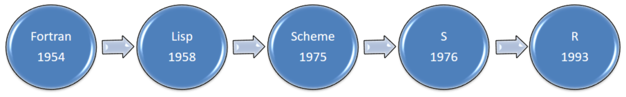
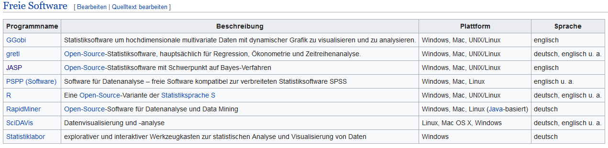
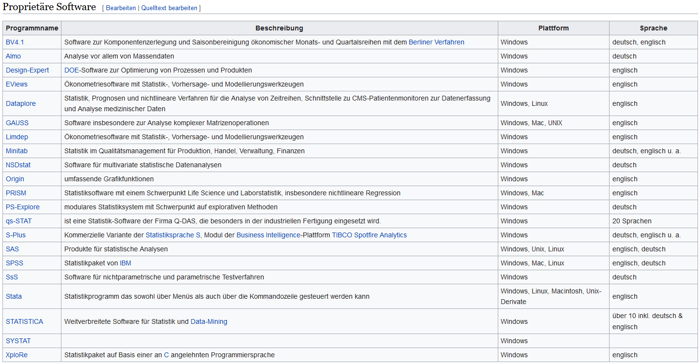
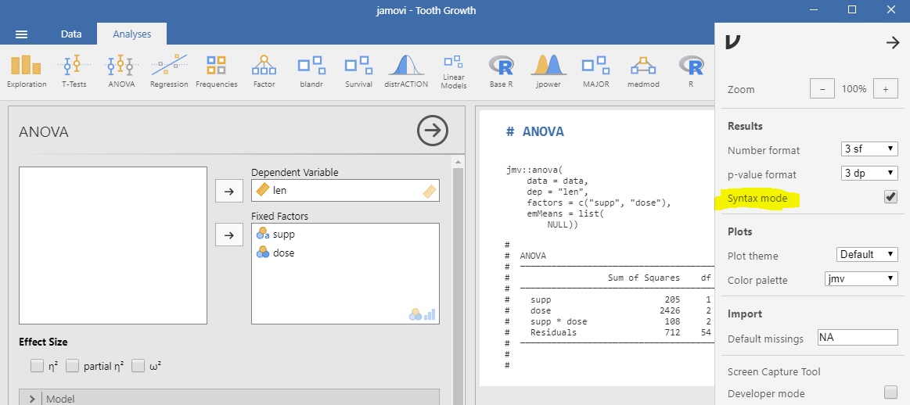

# Aufbau des Kurses


Im Lauf des Kurses werden wir abwechselnd zwei unterschiedliche Ansätze des Lernens verwenden. Ich habe diese Ansätze *Top-Down* und *Bottom-Up* genannt und werde die Idee dahinter noch im Detail erklären. Der Einstieg in R wird wesentlich durch die Verwendung von *RStudio* erleichtert. Wir werden im Folgenden die Eigenschaften und den Umgang mit diesem Programm im Detail besprechen.

Unabhängig von der Vorgehensweise werden wir jeweils zu den behandelten Themen direkt Übungen in R durchführen. Diese Übungen sind zum Großteil in den vorliegenden Unterlagen beschrieben und der entsprechende R-Code kann direkt aus diesen Unterlagen ins *RStudio* übernommen und ausgeführt werden.

Des Weiteren sind zwischen den Kursterminen Hausübungen zu bearbeiten. Den genauen Ablauf werde ich während der Lehrveranstaltung bekannt geben. Zur Beurteilung eurer Leistungen in der LV sind interaktive Online-Fragen zu bearbeiten. Auch hierzu werde ich Details während der LV bekannt geben.

## Ziele {-}

 * Aufbau von R-Studio.
 * wo und wie findet man nützliche Infos zu R und RStudio.
 * Definition von Daten und Objekten in R 
 * grundlegende Logik von Befehlen und Funktionen in R.
 * Daten einlesen und bearbeiten.
 * einfache deskriptive Statistiken anfordern.
 * einfache Graphiken erstellen und bearbeiten.
 * einige nützliche (statistische) Funktionen kennen.

## Allgemeines {-}

Nachfolgend ein kurzer Überblick über die Entstehungsgeschichte von R.

### Entstehungsgeschichte von R[^1] {-}

<center>

{ width=50% }

</center>

* Entwickelt 1992, orientiert sich R eng an Sprache S. Weitere Inspirationsquelle war die Programmiersprache Scheme. **1993 wurde die Software erstmals öffentlich vorgestellt** und seit Juni 1995 steht R unter der [GNU General Public License](https://de.wikipedia.org/wiki/GNU_General_Public_License){target="_blank"}.
* Bis 1996 oder 1997 gab es zwischen 50 und 100 Leute in einer Mailingliste, die dabei halfen die Sprache gemeinsam zu verbessern. Im Jahr 1997 wurde das R Development Core Team gebildet (heute R Core Team), das sich um die Weiterentwicklung von R kümmert und den Quellcode verändern kann.
* Das Comprehensive R Archive Network (CRAN) als Plattform für Pakete startete am 23. April 1997 um Anwendern die Möglichkeit zu geben selbst geschriebene Funktionen leichter mit Anderen zu teilen.
* Seit April 2001 gibt es R für macOS. Im September 2002 gründeten die Mitglieder des R Development Core Teams den gemeinnützigen Verein The R Foundation for Statistical Computing in Wien, welcher sich um die Außendarstellung kümmert.
* Die R-Version 2.0 wurde am 4. Oktober 2004 veröffentlicht. Seitdem nutzt R Lazy Loading, um Daten bei geringer Beanspruchung des Arbeitsspeichers schnell laden zu können.
* Ab Version 2.1 (18. April 2005) unterstützt R unterschiedliche Sprachversionen (Internationalisierung) und Zeichenkodierungen, insbesondere UTF-8. 
* Mit die Einführung von Version 2.11 im April 2010, die R auf 64-Bit-Systemen nutzbar macht und bis zu acht Terabyte Arbeitsspeicher adressieren kann gelang der Einstieg in Big-Data-Processing.
* Im Oktober 2011 (Version 2.14) wurde die parallele Ausführung von Funktionen eingeführt.
* Neben all diesen technischen Entwicklungen wurden unzählige Pakete für alle erdenklichen Anwendungsbereiche durch die Community entwickelt.
* Derzeit (Stand November 2018) gibt es 13.346 packages (mit dem Befehl *available.packages()*) kann man das jederzeit abfragen) allein auf CRAN! Dabei sind die Packages anderer Repositories (z.B. *Bioconductor*[^2] mit 1.649 packages) noch nicht berücksichtigt!

### **Warum** sollte man **R** verwenden? {-}

R ist eine Programmiersprache, die besonders zur Analyse und Visualisierung von Daten genutzt wird. Sehr viele Neuentwicklungen in der Statistik passieren in R. Auch ohne Vorkenntnisse in einer Programmiersprache findet man sich in R schnell zurecht. 

Mit Hilfe von RStudio, den unzähligen Tutorials und Hilfeseiten gelingt es schon nach sehr kurzer Zeit die ersten hilfreichen Programme zu schreiben. Alle diese Tools sind [open source](https://de.wikipedia.org/wiki/Open_Source){target="_blank"}, d.h. transparent, eigenständig veränderbar und vor allem kostenlos. Stellt man die Vor- und Nachteile der Nutzung von R gegenüber, lässt sich die Entscheidung Arbeit in R hineinzustecken relativ leicht rechtfertigen:

* Vorteile
    + Neben gängigen Programmen zur statistischen Auswertung, wie beispielsweise "SPSS" bietet R den Vorteil, dass es auf der ganzen Welt kostenlos zur Verfügung steht.
    + R kann die meisten gängigen Formate importieren und bietet ein quelloffenes Format für erstellte Datensätze.
    + Darüber hinaus stellt R mächtigere und mehr Auswertungsverfahren zur Verfügung als viele andere Programme.
    + R ist eine Programmierumgebung. Funktionen können bequem den eigenen Bedürfnissen angepasst werden. Komplexe Probleme lassen sich auch dann lösen, wenn die Entwickler diese (noch) nicht implementiert haben.
    + R wird von der Scientific Community kontinuierlich weiterentwickelt. Neue statistische Verfahren werden in der Regel auch in R integriert. Ein standardisiertes Pakete-System erleichtert die Nachinstallation ebenso wie die Veröffentlichung eigener Pakete.
    + R erstellt professionelle Graphiken in einer Vielzahl an Formaten.
    + R erleichtert durch z.T. selbstdokumentierende Codes die Reproduzierbarkeit von Studien.
    + R bietet eine Vielzahl an Online-Tutorials, Blogs und sonstige Hilfestellungen.
    
* Nachteile
    + Für den Anfänger ist die Funktionsweise und Bedienung von R zweifellos gewöhnungsbedürftig.
    + die Formatierung von Ergebnisse in R (Tabellen, Graphiken, etc.) muss häufig durch zusätzliche Programmschritte vom Benutzer durchgeführt werden.
    + R ist prinzipiell Code-basiert. Benutzerfreundliche Interaktionsfenster zur Parametrisierung von Analysen müssen durch den Programmierer mit Hilfe entsprechender Programmpakete (z.B. Shiny, Java, etc.) selbst erstellt werden.

### **Wann** sollte man **R** verwenden? {-}

Ein Hardco*R*e'*ler* würde diese Frage nicht verstehen und sich wahrscheinlich kopfschüttelnd wieder der Programmierung widmen, ohne den Fragesteller weiter zu beachten. Für alle anderen stellt sich jedoch die Frage, ob und ab wann sich der Aufwand eine Programmiersprache zu erlernen lohnt. Das kann eigentlich nur jeder für sich selbst entscheiden. Gute Gründe könnten z.B. sein, wenn:

* keine finanziellen Mittel zur Anschaffung einer kostenpflichtigen Statistiksoftware vorhanden sind.
* die zur Verfügung stehende Software ist nicht in der Lage, ein vorliegendes statistisches Problem zu lösen.
* man in einem Team eine Auswertungsstrategie (sanity checks, Standardprozeduren, etc.) entwickeln möchte.
* dynamisches Reporting im Ablauf eines Forschungsprozesses verwendet werden soll.

### **Wann** sollte man **R nicht** verwenden? {-}

Geht es einzig und allein darum, einen Datensatz explorativ und/oder mit gängigen Analysemethoden zu bearbeiten, kann man auf bereits bestehende und benutzerfreundliche Anwendungen zurückgreifen. Wir werden uns im folgenden zwei durchaus brauchbare Programmpakete kurz ansehen.

Stehen Programme wie SPSS, SAS o.ä. zur Verfügung, sollte man sich vor den Einstieg in R klar über die gesteckten Ziele sein und eine Kosten-Nutzen-Rechnung anstellen. Sehr oft ist es viel einfacher, sich in die Syntax des jeweiligen Programms einzuarbeiten, als alles in R zu lösen. Es sei auch darauf hingewiesen, dass (zumindest) [SPSS bereits eine Schnittstelle mit R](https://www.ibm.com/support/knowledgecenter/de/SSLVMB_25.0.0/statistics_r_tutorial_project_ddita/spss/tutorials/rtut_intro.html){target="_blank"} anbietet. Details dazu sind in den entsprechenden Manuals nachzulesen.

Weitere wichtige Überlegungen bezüglich der Umstellung/Einführung von R sind:

* wie viele Mitarbeiter verwenden ein statistisches Auswerteprogramm und wie viele davon müssten sich in R einarbeiten.
* welche Auswertungsmethoden will ich langfristig gesehen einsetzen? Sind dabei Verfahren, die mit SPSS, SAS, etc. nicht umsetzbar sind?
* Wie sehr kann ich mich auf die Korrektheit der Ergebnisse aus R verlassen? Immerhin ist ja alles Freeware und es wird keine Haftung für die Richtigkeit der Ergebnisse übernommen. Spielt das eine Rolle für meine Entscheidung?

### Alternativen zu R {-}

Hardco*R*e'*ler* kennen das Wort Alternative im Zusammenhang mit R nicht. Daher geben die nachfolgende Abbildungen einen Überblick über die derzeit (Stand Nov. 2018) wesentlichen Statistikprogramme am Markt[^3], ohne den Anspruch zu erheben, eine echte Alternative zu R zu sein.

Freie Software:

<center>

{ width=70% }

</center>

Proprietäre Software:

<center>

{ width=70% }

</center>

Mit Stand November 2018 war laut Tiobe[^4] R an 14 Stelle - 3 Stellen vor Matlab! SPSS ist in der aktuellen Bewertungsliste nicht angeführt. Der Nutzungsverlauf von R seit 2010 lässt vermuten, dass R auch in den kommenden Jahren an Bedeutung für die statistische Analyse beibehält, wenn nicht noch wesentlich weiterentwickelt. 

<center>

{target="_blank"} für R seit 2008 (the ratings are calculated by counting hits of the most popular search engines. The number of hits determines the ratings of a language. The counted hits are normalized for each search engine for all languages in the list. In other words, all languages together have a score of 100%.)](Images/01_TiobeRVerlauf.PNG){ width=50% }

</center>

Zusätzlich zu dieser Liste gibt es noch viele weitere Anwendungen, die zum Teil für ganz spezielle Analysetechniken maßgeschneidert wurden - falls erforderlich einfach im Web danach suchen.

#### JAMOVI {-}

Ist ein Computerprogramm zur Datenanalyse und Durchführung von statistischen Tests. 

<center>

{target="_blank"}](Images/01_JAMOVI.PNG){ width=50% }

</center>

Jamovi benutzt für die statistischen Auswertungen R. Damit bietet sich diese Programm auch an, bei Bedarf zwischen der bequemen Benutzung von JAMOVI und einer ins Detail gehenden Weiterentwicklung von JAMOVI-Programmen zu wechseln. Die Voraussetzungen um problemlos zwischen R und JAMOVI zu wechseln bietet das Paket *jmv*. Um den in JAMOVI verwendeten R Code sichtbar zu machen, ist folgende Einstellung in JAMOVI zu wählen:

<center>

{ width=50% }

</center>

Kopiert man den Codeteil von JAMOVI nach R, kann dieser bearbeitet/erweitert werden:


```r
  rm(list = ls())
  if (!require("pacman")) install.packages("pacman")
  pacman::p_load(here, jmv, xtable)
  options(digits=3)
  
  DatenFile <- "/Heart Rate.csv"
  D2L       <- paste0(here("Data"), DatenFile)
  data      <- read.csv(D2L, check.names = FALSE)
  
  jmv::anova(data = data,
             dep = "Heart Rate",
             factors = c("Gender", "Group"),
             emMeans = list(NULL))
  
  # Erweiterung in R: Angabe der Effektgrößen in Tabelle  
  jmv::anova(data = data,
             dep = "Heart Rate",
             factors = c("Gender", "Group"),
             emMeans = list(NULL),
             effectSize = c('eta', 'partEta', 'omega')) # Diese Zeile wurde in R hinzugefügt
```

#### JASP {-}

Ist ebenfalls ein Computerprogramm zur Datenanalyse und Durchführung von statistischen Tests. JASP hat einen ähnlichen Funktionsumfang wie JAMOVI. Als Besonderheit kann gelten, dass die meisten Funktionen neben der üblichen ("frequentistischen") Form auch in einer zweiten Form, basierend auf der *bayesschen Statistik*, verfügbar sind. Der Funktionsumfang kann - wie auch bei JAMOVI - durch Module erweitert werden. 

<center>

{target="_blank"}](Images/01_JASP.PNG){ width=50% } 

</center>

Bei JASP sind neben der Bayesschen Statistik auch die verfügbaren Datensätze für den Einstieg in die Nutzung dieses Programm erwähnenswert. Sortiert nach Themenbereichen und referenziert nach Herkunft kann man einerseits mit den entsprechenden Verfahren experimentieren und gegebenenfalls auch noch in der Literatur nachschlagen - welche eben die gleichen Datensätze zur Erklärung der Verfahren verwendet. Man kann diese Daten aber auch exportieren und in JAMOVI verwenden!

[^1]: [Geschichte von R - Wikipedia](https://de.wikipedia.org/wiki/R_(Programmiersprache)#Urspr%C3%BCnge_(1992)){target="_blank"}
[^2]: [Bioconductor - Software for Bioinformatics](https://www.bioconductor.org/){target="_blank"}
[^3]: [Statistische Software Wikipedia](https://de.wikipedia.org/wiki/Liste_von_Statistik-Software){target="_blank"}
[^4]: [TIOBE Programming Community Index](https://www.tiobe.com/){target="_blank"}
