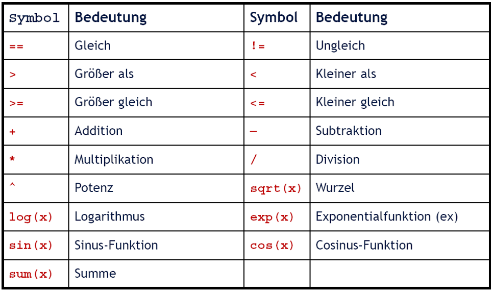

# **R**Studio[^5]

[^5]: [RStudio Beschreibung Wikipedia](https://de.wikipedia.org/wiki/RStudio)

[RStudio](https://www.rstudio.com/) ist eine vom Unternehmen RStudio, Inc. angebotene, integrierte Entwicklungsumgebung und grafische Benutzeroberfläche für die statistische Programmiersprache R. Bei RStudio handelt es sich um eine IDE[^6]-Anwendung, ein Begriff den man häufig bei der Beschreibung von RStudio verwendet.

[^6]: **I**ntegrated **D**evelopment **E**nvironment

RStudio ist sowohl als lokale Desktop-Version als auch als Server-Version mit gleichem Layout verfügbar. Die Umgebung teilt sich in vier Fenster (Panes), in denen:

* eines für die Erstellung von Skripten genutzt wird, 
* ein anderes als Kommandozeile mit Output des Programmiercodes und 
* ein weiteres für die Anzeige von Objekten in der Arbeitsumgebung. 
* In einem vierten Bereich lassen sich mit Reitern grafischer Output, eine Paketverwaltung, das Ordnerverzeichnis und mehr anzeigen. 

RStudio bietet eine umfangreiche Entwicklungsumgebung und ermöglicht eine Vielzahl sehr hilfreicher Funktionalitäten, wie:

* Autovervollständigung, automatische Einrückungen, Syntaxhervorhebung.
* Code-Faltung.
* integrierte Hilfe und Informationen zu Objekten in der Arbeitsumgebung. 
* Datensätze betrachten und bearbeiten. 
* Zusammenfassen von Skripten, Daten und weitere Dateien zu Projekten (.Rproj), was die Zusammenarbeit erleichtert, zumal eine Versionsverwaltung mit Git enthalten ist. 

Mit Hilfe der Paketverwaltung lassen sich Pakete installieren und laden. Die Erstellung von Berichten mit Hilfe von *knitr* oder *Sweave* kann aus RStudio heraus erfolgen. Ein grafischer Debugger ist enthalten. Zudem kann Code in C, C++ oder Fortran kompiliert werden und direkt eingebunden werden.

Für beide Ausführungen (Desktop, Server) von RStudio kann auch eine kommerzielle Variante erworben werden, die Support einschließt. Mit der kommerziellen Serverversion können mehrere Sitzungen parallel laufen und unterschiedliche Versionen von R verwendet werden. Außerdem sind das Teilen von Projekten und das Ressourcenmanagement einfacher. 

## Aufbau von RStudio {-}

Beim Erststart von RStudio werden drei Fenster angezeigt. Für die effiziente Entwicklung von R-Programmen verwendet man einen Editor, welcher im RStudio integriert ist. Die Verwendung des Editors öffnet ein viertes Fenster. Diese vier Fenster bilden im Allgemeinen das Arbeitsumfeld mit RStudio.

1. Konsole
2. Environment
3. Files
4. Source

Die standardmäßige Anordnung und Anzeige von Details innerhalb der Fenster kann durch den Benutzer angepasst werden. Details dazu werden bei den jeweiligen Kapiteln besprochen.

## R-Syntax {-}


In verschiedenen Programmiersprachen werden z.B. Groß- und Kleinschreibung, Dezimaltrennzeichen, Sonderzeichen etc. unterschiedlich definiert. Für R gelten folgende (grundlegende) Regeln:

  * R unterscheidet zwischen Groß- und Kleinschreibung.
  * Dezimaltrennzeichen: Punkt statt Komma.
  * Keine Leerzeichen in Objektnamen, besser: my.object, my_object oder MyObject usw.
  * Keine arithmetischen Operatoren (+,-,/) in Objektnamen.
  * Erstes Zeichen eines Objektnamens muss ein Buchstabe sein.
  * Befehle dürfen über mehrere Zeilen gehen.
  * Alles, was existiert, ist ein Objekt.

## Kommandozeile (Befehlszeile, Console) {-}

Die [Kommandozeile](https://de.wikipedia.org/wiki/Kommandozeile), Befehlszeile (command-line interface, CLI), oft auch als Konsole oder Terminal bezeichnet, ist ein Eingabebereich (interface) für die Steuerung einer Software, der typischerweise (aber nicht zwingend) im Textmodus abläuft. Die Kommandos oder Befehle werden als Zeichenketten über die Tastatur eingegeben. Die Ausführung der Befehle wird meist direkt aus der Zeile durch zusätzlich angegebene Parameter gesteuert (Kommandozeilenparameter). 

Ein Kommandozeilenprogramm läuft typischerweise mit den gegebenen Parametern einmal ab, bevor eine erneute Befehlseingabe möglich ist. Ein automatisiertes Abarbeiten mehrerer Kommandos nennt man Stapelverarbeitung (batch).

In die Kommandozeile von RStudio können Variablendefinitionen, Berechnungen/Funktionen, sowie der Aufruf von Hilfefunktionen direkt eingegeben und ausgeführt werden. Die folgenden Beispiele zeigen die Auswirkungen von direkten Eingaben in der Konsole:


```r
2 + 2
help(mean)
?mean
Var1 <- c(2,3,4)
mean(Var1)
```

## Mathematische Operatoren/Funktionen {-}

Arithmetische und logische Operatoren in R sind in nachfolgender Tabelle definiert. Des weiteren findet man auszugsweise ein paar mathematische Funktionen, anhand deren das Prinzip eines Funktionsaufrufes verdeutlicht werden. Funktionen haben in R folgende Eigenschaften:

* jede Funktion hat einen Namen (z.B. sin für die Sinusfunktion, aov für Fit an Analysis of Variance Model, ...)
* eine Funktion kann unter Umständen ohne Parameter (z.B. *getwd()*), oder mit einem oder mehrerern Parametern aufgerufen werden (z.B. *mean(x)*, *mean(x, na.rm = TRUE)*.
* Für Funktionen, bei denen die Übergabe von Parametern notwendig ist (z.B. *mean()*), ist folgendes zu beachten (gib in der Console den Befehl *?mean* ein - beachte das Help-Fenster).
    + In Klammern stehende Parameter die keine Bezeichnung aufweisen (bei der Funktion *mean* das *x*), sind zwingende Angaben für den Aufruf der Funktion.
    + Bei Parametern, die mit einem Namen versehen sind, handelt es sich um optionale Parameter. Diese müssen beim Aufruf der Funktion nicht angegeben werden. In diesem Fall werden die in der Hilfe ersichtlichen Standardwerte verwendet.
    + Sollten die Standardwerte nicht verwendet werden, sind diese beim Aufruf der Funktion mit entsprechenden Werten zu versehen - wie z.B. bei *mean(x, trim = .2, na.rm = TRUE)*.
    + Wird die Reihenfolge laut Beschreibung der Funktion in der Hilfeseite eingehalten, können die Namen der Parameter weggelassen werden. Kopiere bitte zeilenweise den nachfolgenden Code in die Konsole und diskutieren die Ergebnisse.


```r
x <- c(rpois(n = 50, lambda = 10), 100, NA, NA)
hist(x)
mean(x)
mean(x, na.rm = TRUE)
mean(x, na.rm = TRUE, trim = .1)
mean(x, TRUE, .1)
mean(x, .1, TRUE)
```

<center>

{ width=50% } 

</center>

## Hilfe in RStudio {-}

Mit der Installation von RStudio wird automatisch auch eine Dokumentation der verfügbaren Funktionen zur Verfügung gestellt. Dieses Hilfe-System kann auf unterschiedlichste Arten angesprochen werden. Folgende Möglichkeiten sind im RStudio gegeben:

* über die *Console* mit folgenden Befehlen

```r
help.search("mean")
help("mean")
?mean
```
* über das *Help*-Menü
* über das *Files*-Pane im Reiter *Help*

Darüber hinaus gibt es noch die Möglichkeit, eine der unzähligen Helpseiten im Internet in Anspruch zu nehmen. Eine Empfehlung, welche Hilfeseite(n) am besten sind ist schwer zu geben - durch Erfahrung und persönlichen Vorlieben werden sich schnell ein paar Seiten als hilfreich bewähren. Zum Einstieg nachfolgend ein paar Seiten die ich persönlich immer wieder verwende:

* [R-project](https://www.r-project.org/help.html)
* [Cookbook for R](http://www.cookbook-r.com/)
* [Quick-R](https://www.statmethods.net/interface/help.html)
* [RDocumentation](https://www.rdocumentation.org/packages/utils/versions/3.5.1/topics/help)
* [RStudio Support](https://support.rstudio.com/hc/en-us)
* u.v.m.

### Online-Lernprogramme {-}

Eine weitere (unerschöpfliche) Quelle um R effizient und schnell zu erlernen sind entsprechende Online-Kurse. Einerseits gibt es über YouTube bereits viele Tutorials (die mehr oder weniger hilfreich sind/sein können). Andererseits haben sich aber bereits einige Universitäten und Firmen darauf spezialisiert, qualitativ hochwertige Online-Tutorials und Webinars zur Verfügung zu stellen. Viele davon sind noch kostenlos. Auch hier ist es schwierig eine punktuelle Empfehlung abzugeben. Nachfolgend eine kurze (und daher sicher unvollständige) Liste von Anbietern, die ich zumindest zum Teil selbst ausprobiert und als gut empfunden habe:

* [DataCamp](https://www.datacamp.com/).
* [coursera](https://www.coursera.org/).
* [RStudio Online Learning](https://www.rstudio.com/online-learning/).
* [Course](https://www.udemy.com/r-programming/).
* [Quick-R Tutorials](https://www.statmethods.net/r-tutorial/index.html).

### Verwendung der Konsole (Aufgabe 1) {-}

Berechne in der Konsole die Ergebnisse folgender Ausdrücke und prüfe das Ergebnis auf Korrektheit:

a. $(3 + 4 - 5) * 9$
b. $\frac{99}{33}$
c. $(\sqrt{2})^2$
d. $e^{3+4}$

Gib nachfolgende Befehle ein und diskutiere das Ergebnis:

a. $5 = 7$
b. $5 == 7$
c. $5*5 >= 6*4$
d. $\sqrt{3} \neq cos(17)$

Die Lösungen zu den Beispielen findest du am Ende dieses Dokumentes.

### Wiederverwendung von Befehlszeilen - die Command-History {-}

Durch die Verwendung der Pfeiltasten ($\uparrow$ und $\downarrow$) können Sie bereits eingegeben Befehle in der Kommandozeile aus der Historie abrufen. Die Historie ist auch über das Environment Fenster im Tab *History* verfügbar. Durch Markieren einzelner oder mehrerer Zeilen im History-Fenster und anschließender Eingabetaste, werden diese Befehle in die Kommandozeile übernommen und können dort nochmals ausgeführt werden.

### Weitere Eigenschaften der Console Pane {-}

Neben der Ausgabe von Ergebnissen werden in der Console-Pane auch Hinweise, Warnungen und Fehler die während der Ausführung eines Programmes, bzw. dem Laden/Aktualisieren von Packages ausgegeben werden angezeigt. Dabei ist vor allem bei den Meldungen, die während des Ladens/Aktualisierens von Packages angezeigt werden, besondere Aufmerksamkeit angebracht. Alle Meldungen, also rein informative wie auch Fehlermeldungen, werden in $\color{red}{\text{rot}}$ angezeigt. Da häufig sehr viele Meldungen (sehr schnell) über die Console laufen, übersieht man leicht Fehlermeldungen. Daher ist es vor allem bei langen Meldungen zu empfehlen, die Gesamte Meldungsliste sorgfältig zu kontrollieren.

## Terminal-Fenster {-}

Das Terminalfenster bietet die Möglichkeit, direkt auf die Systemumgebung zuzugreifen. über die Systemumgebung kann man z.B.:

* Fernzugriffe (remote logins) ausführen.
* lang dauernde Berechnungen im Hintergrund starten.
* Fortgeschrittene Programmkontrolle starten.
* Administration eines RStudio-Servers durchführen.
* etc.

## R-Markdown-Fenster {-}

[R-Markdown Beschreibung](https://de.wikipedia.org/wiki/Markdown) ist eine vereinfachte Auszeichnungssprache, mit dem Ziel Dokumente zu erstellen, in dem sowohl Text, wie auch R-Code sein kann. Markdown ist eng an HTML angelehnt, aber bei weitem kein Ersatz dafür. Wesentliche Vorteile von Markdown sind:

* Sehr leicht erlernbar.
* Forschung wird reproduzierbar.
* Leichterer Austausch von Analyseergebnissen und der zugehörigen Dokumentation.
* Beim Erstellen ("knit") wird der Code ausgeführt und mit den Beschreibungen zusammen angezeigt.
* Das kombinierte Dokument kann als Word-, HTML- oder PDF-Datei erstellt.

Neben der Nutzung als Software-Dokumentationswerkzeug bietet Markdown auch eine einfache Möglichkeit, einen Forschungsprozess durchgehend abzubilden und Inhalte mit fortlaufender Evaluierung während der Datenerhebung zu verbinden (Stichwort *sanity-check*).

**Ein Beispiel für die Nutzung von Markdown sind sämtliche Unterlagen dieser LV!**

----

## Lösungen {-}

### Aufgabe 1 {-}


```r
rm(list = ls())
if (!require("pacman")) install.packages("pacman")
pacman::p_load(here)
# Berechnungen
(3 + 4 + 5) * 9
99 / 33
sqrt(2)^2
exp(3+4)
# Logische Vergleiche
5 = 7
5 == 7
5*5 >= 6*4
sqrt(3) != cos(17)
```

