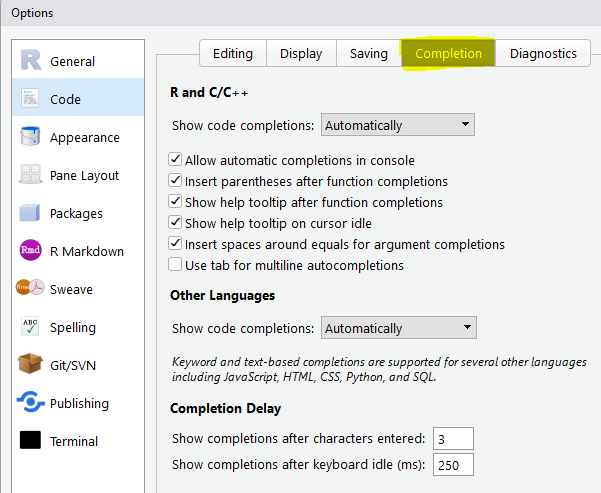
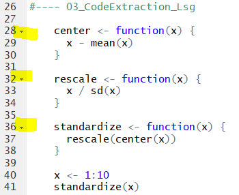

# Source-Pane

Der Source-Pane, oder auch Editor, ist ein äußerst hilfreiches Instrument bei der Erstellung von Programmen. Im Gegensatz zur Konsole ist es im Editor möglich, mehrere Befehle hintereinander aufzuzeichnen und diese dann nach Wunsch einzeln, blockweise oder gesamt auszuführen. Da in den meisten Füllen die Analyse von Daten aus mehreren/vielen hintereinander folgenden Arbeitsschritten (laden der Daten, Berechnung der deskriptiven Statistik, Erstellung von Graphen, inferenzstatistische Auswertung, etc.), ist die Programmierung ohne Editor undenkbar.

Der mit RStudio zur Verfügung gestellte Editor hat neben der Möglichkeit Programmcode aufzuzeichnen und zu speichern eine Fälle weiterer Möglichkeiten. Die wichtigsten Eigenschaften für einen Start in die R-Programmierung werden in den folgenden Kapiteln kurz angesprochen.

## Dateitypen {-}

Der Editor bietet für die Erstellung von Dokumenten verschiedene Fiel-typen an:

{ width=50% }

### R Script {-}

Das meist verwendete und für den Einstieg wesentliche Dokument ist das R Script. Geöffnete wird ein leeres Arbeitsblatt in welchem zeilenweise die Befehle und Funktionen von R eingefügt werden. Der Editor bietet aber darüber hinaus eine Vielzahl an weiterer Möglichkeiten, wie z.B.:

* Code-Complete Funktion
* Keyboard Shortcuts
* Code Snippets
* Extract Funktion
* Suchfunktionen
* Code Ausführung
* Traceback und Debugging
* Kommentare und Dokumentation von Code, oder Codeteilen

Anwendung und Eigenschaften dieser Möglichkeiten werden im folgenden besprochen.

### R-Markdown {-}

R-Markdown ist eine Dokumentenart, mit der Textverarbeitung mit gleichzeitiger Nutzung aller R-Funktionalitäten vereint werden. Besondere Erwähnung findet es hier deshalb, da alle zur Verfügung stehenden Unterlagen dieses Kurses mit R-Markdown erstellt wurden. Sofern es zeitlich möglich ist, werden wir am Ende der Lehrveranstaltung die Verwendung und Anwendbarkeit dieser Option besprechen.

### Andere Dokumentenarten {-}

Die restlichen Arten von Dokumenten sind spezielle Formate, die eine Einbindung von C++ und diversen Dokumentationsformaten erlauben. Zu erwähnen wäre in diesem Zusammenhang noch die *Shiny Web App*, mit welcher man relativ einfach Benutzerschnittstellen (UI's[^7]) erzeugen kann. Diese Schnittstelle ist vor allem dann von Vorteil, wenn bestimmte Programme auch für Nutzer die keinen R-Background haben zur Verfügung gestellt werden. 

[^7]: User Interfaces

## Nützliches im Editor {-}

Im folgenden beschäftigen wir uns kurz mit einigen der hilfreichsten Eigenschaften des RStudio-Editors.

### Code completion {-}

Unter *code completion* versteht man die Eigenschaft des Editors, während der Eingabe einer Funktions-, bzw. Variablennamens eine Liste der verfügbaren Funktionen/Variablen anzuzeigen und diese auch mit dem Tabulatur ($\rightleftharpoons$) zu übernehmen. 

Nach wie vielen Zeichen die Liste angezeigt wird, kann über die *Global Options* im Menü *Tools* eingestellt werden (standardmäßig wird nach 3 Zeichen die Liste angezeigt).

{ width=50% }

Öffne eine neue *R Script* Datei. Kopiere die erste Zeile des nachfolgenden Codes in das Skript und führe diese aus (markieren der Zeile mit anschließendem Drücken von *Ctrl Enter*). Gib nun die weiteren Befehlszeilen direkt in den Editor ein und beobachte den Effekt, der sich nach der Eingabe des dritten Zeichens zeigt.

### Keyboard Short-Cuts {-}

Mit Hilfe der Keyboard-Shortcuts können Zeichen, Funktionen, etc. schnell und einfach in das Skript eingefügt werden. Mit der Basisinstallation wurden bereits eine Menge von Shortcuts definiert. Eine Liste dieser Shortcuts ist durch den Shortcut *Alt Shift K*, oder unter folgendem Menü zu finden:

{ width=70% }

Welche der Shortcuts man sich wirklich merken soll ist Geschmacksache. Zwei sehr häufig von mir verwendete wären:

* Kommentar mit Ctrl Shift C
* Lange Zeilen besser darstellen mit Ctrl Shift /, etc. 

### Code Snippets {-}

Neben den Shortcuts bieten auch die *Snippets* eine bedeutende Erleichterung beim Schreiben von Codes. Dabei handelt es sich um Textmakros die häufig verwendete Codefragmente  in das Skript einfügen können. Vordefinierte Snippets können unter Tools $\rightarrow$ Global Options $\rightarrow$ Code $\rightarrow$ Edit angesehen und auch geändert, bzw. hinzugefügt werden.

{ width=50% }

Wie bei der *code completion* werden nach 3 eingegebenen Zeichen die vordefinierten Snippets in einer Liste angezeigt. Die Übernahme des Inhalts wird durch Auswahl gefolgt vom Tabulator ($\rightleftharpoons$) durchgeführt. Wird z.B. *fun* eingegeben, wird automatisch folgende Liste angezeigt:

{ width=70% }

Durch Wahl der entsprechenden Funktion (in diesem Fall das Snippet), wird das Makro ausgeführt und der vordefinierte Text in den Editor eingefügt. Probier es am besten selbst aus. Gib *fun* ein, wähle das *snippet fun* und drücke die Tabulatortaste. Diskutiere das Ergebnis.

### Extract Funktion {-}

Die extract function wird vor allem dann verwendet, wenn ein selbst geschriebener Codeteil in eine Funktion umgewandelt werden soll. Die Vorgehensweise ist dabei denkbar einfach:

1. schreibe einen Code.
2. markiere den Code.
3. wähle im Menü $\rightarrow$ Code $\rightarrow$  Extract Function, oder drücke *Ctrl Alt X*.
4. Bennen die Funktion.

Kopier die folgenden Zeilen in den Editor und wandle die Zeile:

1. *x - mean(x)* in eine Funktion mit dem Namen *center* um.
2. *x / sd(x)* in eine Funktion mit dem Namen *rescale* um.
3. *rescale(center(x))* in eine Funktion mit dem Namen *standardize* um.
4. Markiere die drei Funktionen sowie die Zeilen  *x <- 1:10* und *standardize(x)* und drücke *Ctrl Enter*
5. Diskutiere das Ergebnis.

Wenn alles funktioniert hat, sollte dein Code folgendermaßen aussehen:

### Suchfunktionen {-}

Häufig werden wir nach bestimmten Begriffen (Funktionsnamen, Variablennamen, etc.) innerhalb unseres Codes suchen. Mit *Ctrl f*, bzw. über das Menü *Edit* $\rightarrow$ *Find*, wird das zur einfachsten Sache - beachte das Suchfeld direkt unter der Symbolleiste, sowie die Möglichkeiten für die Einschränkung der Suche (In selection, Match case, etc.). Gleichzeitig wird damit auch die Möglichkeit gegeben, bestimmte Suchbegriffe im Text zu ersetzen (siehe *Replace* Feld).

{ width=50% }

Eine überaus wertvolle Suchfunktion kann durch *Ctrl Shift f*, bzw. über das Menü *Edit* $\rightarrow$ *Find in Files*, aufgerufen werden. Mit dieser Suchfunktion werden alle Files eines bestimmten Verzeichnisses auf bestimmte Begriffe durchsucht.

### Code Folding {-}

Mit *code folding* kann man vor allem bei längeren Programmen sehr gut die Übersicht von bestimmten Programmteilen behalten. Als Beispiel kann man den soeben erzeugten Code nochmals genauer betrachten:

{ width=30% }

Bei genauerem Hinsehen fallen einem vielleicht die schwarzen Dreiecke direkt neben der Zeilennummerierung auf. Klickt man diese mit der Maus an, wird entweder ein Teil des Codes auf eine Zeile reduziert (*folding*), oder falls bereits reduziert, wieder entfaltet.

Anwendung findet diese Möglichkeit vor allem bei Codeteilen, die bereits getestet wurden und deren Einzelheiten für die weitere Entwicklung von Code nicht von Interesse sind. Damit wird unwesentliche ausgeblendet und die Übersicht über den relevanten Code leichter behalten.

## Running Code {-}

Für die zeilenweise Ausführung von Code brauch man nur in der betroffenen Zeile *Ctrl Enter* drücken (die Zeile kann, aber muss dafür nicht markiert sein). Wir die Markierung verwendet, ist darauf zu achten, dass genau der markierte Inhalt ausgeführt wird!

Der Vorteil der Markierung liegt darin, dass nicht nur eine Zeile, sondern markierte Bereiche (Blöcke) ausgeführt werden können.

Darüber hinaus bieten sich im RStudio die Symbolleisten für die Ausführung von Code an:

{ width=30% }

## Traceback (Debugging) {-}

Eine wirklich geniale Sache bei RStudio ist die integrierte Möglichkeit des sogenannten *Debugging*. Um Debugging zu demonstrieren, verwenden wir den Codeteil aus dem Kapitel *extract function*. Bitte den nachfolgend gezeigten Code in ein neues RScript kopieren.

{ width=30% }

Führe nun folgende Schritte aus:

1. Speichere den neuen Code unter den Namen *03_DebuggingDemo.R*.
2. Ändere in der Funktion center *mean(x)* auf *meen(x)* (wir fügen absichtlich einen Fehler ein!)
3. Speichere das Skript und führe es aus (mit *Source* in der Symbolleiste)

](Images/03_Traceback.PNG){ width=60% } 

## Kommentare {-}

Ein gutes, nachvollziehbares und wiederverwendbares R-Programm basiert nicht alleine auf einer effiziente Programmierung, sondern auch auf einer entsprechende Beschreibung des Programms, bzw. bestimmten Teilen des Programmcodes. Um ein Programm zu dokumentieren gelten folgende Regeln:

  * Kommentare beginnen mit $\#$.
  * Kommentare enden mit dem Ende der Zeile.
  * Kommentare können am:
    + Anfang einer Zeile stehen: $\#$ Erstellungsdatum: 12.11.2018 
    + Nach einem Codeteil: *mean(x)* $\#$ Berechnung des Mittelwertes von *x*
  * Sehr lange Kommentare in einer Zeile können durch \textit{Ctrl Shift /} der Bildschirmbreite angepasst werden.
  
Einige Richtlinien für Kommentare in R findet ihr unter [Commenting guidelines](https://google.github.io/styleguide/Rguide.xml#comments)
