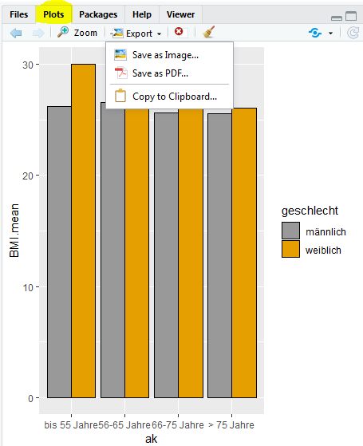
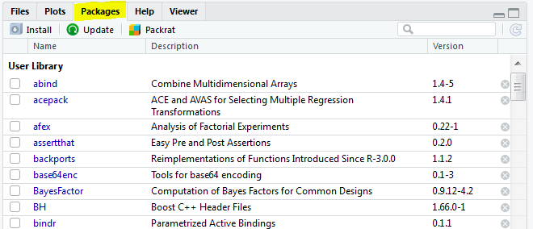
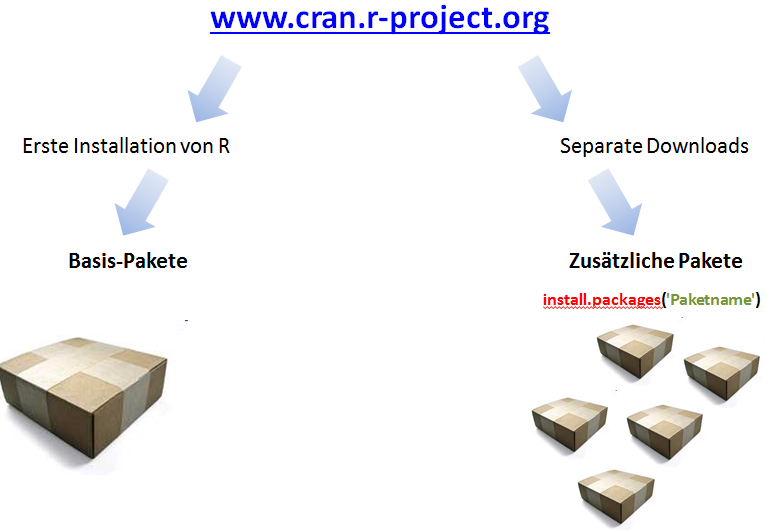
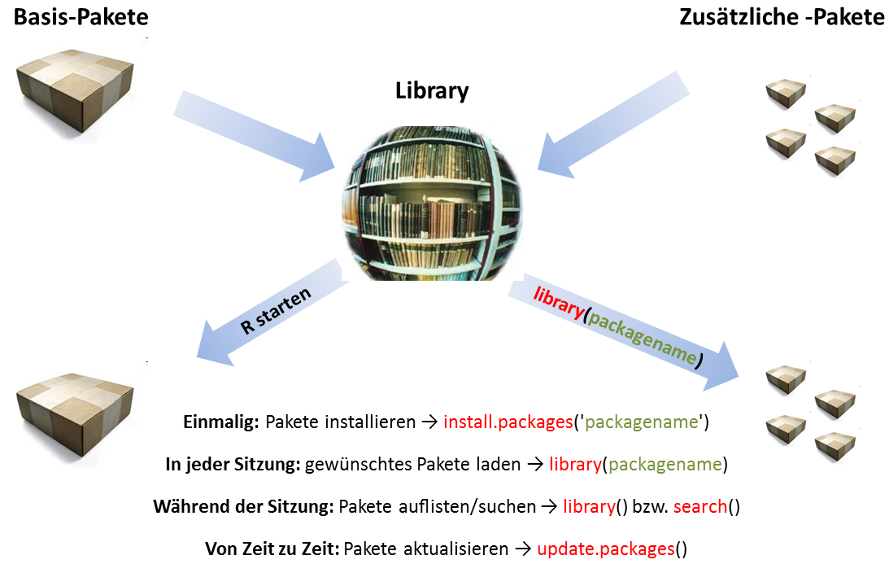

# Files-Pane


Über das Files-Pane können 5 unterschiedliche Registerkarte angesprochen werden:

* Files
* Plots
* Packages
* Help
* Viewer

## Files {-}

Entspricht im Wesentlichen einem Dateimanager. Angezeigt werden die Inhalte des aktuellen Arbeitsverzeichnis, welches direkt unter den Symbolen angezeigt wird. Man kann das Arbeitsverzeichnis auch in der Konsole mit der Funktion *getwd()* abfragen und gegebenenfalls auch in eine Variable zur weitern Verwendung in einer Variablen speichern (siehe nachfolgende Beispiele).


```r
getwd()       # gibt das aktuelle Arbeitsverzeichnis in der Konsole aus
WD <- getwd() # speichert das Arbeitsverzeichnis in der Variablen WD
setwd("E:/OwnCloud/LEHRE2019/18WS R-Intro")
setwd(WD)     # setzt das Arbeitsverzeichnis entsprechend des Inhaltes 
              # der Variable WD
```

## Plots {-}

Standardmäßig werden alle in R-erzeugten Plots in dieses Fenster geschrieben. über die Symbolleiste ist es möglich, zwischen den bereits generierten Plots zu blättern ($\leftarrow$, $\rightarrow$), einen Plot in einem eigenen Fenster zu öffnen (Zoom), die Graphiken zu exportieren (als PDF oder als Bild in den verschiedensten Formaten, wie z.B. png, jpg, eps, tiff, etc.), einzelne Graphen, bzw. alle Graphen zu löschen.

<center>

{ width=30% }

</center>

## Packages {-}

Eine zentrale Rolle bei der Verwendung von R spielen die Pakete. Im diesem Fenster kann man einerseits die bereits geladenen Pakete sehen, bzw. einen Update durchführen. Mit *Packrat* steuert man bei Projektarbeiten eine einheitliche Verwendung von Paketversionen für allen beteiligten Projektmitarbeitern.

<center>

{ width=50% }

</center>

### Umgang mit Paketen {-}

Pakete sind Sammlungen zusätzlicher Funktionen, die bei Bedarf geladen werden können. Sie enthalten häufig Beispieldaten, die zur Demonstration dieser Funktionen verwendet werden können. Obwohl R in der Basisversion schon mit einigen gängigen statistischen Funktionen und Modellen ausgestattet ist, erfordern die meisten unserer Arbeiten zusätzliche Pakete.

### Installation und Verwendung von Paketen {-}

Um ein Paket verwenden zu können, muss es zuerst installiert und dann geladen. Diese Schritte können in der Befehlszeile oder auf der Registerkarte "Pakete" ausgeführt werden. 

Im Fenster "Pakete" sieht man eine Liste aller derzeit auf Ihrem Computer installierten Pakete sowie 2 Schaltflächen mit der Bezeichnung "Install" oder "Update". Um ein neues Paket zu installieren, klickt man einfach auf die Schaltfläche *Install*.

Für die Arbeit mit Pakten ist folgendes zu beachten:

* R-Pakete müssen nur einmal installiert werden (bis R aktualisiert oder neu installiert wird). 

<center>

{ width=40% }

</center>

* Bei jedem Start einer neuen R-Sitzung muss jedoch jedes Paket, dass in der aktuellen Sitzung verwendet werden soll, geladen werden.

<center>

{ width=40% }

</center>

In der Abbildung sind auch die Funktionen zum Installieren und Aktualisieren angegeben. Da bei vielen Paketen fortlaufend Änderungen/Erweiterungen und Verbesserungen vorgenommen werden, ist in regelmäßigen Abständen nach Updates der geladenen Pakete zu suchen. Dies ist am einfachsten über das Menü *Tools* $\rightarrow$ *Check for Package Updates*, bzw. über die Funktion *update_packages()* (ist im Package *utils* enthalten) in der Konsole oder über den Editor durchzuführen. 

## Help {-}

Verschiedenen Möglichkeiten in R Hilfe in Anspruch zu nehmen, haben wir ja bereits in vorangegangenen Kapiteln angesprochen. Die unter dieser Registrierkarte befindliche Hilfe zu den einzelnen Funktionen ist in technischer Sicht sehr aufschlussreich, da es einer vollständigen Dokumentation der Funktionen innerhalb von Paketen entspricht.

Für Einsteiger in R kann diese Hilfe jedoch auch schnell *zu technisch* werden. Daher empfiehlt es sich, bei Bedarf auf die bereits hingewiesenen Alternativen von benutzerfreundlicheren Websites zurückzugreifen.

## Viewer {-}

RStudio enthält einen Viewer-Bereich, in dem lokaler Webinhalt angezeigt werden kann. Beispielsweise Webgrafiken, die mit Paketen wie googleVis, htmlwidgets und rCharts generiert wurden, oder lokale Webanwendung, die mit Shiny, Rook oder OpenCPU erstellt wurde.

Zu beachten ist, dass der Viewer-Bereich nur für lokale Webinhalte verwendet werden kann. Bei den Inhalten kann es sich entweder um statische HTML-Dateien handeln, oder um eine lokal ausgeführte Webanwendung handeln.

Für die aktuelle Lehrveranstaltung wird dieses Fenster keine, bzw. nur eine nachrangige Rolle spielen, daher verzichten wir fürs Erste auf weitere Ausführungen zu diesen Themen.
