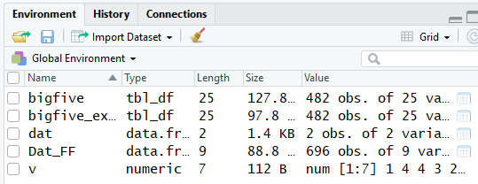
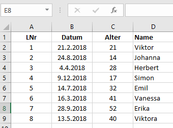

# Rlernen

## Top-Down vs. Bottom-Up {-}

Wie beim Erlernen einer neuen Sprache, gibt es auch für Programmiersprachen verschiedene Ansätze. Im Bottom-Up Ansatz wird man sich zuerst mit den Elementen einer Sprache (Vokabeln) und deren korrekter Zusammensetzung (Grammatik) beschäftigen. Dieser Ansatz ist vor allem zu Beginn oft schwierig und mühsam, da die Zusammenhänge erst nach einiger Zeit klar werden und die (erfolgreiche) Anwendung der Sprache erst nach einer mehr oder weniger langen *Vorlaufzeit* möglich ist.

Beim Top-Down Ansatz wird man direkt mit dem gesamten Umfang der Sprache konfrontiert. Sprachbausteine werden von anderen übernommen, Details zur Struktur, den Regeln und eine Erweiterung des Wortschatzes bilden sich durch die Übernahme von Experten.

Bei der Erlernung einer Programmiersprache bietet sich vor allem durch die unzähligen Möglichkeiten  von Beispielen und Vorlagen im Internet, sowie die bis ins letzte Detail ausgearbeiteten Hilfeseiten zu den jeweiligen Sprachen eine Mischung des Lernvorganges an. 
Wir werden den Einstieg in die Programmiersprache R mit einem Top-Down Ansatz beginnen.

### Top Down - Copy und Paste {-}

Erstelle eine neue R-Script-Datei. Kopiere den nachfolgenden Code in diese neue Datei und speicher diesen unter den Namen *06_R_Paste_Copy_Intro.R* in ein Verzeichnis deiner Wahl.


```r
#------------------------------- Initialisierung
rm(list = ls())
if (!require("pacman")) install.packages("pacman")
pacman::p_load(ggplot2)
#------------------------------- Ende Initialisierung
```

Öffne einen Browser (Mozilla, IE, Chrome, ...) und bearbeite folgende Aufgabenstellungen:

### Copy und Paste (Aufgabenblock) {-}

1. Kopiere von [Indexing with numbers and names](http://www.cookbook-r.com/Basics/Indexing_into_a_data_structure/){target="_blank"} die Zeile $v <- c(1,4,4,3,2,2,3)$ in das neue Skript und führe diese Zeile aus. Beschreibe die Auswirkung dieser Zeile bezüglich der Änderungen im Konsolen- und Environment-Fenster.
2. Kopiere (aus der Website) die Zeile $v[c(2,3,4)]$ in das neue Skript und führe diese Zeile aus. Beschreibe die Auswirkung dieser Zeile bezüglich der Änderungen im Konsolen- und Environment-Fenster.
3. Gehe zur folgenden Website: [Bar and line graphs (ggplot2)](http://www.cookbook-r.com/Graphs/Bar_and_line_graphs_(ggplot2)/){target="_blank"} und kopiere aus dem Block *Bar graphs of values* die ersten vier Zeilen in den Editor. Führe diese Zeilen aus und diskutiere das Ergebnis.
4. Kopiere nun von dieser Website den zweiten Codeblock und führe den Code aus. Diskutiere das Ergebnis (siehe Plots-Fenster).
5. Kopiere nun die zwei Codeblocks im Kapitel "Bar graphs of counts" und führe den Code aus. Beachte vor allem, woher die Daten (tips) kommen! 
6. Gebe die Befehle data() und ?tips, bzw. ?french_fries ein und diskutiere das Ergebnis.
7. Führe folgende zwei Zeilen aus: 
    + Dat_FF <- french_fries
    + str(Dat_FF)
8. Laden mit Hilfe von Import Dataset die SPSS-Datei "bigfive.sav" und kopiere die entsprechenden Befehle in dein Skript.
9. Lade nun die Datei "bigfive_excel.xlsx" (ebenfalls in ../Data/) mit Hilfe von Import Dataset und kopiere die entsprechenden R-Befehle in den Editor.

## Objekte in R (bottom up) {-}

In R kann alles als Objekt gespeichert werden. 

* Einzelne Werte Mehrere Werte (z. B. als Datensatz mit Rohdaten)
* Tabellen
* Statistische Modelle
* Ergebnisse statistischer Analysen
* Funktionen, etc.

Alle Objekte, die in einer R-Sitzung erstellt oder geöffnet wurden, liegen im sogenannten Environment (Arbeitsbereich). Bei der letzten Übungsaufgabe wurden folgende Objekte im Environment angelegt:

<center>

{ width=50% }

</center>

Das Anlegen eines Objektes im Environment erfolgt über die Zuweisung *Objektname <- Objektinhalt*. Die Zuweisung über das *<-* ist dabei R-spezifisch. Man kann auch das übliche *=* verwenden, wobei dieses in R auch noch eine andere Eigenschaft hat (Details später). 

Für die Vergabe von *Objektnamen* sind folgende Regeln zu beachten:

* Objektname darf nicht mit Zahl beginnen
* Objektname darf keine Operatoren enthalten (+, -, * etc.)
* Auf Groß- und Kleinschreibung achten

In gibt es eine Vielzahl von verschiedenen Objekttypen. Die grundlegenden Objekttypen (und deren Gemeinsamkeit mit SPSS-Datentypen) sind:

* Vektoren $\rightarrow$ ordinale/metrische Variablen
    + numeric (Zahlen)
    + character (Buchstaben)
* Faktoren $\rightarrow$ nominale/ordinale Variablen
    + nominale Variable
    + Kategorien des Faktors = levels (kann Buchstaben oder Zahlen enthalten)
* Data Frames (mehrere Zeilen und Spalten) $\rightarrow$ Datensatz
    + Spalten (Vektoren und Faktoren
    + Zeilen (Fälle, z. B. Versuchspersonen)
* Matrizen $\rightarrow$ in SPSS nicht vorhanden
    + viele Zeilen und Spalten
    + es können nur Daten eines Typs (z. B. numerische Werte, oder nur Faktoren, etc.) dargestellt werden.
* Arrays $\rightarrow$ in SPSS nicht vorhanden
    + Kombination mehrerer Matrizen (Zusammenfassungen von Elementen des gleichen Datentyps (numeric, character, logical), werden über 2 oder mehr Indizes adressiert).
* Listen $\rightarrow$ in SPSS nicht vorhanden
    + Kombination mehrerer Objekte 
    + Listen können beliebige Objekte enthalten, auch Objekte verschiedenen Typs. 
    + Im Unterschied zu Data Frames und Arrays können auch Objekte unterschiedlicher Länge gespeichert werden.

### Vektoren {-}

Das einfachste Objekt ist ein Vektor, der aus mehreren  Elementen besteht. Öffne eine neue Skript-Datei und kopiere folgenden Inhalte in diese Datei:


```r
  name       <- "Max Mustermann" # Beachte das Fenster Environment
  mein.alter <- 35
  mein.alter
  mein.alter + 10
  mein.alter.1 <- mein.alter + 10
  mein.alter.1
```

Speichere die Datei unter dem Namen *06_Objekte.R*. Führe nun die Inhalte zeilenweise aus und diskutiere die Wirkung der einzelnen Zeilen! Kopiere nun den folgenden Code in die Datei und führe diesen Code zeilenweise aus. Was passiert dabei im Environment?


```r
  # Fasse Zahlen in einem Vektor zusammen
    alter    <- c(19, 24, 20, 19) # Beispiel: Alter von 4 Studenten
    kurs.num <- c(1, 3, 2, 2) # Beispiel: Zugeh?rigkeit zu einem von 3 Kursen
  # Fasse Buchstaben in einem Vektor zusammen
    kurs.bez <- c('Kurs1', 'Kurs3', 'Kurs2', 'Kurs2')
  # Zeige Inhalt des Vektors
    alter
    kurs.num
    kurs.bez
```

Um auf einzelne Elemente eines Vektors zuzugreifen gibt es mehrere Möglichkeiten.

1. Zugriff durch direkte Indizierung
2. Zugriff durch Variablen (Vektoren), in denen die Indizes der Elemente auf die man zugreifen will abgespeichert sind.

Der folgende Code zeigt beide dieser Möglichkeiten. Kopiere den Code in das Skript und führe diesen zeilenweise aus.


```r
    alter[2]   # direkte Indizierung, das zweite Element des Vektors wird ausgegeben
    alter[1:3] # direkte Indizierung, das erste bis dritte Element des Vektors wird ausgegeben.
               # Beachte dabei die Verwendung von :
    2:4        # erzeugen eines Vektors der in ganzen Schritten von 2 beginnend bis 4 hinaufz?hlt
    v_1 <- 2:4 # speichern des Vektors in der Variablen v_1
    alter[v_1] # Verwendung des Vektors v_ind um die Elemente des Vektors alter auszugeben
    v_2 <- seq(from = 1,  # erzeugen einer Sequenz von Zahlen, die mit 1 beginnt, bei 4 endet
               to   = 4,  # und in 2-er Schritten hinaufz?hlt
               by   = 2)  # Die Sequenz wird in v_2 gespeichert.
    alter[v_2] # Verwendung des Vektors v_2 um die Elemente des Vektors alter auszugeben.
    alter[-4]  # um Werte eines Vektors nicht anzuzeigen, kann der Index des entsprechenden
               # Wertes mit einem f?hrenden Minuszeichen angegeben werden. Dadurch wird der 
               # vierte Eintrag des Vektors nicht ausgegeben!
    v_3  <- c(1, 3, 4) # auch die Verwendung der Funktion c() kann zur Erstellung von Indexlisten
                       # verwendet werden.
    alter[v_3]
```

Um festzustellen, um welche Art von Daten, bzw. welche Klasse von Daten (numerisch, alphanumerisch, Datum, etc.) im jeweiligen Objekt abgespeichert sind, kann die Funktion *class()* verwendet werden. Das Ändern des Datentyps eines (einfachen) Objektes ist durch die Funktionen *as.numeric(variable)*, bzw. *as.character(variable)* möglich. Darüber hinaus gibt es noch viele Funktionen, die bezüglich des Datentyps von Objekten verwendet werden können. Einige dieser Funktionen werden bei den entsprechenden Anwendungen im Detail besprochen.


```r
    class(alter) # Zeigt an, zu welcher Klasse die Inhalte des Objekts alter geh?ren
    alter_char <- as.character(alter) # wandelt num in char
    class(alter_char)
    alter_num  <- as.numeric(alter_char) # wandelt char in num
    class(alter_num)
```

Das Wandeln von numerisch auf alphanumerisch und vice versa sind jedoch häufig gebrauchte Funktionen, vor allem bei der Übernahme von Daten aus anderen Anwendungen.

### Arithmetische Operator (Vektorenrechnung) {-}

In R werden  +  -  *  / für Addition, Subtraktion, Multiplikation und Division verwendet. Diese Operatoren werden auf alle Elemente eines Vektors angewendet: 


```r
    Geburtsjahr <- 2018 - alter
    Alter_Tage  <- alter * 365
    v1 <- 1:5
    v2 <- v1*2
    v2
    v2 <- v2 - .5
    v2
    v3 <- c(2, 5, 8, 10, 12)
    v4 <- v1 * v3
```

### Weitere nützliche Vektor-Funktionen {-}

Neben der bereits besprochenen Funktion *seq()*, sind auch nachfolgende Funktionen für das Arbeiten mit Vektoren oft nützlich. Da wir diese Funktionen laufend verwenden, werden hier nicht alle Einzelheiten diskutiert - verwende dazu die help() Funktion. 


```r
    y <- c("a", "b", "c", "d") 
    rep(y, 3) # Replicate Elements of Vectors and Lists
    rep(1:5, 4)
    n <- c(2, 4, 1, 10)
    rep(y, n)
    y <- c("i", "i", "a", "a", "E", "E", "E", "E", "U")
    unique(y) # eindeutige Elemente eines Vektors
    table(y)  # erstellt eine Kreuztabelle
    sort(y)   # sortieren von Vektoren (ACHTUNG: order() bei Datenstrukturen verwenden, siehe sp?ter)
    paste(y, 1:9)
    paste0(y, 1:9)
```

### Logische Vektoren {-}

Ein logischer Vektor besteht aus TRUE und FALSE Elementen. Diese Vektoren folgen einer sogenannten *Boolean-Logik* mit diesen Prinzipien (in R wird das logische UND mit $\&$, das logische ODER mit $|$ geschrieben:

* T und  T gleicht T (T & T $\rightarrow$ T)
* F und  F gleicht F (F & F $\rightarrow$ F)
* T und  F gleicht F (T & F $\rightarrow$ F)
* T oder T gleicht T (T | T $\rightarrow$ T) 
* F oder F gleicht F (T | T $\rightarrow$ F)
* T oder F gleicht T (T | T $\rightarrow$ T)

Werden Klammern verwendet gilt: Ausdruck innerhalb der Klammern wird zuerst ausgewertet! Mit der *sum()* Funktion können die Anzahl der wahren (T) Elemente eine Vektors ermittelt werden. Ein Anwendungsbeispiel wäre z.B., mit einer logischen Abfrage zu ermitteln, wie viele Ja-Antworten in einem Vektor bestehend aus Ja/Nein Antworten vorhanden sind (siehe nachfolgenden Code).


```r
    T & T
    F & F
    T & F
    T | T
    F | F
    T | F
    (T & F) | T
    
    Vec <- c(rep( "Nein", len = 25), 
                   rep( "Ja", len = 43),
                   rep( "Weder noch", len = 12))
    sum(Vec == "Ja")
```

### Der %in% Operator und die which()-Funktion {-}

Der %in% Operator wird benutzt, um einem Vektor mehrere Elemente zu entnehmen. Dies kann auch mit sämtlichen Teilfragen und dem | Operator durchgeführt werden. Nachfolgend erzeugen wir einen logischen Vektor *InVec*, der T ist, wenn *Vec* "Nein" oder "Weder noch" enthält:


```r
    InVec <- Vec %in% c("Nein", "Weder noch")
    InVec
```

Logische Operatoren und die *which()* Funktion bieten eine effiziente Möglichkeit auf Elemente eines Vektors zuzugreifen. Betrachte folgende Beispiele:


```r
    VRand <- rnorm(200, mean = 50, sd = 8)
    VRand_GT_Mean_Indices <- VRand >= mean(VRand, na.rm = T)
    VRand[VRand_GT_Mean_Indices]
    sum(VRand_GT_Mean_Indices)
    sum(VRand_GT_Mean_Indices == "TRUE")
    sum(VRand_GT_Mean_Indices != "TRUE")
    any(VRand_GT_Mean_Indices)
    which(VRand_GT_Mean_Indices)
    which(VRand_GT_Mean_Indices == "TRUE")    
    which(VRand_GT_Mean_Indices == "FALSE")    
```

### Aufgabenblock Vektoren {-}

Kopiere den folgenden Code in eine neues R-Skript und speichere dieses unter dem Namen *06_Objekte_Aufgaben*.


```r
    # Vektoren - Combine
    id     <- c(11, 16, 17, 18, 19, 20, 23) # c() entspr. combine; <- Zuweisung zu einer Variablen
    Geschlecht <- c("m?nnlich", "weiblich")
    sex    <- c(1, 1, 7, 1, 1, 2, 2)
    lalt   <- c(2, 3, 2, 3, 1, 1, 2)
    gross  <-  c(173, 166, 178, 154, 164, 389, 181)
    mon    <- c(266, 241, 231, 265, 225, 229, 222)
    date   <- c(4, 5, 3, 3, 2, 4, 3)
    entsch <- c(3, 4, 4, 5, 3, 1, 2)
    proj   <- c(2, 1, 2, 2, 2, 1, 2)
    i1     <- c(3, 2, 1, 3, 4, 2, 2)
    i2     <- c(3, 2, 1, 3, 4, 2, 2)
    i3     <- c(3, 3, 3, 2, 2, 2, 4)
    i4     <- c(2, 1, 2, 4, 2, 1, 4)
    i5     <- c(2, 1, 4, 1, 3, 4, 1)
```

Bearbeite nun folgende Aufgaben:

1. berechne den Mittelwert der Variablen *gross*.
2. kopiere die Variable *gross* in eine neue Variable *gross1*.
3. ersetze den ersten Wert von *gross1* mit dem Wert NA.
4. berechne den Mittelwert von *gross1* - diskutiere das Ergebnis.
5. berechne den Mittelwert von *gross1* unter Berücksichtigung fehlender Werte (verwende die Hilfe um über die Parameter der Funktion mean() nachzulesen!).
6. berechne den Mittelwert von *gross1*, wobei 50% der Werte (je 25% der ersten und 25% der letzten) nicht in die Mittelwertberechnung einbezogen werden sollen.
7. bilde das Produkt des zweiten mit dem dritten Wert der Variablen *gross* und speichern das Ergebnis in der Variablen *gross_prod*.
8. setzte den dritten Wert der Variablen *sex* auf 1.
9. erstelle eine Variable (*x*), deren Werte absteigend und in Einserschritten von 50 nach 1 sein sollen.
10. zeige alle bis auf den zweiten Wert der Variablen *x* an.
11. erstelle eine Sequenz (*x*) die mit 1 beginnt und in Zweierschritten hinaufzählt.
12. erstelle eine Sequenz (*x*) die mit 10 beginnt und in Zweierschritten hinunterzählt.
13. erstelle eine Sequenz (*x*) die mit 0 beginnt und in Zweierschritten bis 10 hinaufzählt und deren letzter Wert 50 ist (also x = 0 2 4 ... 10 50).
14. stelle fest, welcher Klasse der Vektor *x* zugeordnet ist.
15. wandle den Vektor *x* vom Datentyp 'numeric' auf 'character' und speichere das Ergebnis in *x_c*.
16. stelle fest, welcher Klasse der Vektor *x_c* zugeordnet ist.
17. wandle den Vektor x zurück in Datentyp 'numeric' und speichere das Ergebnis in *x_n*
18. stelle fest, welcher Klasse der Vektor *x_n* zugeordnet ist.
19. wie viele Personen sind größer-gleich ($\ge$) als 173?
20. für welches Element der Variablen *gross* ist die Körpergröße = 181 wahr (T)?

## Faktoren {-}

Faktoren sind eine spezielle Form von Vektoren und werden auch in R als nominale Daten definiert. Beispielsweise wird die Unterteilung von Probanden nach dem Geschlecht üblicherweise in einem Datentyp *Faktor* abgespeichert. Dieser Faktor würde üblicherweise 2 sogenannte Faktorenstufen (*levels*) besitzen (männlich/weiblich).

Faktoren können aber durchaus auch mehrere Faktorenstufen aufweisen. Zum Beispiel könnte ein Faktor die höchst abgeschlossene Schulbildung (Hauptschulabschluss, Abitur, FH, Uni) abbilden. Dieser Faktor hätte demnach 4 Stufen. 

Da Faktoren auf nominalen Niveau definiert werden, ist eine Zuordnung von *levels* und *labels* möglich. Für SPSS-Nutzer ist diese Möglichkeit etwas verwirrend, da die Bedeutung in R folgende ist:

* levels sind der Input, also wie die Stufen kodiert sind (im Beispiel mit 1, 2, 3).
* labels sind der Output, also welche levels mit welchem label versehen werden.

Um mehrere Daten einem Faktor zuzuordnen, wird der *factor()*-Befehl mit dem *c()*-Befehl kombiniert. Kopiere folgenden Code in das Skriptfile und führe die Befehle zeilenweise aus. Diskutiere die Ergebnisse.


```r
    # Fasse Zahlen in einem Vektor zusammen
    alter    <- c(19, 24, 20, 19) # Beispiel: Alter von 4 Studenten
    kurs.num <- c(1, 3, 2, 2) # Beispiel: Zugeh?rigkeit zu einem von 3 Kursen
    # Fasse Buchstaben in einem Vektor zusammen
    kurs.bez <- c('Kurs1', 'Kurs3', 'Kurs2', 'Kurs2')

    A <- factor(c("male", "female", "female", "male"))
    A
    levels(A)
    nlevels(A)

    kurs.fac1 <- factor(kurs.num)
    class(kurs.fac1)

    kurs.fac2 <- factor(kurs.num, 
                        levels = c(1, 2, 3), 
                        labels = c('Kurs1', 'Kurs2', 'Kurs3'))
    str(kurs.fac2)
    levels(kurs.fac2)
    table(kurs.fac2)
```

### Aufgabenblock Faktoren {-}

1. erstelle die Variable x = c(1,2,3,1,1,2,2) und wandeln diese in einen Faktor *x_fact* um. Benenne die Stufen des Faktors der Variablen x_fact mit 'A', 'B', ...
2. kopiere *x_fact* in Variable *x_fact2* und ändere die Bezeichnung der Faktorenstufen auf 'S1', 'S2', ... (verwenden dazu die Funktion levels(...)). Verwende den Befehl *table()* um die Variable *x_fact2* anzuzeigen. Was bewirkt der Befehl?
3. gib folgenden Befehl ein: x_fact3 = factor(x_fact2, levels = c('S3', 'S1', 'S2')).  Vergleiche *x_fact2* und *x_fact3*, was hat sich geändert?

## Matrizen {-}

Matrizen sind in R Objekte, denen Elemente gleichen Datentyps in Form von Zeilen und Spalten zugewiesen können. Damit können Vektoren des gleichen Datentyps in ein Objekt (der Matrix) zeilen-, oder spaltenweise zusammengehängt und abgespeichert werden. In R kann eine Matrix aus Vektoren mit den *rbind()* und *cbind()* Funktionen zusammengesetzt werden. 

* Mit *rbind()* werden die Vektoren als Reihen der Matrix gespeichert, und 
* mit *cbind()* als Spalten.

Werden Vektoren mit unterschiedlichen Datentypen durch diese Funktionen zusammengefasst, werden alle Werte in der Matrix als Typ *character* gespeichert. Kopiere den Code aus folgenden Block und führe diesen zeilenweise aus. Diskutiere die Ergebnisse.


```r
    A <- 1:10
    B <- sample(15:93, 10, replace = TRUE)
    C <- rbind(A,B)      # Zeilenweises zusammenführen der beiden Vektoren
    str(C)               # Zeigt die Struktur und jeweiligen Datentypen in der Struktur von Matrix C
    
    matrix.col           <- cbind(A, B) # Spaltenweises zusammenf?hren der beiden Vektoren
    matrix.col
    colnames(matrix.col) <- c("LNr", "Alter")
    rownames(matrix.col) <- paste0("VP", 1:10)
    matrix.col

    matrix.col.Alternativ <- cbind(LNr = A, Alter = B) # sofortige Benennung der Variablen
    matrix.col.Alternativ
    
    matrix.rows           <- rbind(A, B) # Zeilenweises zusammenführen der beiden Vektoren
    matrix.rows
    
    AnzZeilen  <- nrow(matrix.rows)
    AnzSpalten <- ncol(matrix.rows)
    DimMat     <- dim(matrix.rows)
    DimMat[1] # Anzahl Zeilen in der Matrix matrix.rows
    DimMat[2] # Anzahl Spalten in der Matrix matrix.rows
```

Wie dem obigen Code zu entnehmen ist, kann bei einer Matrix sowohl der Spaltenname wie auch die Bezeichnung der Zeilen mit den Funktionen *colnames()* und *rownames()* festgelegt werden. Vor allem bei den Spaltenbezeichnungen erweist sich diese Möglichkeit für viele Anwendungen noch als sehr hilfreich.

Um festzustellen, wie viele Zeilen, bzw. Spalten eine Matrix besitzt, kann man entweder dem Environment (Spalte Value) entnehmen, oder direkt mit den Funktionen *nrow(Matrix)* / *ncol(Matrix)* abfragen. Die Funktion *dim(Matrix)* liefert als Ergebnis einen Vektor, dessen erster Eintrag die Zeilenanzahl und der Zweite die Spaltenanzahl beinhaltet[^10].

[^10]: das Wissen um die Dimension einer Matrix wird vor allem noch bei Programmschleifen hilfreich sein. Mehr davon später.

### Zugriff auf Elemente einer Matrix {-}

Wie bereits bei Vektoren, wird auch bei Matrizen ein Index für die Adressierung einer Position verwendet. Im Unterschied zum Vektor, werden bei Matrizen zwei Indizes verwendet:

* der erste Index bezieht sich immer auf die Zeilennummer einer Matrix
* der zweite Index bezieht sich immer auf die Spaltennummer einer Matrix

Folgende Beispiele verdeutlichen die Verwendungsmöglichkeiten der Adressierung mit Indizes:


```r
    matrix.rows
    matrix.rows[2,]    # liest alle Elemente der zweiten Zeile einer Matrix
    matrix.rows[,2]    # liest alle Elemente der zweiten Spalte einer Matrix
    matrix.rows[1,2]   # liest das Element der ersten Zeile und der zweiten Spalte einer Matrix
    matrix.rows[2,1]   # liest das Element der zweiten Zeile und der ersten Spalte einer Matrix
    matrix.rows[1,3:4] # liest das Element der ersten Zeile und der dritten bis vierten Spalte einer Matrix
    ZI <- 2            # Zeilenindex
    SI <- c(1,3,4)     # Spaltenindex
    matrix.rows[ZI,SI] # liest die ZI'te Zeile(n) und die SI'ten Spate(n)
    
    matrix.rows[3]     # Gibt das dritte Element eine Matrix aus. Ausgehend von der ersten Zeile und Spalte,
                       # werden die Elemente der ersten Spalte aufsteigend nummeriert. Am Ende einer Spalte,
                       # wird die Nummerierung in der ersten Zeile der nachfolgenden Spalte fortgesetzt - 
                       # bis das Ende der Matrix erreicht ist.
    matrix.rows[6]
```

*Bemerkung:* verwendet man bei einer Matrix nur einen Index, so wird das entsprechende Element eine Matrix ausgegeben. Die Nummerierung wird dabei folgendermaßen festgelegt: ausgehend von der ersten Zeile und Spalte werden die Elemente der ersten Spalte aufsteigend nummeriert. Am Ende einer Spalte wird die Nummerierung in der ersten Zeile der nachfolgenden Spalte fortgesetzt - bis das Ende der Matrix erreicht ist. 

### Erzeugen von Matrizen {-}

Es gibt verschiedenstes Möglichkeiten, Matrizen mit Hilfe von R-Funktionen zu erzeugen. Vor allem für Simulation von Daten (z.B. Ziehung eines Samples der Größe $N$ aus einer normalverteilten Grundgesamtheit, oder aus einer Gleichverteilung etc.) kann für die Evaluierung von statistischen Modellen elegant gelöst werden. Folgende Beispiele geben einen Einblick in einige wenige Möglichkeiten Matrizen zu generieren. Kopier den Code in deinen Editor und führe diesen zeilenweise aus. Diskutiere die Funktionen und die Ergebnisse.


```r
    matrix(5, 3, 3)
    matrix( rep( 0, len = 25), nrow = 5)
    matrix(runif(9), 3, 3)
    a <- sample(1:100, 9, replace = TRUE)
    matrix(a, 3, 3)
    b <- rnorm(9, mean = 100, sd = 15)
    matrix(b, 3, 3)
```

### Arithmentische Funktionen auf zwei Matrizen {-}

Wenn arithmetische Funktionen auf zwei Matrizen angewendet, dann werden immer zwei Elemente derselben Zeile und Spalte addiert, subtrahiert, multipliziert oder dividiert. Aus diesem Grund ist es auch erforderlich, dass die Dimension (= Anzahl Zeilen und Spalten, auch $m \times n$) der beiden Matrizen übereinstimmt. Dies kann mit Hilfe von logischen Operatoren überprüft werden.

Ohne auf weitere Details einzugehen, sei hier noch die Berechnung des Skalarproduktes zweier Matrizen erwähnt. Dieses wird durch den Operator $\%*\%$ berechnet. Kopier den folgenden Code in den Editor und führe diesen Zeilenweise aus. Diskutiere die Ergebnisse.


```r
    R1 <- rnorm(9, mean = 100, sd = 15)
    m1 <- matrix(R1, 3, 3)
    R2 <- rnorm(9, mean = 100, sd = 15)
    m2 <- matrix(R2, 3, 3)
    dim(m1) == dim(m2)
    R3 <- rnorm(12, mean = 100, sd = 15)
    m3 <- matrix(R3, 4, 3)
    dim(m1) == dim(m3)

    m1 * m2    
    m1 - m2
    m1 / m2    

    m4 <- m1 %*% m2 # ACHTUNG: berechnet das Skalarprodukt!
    m4
    m5 <- m1[,1] %*% m2[,1]
    m5
```

Darüber hinaus können auch Funktionen wie *mean()*, *median()*, *sum()*, etc. auf alle Elemente einer Matrix angewendet werden. Kopier den folgenden Code in den Editor und führe diesen zeilenweise aus. Diskutiere die Ergebnisse.


```r
    R6 <- rnorm(24, mean = 100, sd = 15)
    m6 <- matrix(R6, 8, 3)
    mean(m6)           # Grand Average der Matrix m1
    apply(m6, 1, mean) # Mittelwert der Zeilen
    apply(m6, 2, mean) # Mittelwert der Spalten
```

Die hier verwendete Funktion *apply()* ist Teil einer Funktionsgruppe, die als Alternative für Schleifen verwendet werden kann. Weitere wichtige Funktionen dieser Gruppe sind:

* lapply() - Anwendung einer Funktion auf die Elemente einer Vektoren, Dataframes und Listen. Liefert als Ergebnis eine Liste.
* sapply() - vereinfacht die Ausgabe der lapply()-Funktion.
* rep() - zum wiederholten Replizieren von Vektoren und/oder Faktoren.

Anwendung und Details über diese Funktionen werden in entsprechenden Kapiteln behandelt.

### Aufgabenblock Matrizen {-}


```r
    id     <- c(11, 16, 17, 18, 19, 20, 23) # c() entspr. combine; <- Zuweisung zu einer Variablen
    Geschlecht <- c("männlich", "weiblich")
    sex    <- c(1, 1, 7, 1, 1, 2, 2)
    lalt   <- c(2, 3, 2, 3, 1, 1, 2)
    gross  <-  c(173, 166, 178, 154, 164, 389, 181)
    mon    <- c(266, 241, 231, 265, 225, 229, 222)
    date   <- c(4, 5, 3, 3, 2, 4, 3)
    entsch <- c(3, 4, 4, 5, 3, 1, 2)
    proj   <- c(2, 1, 2, 2, 2, 1, 2)
    i1     <- c(3, 2, 1, 3, 4, 2, 2)
    i2     <- c(3, 2, 1, 3, 4, 2, 2)
    i3     <- c(3, 3, 3, 2, 2, 2, 4)
    i4     <- c(2, 1, 2, 4, 2, 1, 4)
    i5     <- c(2, 1, 4, 1, 3, 4, 1)
```

Unter Verwendung der obigen Variablen sind folgende Aufgaben zu bearbeiten:

1. erstelle eine Matrix *X*, in welcher die Variablen *lalt*, *sex* und *gross* als Spalten gespeichert sind.
2. erstelle eine Matrix *Z*, in welcher die Variablen *lalt*, *sex* und *gross* als Zeilen gespeichert sind.
3. Gib den Wert der zweiten Zeile und dritten Spalte der Variablen *X* aus.
4. Gib die dritte Zeile der Variablen *X* aus (alle Spalten).
5. Gib die 3te bis 5te Zeile und 1te bis 2te Spalte der Variablen *X* aus.
6. Verwende den Befehl *colnames()* um die Spaltenbezeichungen der Variablen *X* anzuzeigen.
7. erstelle eine Variable *ColNames* mit den Werten 'Alter', 'Gewicht' und 'Groesse'.
8. weise der Variablen *X* diese neuen Spaltenbezeichungen zu (verwende den Befehl *colnames()*).
9. erstelle eine Variable *namen*, in welcher 7 beliebige Namen gespeichert sind.
10. verwende diese Variable um der Matrix *X* diese Namen als Zeilenbezeichnung zuzuweisen (verwenden den Befehl *rownames()*).
11. probiere den Befehl *fix(X)*, vgl. in der Hilfe, was der Befehl macht und diskutiere die Eigenschaften.
12. ermittle die 'Dimension' der Matrix *X* (verwende den Befehl *dim()*).
13. ermitteln die 'Länge' der Matrix *X* (verwende den Befehl *length()*).
14. Berechne die Körpergröße in Meter und füge das Ergebnis als weitere Spalte zur bestehenden Matrix *X* an.
15. Ermittle jene Positionen (Indizes) der Personen die größer als 200 cm sind. Was ist der Name der Person?

## Data-Frames {-}

Eine Erweiterung des Datentyps *Matrix* ist der sogenannte *Dataframe*. Mit diesem Datentyp ist es möglich, innerhalb eines Objektes auch unterschiedliche Formate (Datentypen) zu speichern. Bei Vektoren und Matrizen gilt die Einschränkung, dass alle Elemente denselben Datentyp aufweisen müssen. Bei Matrizen gilt darüber hinaus, dass beim Hinzufügen von z.B. einer weiteren Spalte die Anzahl der Zeilen der bereits bestehenden Zeilenanzahl der Matrix entspricht (anderenfalls gibt es eine Fehlermeldung).

Bei einem *Dataframe* können nun Daten unterschiedlichen Typs in ein Objekt zusammengefasst werden. Allerdings bleibt die Voraussetzung, dass die Länge der unterschiedlichen Elemente (Vektoren) gleich ist. 

Ein *Dataframe* ist in gewisser Weise vergleichbar mit einer Excel-Tabelle. 

<center>

{ width=30% }

</center>

In der ersten und dritten Spalte (LNr, Alter) sind numerische Werte, in der zweiten ist ein Datum und in der vierten ein Name (String, Charakters). Wärde diese Tabelle in R als Matrix gespeichert, würde R alle Daten in den Datentyp *character* umwandeln! Bei einem *Datenframe* wird im Gegensatz dazu der Datentyp jeder Spalte beibehalten. 

Um aus bestehenden Objekten (Vektoren, Matrizen) einen Datenframe zu erstellen, wird die Funktion *data.frame()* benutzt. Der Zugriff auf die Elemente eines Dataframes ist gleich wie bei Matrizen. Der Name des *Dataframes* gefolgt von zwei eckigen Klammern, innerhalb welcher die Indizes der Zeilen und Spalten angegeben werden. Entsprechend kann auch die Bezeichnung der Spalten und Zeilen über die Funktionen colnames() und rowname() angezeigt, bzw. verändert werden (vgl. Matrizen).

Darüber hinaus bietet der Dataframe noch eine spezielle Form der Adressierung von Spalten. Betrachtet man die Spalten als Variablen, deren Namen durch den Spaltennamen gegeben ist, kann mittels folgender Syntax auf die entsprechende Spalte zugegriffen werden: *DataframeName$SpaltenName*. Die Adressierung von Elementen innerhalb einer Variablen (Spalte) wird weiterhin mit der Indexmethode durchgeführt.

Manche Programmierer bevorzugen einen *schlanken Code*, d.h. es soll so wenig wie möglich Text in den Programmzeilen stehen. Bei der Verwendung von Dataframes gibt es die Funktionen *attach(DataframeName)* und *detach(DataframeName*). Erstere bewirkt, dass bei der Referenz auf Variablen eines Dataframes der Name desselben nicht mehr angegeben werden muss (man spart sich also den *DataframeName$*). Allerdings stehen dann die Inhalten nur mehr zum Lesen zur Verfügung. Mit *detach(DataFrameName)* wird die direkte Referenzierung über Variablennamen wieder aufgehoben. Es sei jedoch darauf hingewiesen, dass sich einige Probleme in Zusammenhang mit der Benennung anderer Variablen ergeben können!

Folgender Code zeigt die soeben beschriebenen Eigenschaften. Kopiere den Code in den Editor und führe diesen dann zeilenweise aus:


```r
    A  <- 1:10
    B  <- c(rep(0,5), rep(1,5))
    B  <- factor(B, levels = c(0,1), labels = c("Male", "Female"))
    C  <- c("Georg", "Hanna", "Belinda", "Christoph", "Claudia", 
           "Peter", "Nikolas", "Eva", "Gerda", "August")
    D  <- sample(15:93, 10, replace = TRUE)
    
    E  <- rbind(A, B, C, D) # Wandelt alle Daten in Character! Daher verwendet man die Funktion data.frame()
    
    DF <- data.frame(A, B, C, D)
    str(DF)               # Zeigt die Struktur und jeweiligen Datentypen in der Struktur Dataframe E
    DF
    DF[1,2]
    colnames(DF)
    rownames(DF)
    colnames(DF) <- c("LNr", "Geschlecht", "Name","Alter")
    AnzZeilenDF  <- dim(DF)[1] # oder nrow(DF)
    rownames(DF) <- paste0("VP", 1:AnzZeilenDF)
    rownames(DF) <- paste0("VP", 1:nrow(DF))    # gleichwertige M?glichkeit
    rownames(DF) <- paste0("VP", 1:dim(DF)[1])  # gleichwertige M?glichkeit
    DF
    DF$Name
    DF$Alter[2:3]
    attach(DF)
    Alter
    detach(DF)
```

### Aufgabenblock Dataframes {-}

Verwende wiederum nachfolgende Daten zum Bearbeiten der Aufgaben:


```r
    id     <- c(11, 16, 17, 18, 19, 20, 23) # c() entspr. combine; <- Zuweisung zu einer Variablen
    Geschlecht <- c("männlich", "weiblich")
    sex    <- c(1, 1, 7, 1, 1, 2, 2)
    lalt   <- c(2, 3, 2, 3, 1, 1, 2)
    gross  <-  c(173, 166, 178, 154, 164, 389, 181)
    mon    <- c(266, 241, 231, 265, 225, 229, 222)
    date   <- c(4, 5, 3, 3, 2, 4, 3)
    entsch <- c(3, 4, 4, 5, 3, 1, 2)
    proj   <- c(2, 1, 2, 2, 2, 1, 2)
    i1     <- c(3, 2, 1, 3, 4, 2, 2)
    i2     <- c(3, 2, 1, 3, 4, 2, 2)
    i3     <- c(3, 3, 3, 2, 2, 2, 4)
    i4     <- c(2, 1, 2, 4, 2, 1, 4)
    i5     <- c(2, 1, 4, 1, 3, 4, 1)
```

1. erstelle eine Datenstruktur (data.frame) mit dem Namen *fragebogen* mit folgenden Inhalt:
*id*, *Geschlecht*, *sex*, *lalt*, *gross*, *mon*, *date*, *entsch*, *proj*, *i1*, *i2*, *i3*, *i4*, *i5*
2. gib die 3te Zeile des *fragebogens* aus.
3. verwende die Funktion *head()* und diskutiere das Ergebnis
4. versuche den Befehl fragebogen\$i1[1:3]. Diskutieren sie das Ergebnis, sehen Sie nach was das $ bedeutet!
5. gib die Werte der 1'ten bis zur 3'ten Zeile der Spalte *proj* aus.
6. versuche den Befehl attach() und den Befehl detach(). Verwende bei Bedarfsfall die Hilfefunktion.

## Data-Tables {-}

Eine erweiterte Version von *Dataframes* wir durch das Paket *data.table*[^11]. Einer der wesentlichen Vorteile bei der Verwendung von data.table liegt vor allem in der beträchtlich schnelleren Verarbeitung - vor allem bei sehr großen Datensätzen. Das Paket beinhaltet eine Funktion (fread()) zum Lesen von *csv*-Dateien, welche in Hinblick auf Ladezeiten sehr großer Dateien die oft verwendete Funktion *read.csv()* in den Schatten stellt. Auch die Handhabung der Daten in einer *data.table* ist bei weitem schneller als in einem *Dataframe*.

Trotz dieser Vorteile verzichten wir im Folgenden auf die Verwendung dieser Funktionen, da wir einerseits nicht mit *big data* arbeiten werden und andererseits ein Großteil der von R zur Verfügung gestellten Beispieldatensätze in Form von *Dataframes* und *Listen* vorfinden werden.

[^11]: Paket von Matt Dowle, kann über CRAN-Server geladen werden.

## Listen {-}

Um den Einschränkungen bezüglich der *Dataframes* zu entgehen, kann der Datentyp *list* verwendet werden. List-Objekte können neben verschiedenen Datentypen auch unterschiedlich große Objekte (Skalare, Vektoren, Matrizen, Dataframes), aber Objektstrukturen wie z.B. Funktionen beinhalten. Listen bilden damit eine Möglichkeit, so ziemlich alles was in R an Objekten erzeugt werden kann in einer Variablen des Typs list abzuspeichern. Eine Liste zu erzeugen erfolgt einfach über die Funktion *list()*. Betrachten wir zunächst folgenden Code:


```r
    LI        <- list("Rot", c(21,32,11), TRUE, 51.23, m1) # Generiere Liste mit verschiedenen Eintr?gen
    str(LI) # Zeige die Struktur der Liste an
    names(LI) <- c("Farbe", "Alter", "Raucher","Gewicht", "Matrix")
    str(LI)
    # Alternativ kann man die Namen der Listen auch bereits bei der Erstellung durchf?hren
    LI1        <- list(Farbe = "Rot", 
                       Vec = c(21,32,11), 
                       Logi = TRUE, 
                       Wert = 51.23, 
                       Mat = m1) # Generiere Liste mit verschiedenen Eintr?gen
    str(LI1)
    
    LI$Farbe
    LI$Matrix[2, 2:3]
    LI[5]
    LI[[5]][2, 2:3]
    
    LI[6] <- list(Matrix2 = m2) # F?ge Element als letztes Element der Liste hinzu
    str(LI)
    LI[6] <- NULL # Entferne letztes Element der Liste

    LI    <- list(LI, list("green",12.3)) # Listen ineinander verschachteln
    str(LI) # Zeige die Struktur der Liste an
    LI[[1]]$Farbe
    LI[[2]][1]
    XLi <- unlist(LI)
    XLi
```

## Tables {-}

Eine weitere Möglichkeit in R Daten in Objekten zu speichern bietet die Klasse der *Tables*. Die unterschiedlichen Formen der Tables sind am besten durch folgende Beispiele zu erklären:


```r
    rm(list = ls())
    F1 <- factor(c("A","A","B","A","B","B","C","A","C"))
    results <- table(F1)
    results
    attributes(F1)
    
    
    V1 <- c("Sometimes","Sometimes","Never","Always","Always","Sometimes","Sometimes","Never")
    V2 <- c("Maybe","Maybe","Yes","Maybe","Maybe","No","Yes","No")
    results <- table(V1,V2)
    results    
    
    sexsmoke           <- matrix(c(70,120,65,140),ncol = 2,byrow = TRUE)
    rownames(sexsmoke) <- c("male","female")
    colnames(sexsmoke) <- c("smoke","nosmoke")
    sexsmoke           <- as.table(sexsmoke)
    sexsmoke
    
    sexsmoke_DF        <- as.data.frame(sexsmoke)
    
    library(data.table)
    
    DT <- data.table( ID = 1:50,
                      Capacity = sample(100:1000, size = 50, replace = F),
                      Code = sample(LETTERS[1:4], 50, replace = T),
                      State = rep(c("Alabama","Indiana","Texas","Nevada"), 50))
    
    #simple data.table command
    DT[Code == "C", mean(Capacity), State]
    
    DT[Code == "D"]
    DT[, mean(Capacity), by = State]
    DT[Code == "A", mean(Capacity)]
```

Tabellen können mit der Funktion *as.data.frame(tbl)* leicht in die bereits bekannte Klasse des Datenframes umgewandelt werden.

## Attribute {-}

Allen bisher besprochenen Objekte in R können beliebige zusätzlichen Eigenschaften (Attribute) zugewiesen werden. Attribute kann man sich als Namenslisten vorstellen, welche durch die Funktion *attr()* festgelegt werden können.


```r
    str(sexsmoke)
    attr(sexsmoke, "dim")
    
    y <- 1:10
    attr(y, "Mein_Attribut") <- "y ist ein Vektor"
    
    attr(y, "Mein_Attribut")
    str(attributes(y))
```

Auf den Umgang und die Verwendung von Attributen wird in folgenden Kapiteln entsprechend verwiesen. Vor allem beim Import von Daten (z.B. SPSS Ergebnisse einer Limesurveyumfrage) können die Attribute für die Speicherung zu Metainformation einer Variablen (Itemformulierung zu einer Variablen) sehr hilfreich sein.

----

## Lösungen {-}

### Lösungen zu Aufgabenblock Copy und Paste {-}


```r
  # Aufgabe 1
    v <- c(1,4,4,3,2,2,3)
  # Aufgabe 2
    v[c(2,3,4)]
  # Aufgabe 3
    dat <- data.frame(
      time = factor(c("Lunch","Dinner"), levels = c("Lunch","Dinner")),
      total_bill = c(14.89, 17.23)
    )
    dat
    #>     time total_bill
    #> 1  Lunch      14.89
    #> 2 Dinner      17.23
  # Aufgabe 4 & 5
    library(ggplot2)# Load the ggplot2 package
    # Very basic bar graph
    ggplot(data=dat, aes(x = time, y = total_bill)) +
      geom_bar(stat="identity")
    # Map the time of day to different fill colors
    ggplot(data=dat, aes(x = time, y = total_bill, fill = time)) +
      geom_bar(stat = "identity")
    ## This would have the same result as above
    # ggplot(data=dat, aes(x=time, y=total_bill)) +
    #    geom_bar(aes(fill=time), stat="identity")
    # Add a black outline
    ggplot(data = dat, aes(x = time, y = total_bill, fill = time)) +
      geom_bar(colour = "black", stat = "identity")
    # No legend, since the information is redundant
    ggplot(data=dat, aes(x=time, y = total_bill, fill = time)) +
      geom_bar(colour = "black", stat = "identity") +
      guides(fill = FALSE)
  # Aufgabe 6
    data()
    ?tips
    ?french_fries
  # Aufgabe 7
    Dat_FF <- french_fries
    str(Dat_FF)
  # Aufgabe 8
    library(haven)
    bigfive <- read_sav("Data/bigfive.sav")
    View(bigfive)
  # Aufgabe 9
    library(readxl)
    bigfive <- read_excel("Data/bigfive.xls")
    View(bigfive)
```

### Lösungen zu Aufgabenblock Vektoren {-}


```r
    mean(gross)          # A1: Aufruf der Funktion mean().
    gross1     <-  gross # A2: Kopiere Werte von gross in gross1
    gross1[1]  <-  NA    # A3: setzte den ersten Wert von gross1 auf NA (not available) = missing value
    mean(gross1)         # A4: BEACHTE, dass mean nun NA ist -> Markiere mean und dr?cke F1
    mean(gross1, na.rm = TRUE) # A5: nun wird der Mittelwert richtig berechnet!
    mean(gross1, trim = 0.5, na.rm = TRUE) # A6
    gross_prod <- gross[2]*gross[3] # A7
    sex[3]  <- 1    # A8
    x       <- 50:1 # A9
    x[-2]           # A10: Alle Werte bis auf den zweiten Wert der Liste.
    x       <- seq(from = 1, # A11: vgl. gegebenenfalls in der Hilfe unter seq()
                   to = 10,
                   by = 2)
    x       <- seq(from = 10, # A12
                   to = 2,
                   by = -2)
    x       <- c(seq(from = 0, # A13
                     to   = 10,
                     by = 2), 50)
    class(x)  # A14
    x_c <- as.character(x) # A15
    class(x_c) # A16
    x_n <- as.numeric(x)  # A17
    class(x_n) # A18
    sum(gross >= 173) # A19
    which(gross %in% 181) # A20
```

### Lösungen zu Aufgabenblock Faktoren {-}


```r
    # Aufgabe 1
    x       <- c(1, 2, 3, 1, 1, 2, 2)
    x_fact  <- factor(x, levels = c(1, 2, 3), labels = c('A', 'B', 'C'))
    # Aufgabe 2
    x_fact2         <- x_fact
    levels(x_fact2) <- c('S1', 'S2', 'S3')
    table(x_fact2)
    # Aufgabe 3
    x_fact3 <- factor(x_fact2, levels = c("S3", "S1", "S2"))
    table(x_fact2)
    table(x_fact3)
```

### Lösungen zu Aufgabenblock Matrizen {-}


```r
    X <- cbind(lalt, sex, gross) # A1
    Z <- rbind(lalt, sex, gross) # A2
    X[2,3] # A3
    X[3,] # A4
    X[3:5,1:2]  # A5
    colnames(X)  # A6
    ColNames    <- c("Alter", "Gewicht", "Gr??e")  # A7
    colnames(X) <- ColNames # A8
    namen       <- c("Walter", "Gerda","Hannes", "Ute", "Hanna","Doris","Karin") # A9
    rownames(X) <- namen  # A10
    fix(X)  # A11
    dim(X)  # A12
    length(X)  # A13
    cbind(X, X[,3] / 100)
    which(X[,3] > 200)
```

### Lösungen zu Aufgabenblock Dataframes {-}


```r
    fragebogen <- data.frame(id, sex, lalt, gross, mon, date, entsch, proj, i1, i2, i3, i4, i5) # A1
    fragebogen[3,] # A2
    head(fragebogen) # A3
    fragebogen$i1[1:3] # A4
    fragebogen[1:3,9] # A5
    fragebogen[1:3,"i1"] # A5 - Alternative L?ung mit Verwendung des Spaltennamens
    attach(fragebogen) # A6
    detach(fragebogen) # A6
```
