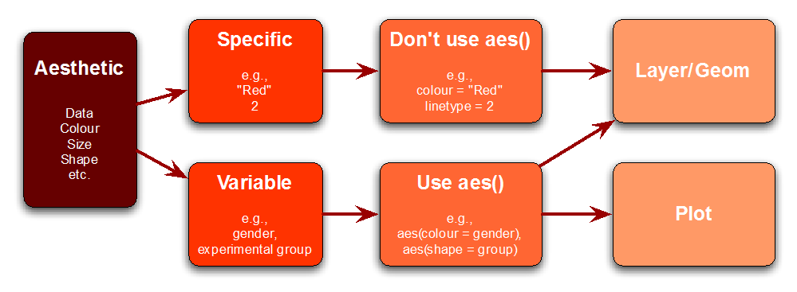

# Rechnen mit R

## Deskriptive Datenanalyse {-}


Ziel einer deskriptiven Analyse ist eine möglichst genaue Beschreibung von Daten  mit einer möglichst kleinen Menge an Zahlen. Dazu eignen sich vor allem:

* Kennwerte
* Tabellen
* Graphiken

Mit der deskriptiven Analyse ist es darüber hinaus möglich, Daten auf ihre Plausibilität und Richtigkeit zu prüfen. Die Bedeutung einer genauen deskriptiven Analyse und die korrekte Interpretation der Ergebnisse dieser Analyse kann nicht hoch genug eingeschätzt werden.

Liegen erst einmal Daten vor ist es entweder zu schwierig, aufwendig, oder zu spät am Versuchsdesign noch etwas nachträglich zu ändern. Allerdings kann man mit einer sorgsamen deskriptiven Analyse durchaus grobe Fehler bei der weiteren Analyse mit statistischen Verfahren vermeiden. Eine der wichtigsten Erkenntnisse für jeden Datenanalytiker ist, dass schlechte Daten nur schlechte Ergebnisse liefern können (garbage in - garbage out Problem). Daher sind vor Beginn jeder statistischen Analyse von Daten die deskriptiven Analysen unerlässlich.

Folgende Kapitel versuchen einen groben Überblick über die Möglichkeiten der deskriptiven Analyse mit R zu geben. Da es diesbezüglich bereits eine sehr große Anzahl an guten Paketen mit sehr vielen hilfreichen Funktionen gibt, ist es im Rahmen dieser LV unmöglich auf alle Details einzugehen. Unser Streifzug durch die deskriptive Statistik mit R ist somit als Anstoß und Motivation für weitere, selbstständig durchzuführende Studien zu diesem Thema zu sehen.

### Kennwerte der deskriptiven Statistik {-}


Kennwerte der deskriptiven Statistik lassen sich bezüglich der Beschreibung der Häufigkeiten, zentralen Tendenzen, Verteilungseigenschaften und der Dispersion unterteilen.

* *Häufigkeiten*
* *Zentrale Tendenzen*: Mittelwert, Median, Modus
* *Verteilungseigenschaften*: Schiefe (skew), Breite (kurtosis), Minimum, Maximum
* *Dispersion*: Spannweite, Quantile, Varianz, Standardabweichung, Standardfehler.

Für die meisten der genannten Kennwerte gibt es im R-Basispaket entsprechende Funktionen. Manche der Funktionen (z.B. Schiefe und Kurtosis) sind in Paketen (z.B. *moments*) verfügbar. Der Standardfehler kann ebenfalls in einem Paket (z.B. plotrix mit Funktion *std.error()*) berechnet werden. Da die Berechnung jedoch sehr einfach ist, kann man sich hier selbst schnell mit einer Funktion behelfen.

Aufgabe: programmiere die Berechnung des Standardfehlers als Funktion. Der Standardfehler berechnet sich:

$SE = \frac{s_x}{\sqrt{N}}$ oder $SE = \sqrt{\frac{s^2_x}{N}}$

*Bemerkung*: verwende die *Extract Function (Ctrl Alt X)* für die Erstellung der Funktion.


```r
  table(DF$geschlecht)
  mean(DF$alter)
  median(DF$alter)
  
  skewness(DF$alter)
  agostino.test(DF$alter, alternative = c("two.sided"))
  kurtosis(DF$alter)
  anscombe.test(DF$alter, alternative = c("two.sided"))

  min(DF$alter)
  max(DF$alter)    
  range(DF$alter)  
  quantile(DF$alter)  
  var(DF$alter)  
  sd(DF$alter)
  # Hier den Code f?r den Standardfehler einbauen
```

Eine nützliche Funktion ist *summary(mydata)*. Darüber hinaus stehen zahlreiche Pakete für die Erstellung deskriptiver Statistiken zur Verfügung. Nachfolgend eine Auswahl von Paketen:

* *Hmisc*
* *pastecs*
* *psych*
* *doBy*


```r
  summary(DF)
  summary(DF$alter)
  
  pacman::p_load(doBy, Hmisc, pastecs, psych)
  
  Hmisc::describe(DF$alter) 
  pastecs::stat.desc(DF$alter)
  psych::describe(DF$alter)
  psych::describeBy(DF$alter, 
                     group = DF$geschlecht)
  doBy::summaryBy(alter + BMI ~ med + geschlecht, 
                  data = DF,
                  FUN = function(x) { c(m = mean(x), 
                                        s = sd(x)) } )
```

Jedes dieser Pakete beinhaltet eine Vielzahl nützlicher Funktionen, die im Rahmen dieses Kurses nicht besprochen werden können. Um zumindest den Einblick in die Vielfalt der Funktionen eines Paketes zu erhalten, öffne die Hilfe für das Paket *Hmisc* und blättere durch den alphabetisch sortierten Funktionsumfang des Paketes - sehr beeindrucken, oder?

## Graphiken der deskriptiven Statistik {-}

Graphiken sind die beste Form der Darstellung von Ergebnissen! Es wird nicht immer möglich sein, entsprechende Graphiken zu erstellen, aber wenn möglich, sollten Ergebnisse immer durch Graphen dargestellt werden! In RStudio werden die Ergebnisse einer Grafikfunktion im Files-Pane unter Plots ausgegeben.

### Graphen des Basispakets {-}

Das Basispaket von R bietet einige nützliche Grafikfunktionen, die sich für eine einfache Darstellung von Daten bestens eignen. Diese sind:

* plot() - Standardfunktion zum Erstellen von Diagrammen
* hist() - Erstellen von Histogrammen
* pie() - Erstellen von Kreisdiagrammen
* barplot() - Erstellen von Säulendiagrammen
* boxplot() - Erstellen von Boxplots (beinhaltet: Maximalwert, Minimalwert, Median, Quartile, Ausreißer)
* dotchart() - Erstellen von Punktdiagrammen


```r
  # plot() function
  plot(DF$BMI, type = "s", main = "BMI")
  points(DF$BMI, cex = .5, col = "dark red")  
  # hist() function
  hist(DF$BMI,
       breaks = 20,
       main = "Altersverteilung",
       xlab = "Alter in Jahren",
       ylab = "H?ufigkeiten")
  # pie() function
  AK_Graph <- table(DF$ak)
  pie(AK_Graph, radius = 0.6)
  # barplot() function
  BMI_Graph <- summaryBy(BMI ~ ak, DF)
  barplot(BMI_Graph$BMI.mean)
  # boxplot() function
  boxplot(DF$BMI ~ DF$ak)
  # dotchart() function
  dotchart(BMI_Graph$BMI.mean, 
           labels = BMI_Graph$ak)
```

Speziellere Graphiken können mit folgenden Funktionen dargestellt werden:

* contour() - Erstellen von Konturdiagrammen, plotten von Isolinien
* forestplot - (aus dem Zusatzpaket "rmeta") erzeugt ein so genanntes "Forest Plot" zusammen mit einer Texttabelle.
* map - (aus dem Paket "maps" und "mapdata") erstellt Karten von Ländern, Kontinenten und der Welt
* metaplot - (aus dem Zusatzpaket "rmeta") erzeugt ein so genanntes "Forest Plot" (Meta-Analyse-Plot), welches im Rahmen von Metaanalysen gängig ist.
* persp() - Erstellen von Dreidimensionalen Abbildungen

Zur Bearbeitung von Details innerhalb von Graphiken stehen z.B. folgende Funktionen zur Verfügung:

* par() - Setzen von grafischen Parametern
* title() - Beschriftung von Diagrammen

Alle Graphiken die in R erzeugt werden, können in den verschiedensten Dateiformaten abgespeichert werden:

* jpeg() - speichert die Grafik als jpeg-Datei ab.
* png() - speichert die Grafik als png-Datei ab.
* pdf() - speichert eine Grafik als PDF-Datei ab.
* postscript() - Speichert die Grafikausgabe in eine Postscript-Datei.
* savePlot() - Speichert die aktuelle Grafik in eine Datei
* devSVG() - speichert eine Grafik als SVG-Datei ab. Dazu ist das Zusatzpaket RSvgDevice erforderlich.

### Graphen mit ggplot2 {-}

Mit dem Paket *ggplot2* erweitern sich die Möglichkeiten bei der Erstellung und Gestaltung von Graphiken erheblich. Es gehört zu den mächtigsten und umfangreichsten Pakten zur Erstellung von Grafiken. Gerade wegen dieser Eigenschaft kann es vor allem für Einsteiger oft schwierig werden. Das Paket bietet aber die Einsteigerfunktion *qplot()* (für Quick Plot). Für Standardgraphiken ist diese Funktion sehr hilfreich, denn viele der komplexen Möglichkeiten in *ggplot2* bleiben bei dieser Funktion verborgen.

Basierend auf den Grundlagen des Buches [The grammar of graphics](http://ggplot2.org/resources/2007-past-present-future.pdf){target="_blank"}
 von Leland Wilkinson baute Wickham sein [Datenvisualisierungspaket](http://en.wikipedia.org/wiki/Ggplot2){target="_blank"} auf und übernahm die grundlegenden Thesen des Buches, die auch heute noch als richtungsweisend für die Statistik gelten. Laut Leland lässt sich jeder Datensatz, egal welcher Komplexität, leicht darstellen, wenn man ihn sinnvoll in *Ästhetik* und *Geometrie* unterteilt. Mittels dieser Differenzierung können Aufgabenbereiche getrennt und Zuständigkeiten an verschiedene Aspekte des Plots übergeben werden.

Sobald komplexere Daten visualisiert werden sollen, zeigen sich die Vorteile von ggplot2:

* *feste Schema*: jeder Plot kann/muss nach einem Muster abgearbeitet werden. Das fährt unter anderem dazu, dass der Code meist sehr einfach gehalten ist und bei nachträglichen Änderungen nur wenigen Abwandlungen unterzogen werden muss.
* *Farb- oder Formeinsatz*: innerhalb des Plots wird automatisch eine Legende berechnet, die ebenfalls jederzeit manuell gestaltbar ist. Dies steht ganz im Gegensatz zu R nativen Plots, die durchweg individuell durchprogrammiert werden müssen.
* *zeitsparend*

#### Quick Plot mit ggplot2 {-}

Die *qplot()*-Funktion folgt nicht dem typischen *ggplot2*-Schema und ist eher als Einstieg ins Plotting gedacht, ermöglicht jedoch dieselbe Plotvisualisierung wie die *ggplot()*-Funktion. Ihr Aufbau und ihre Gestaltung wird lediglich durch verschiedenste Parameter bestimmt.

Öffne folgenden Link [Quick Plot Einstieg](https://www.statmethods.net/advgraphs/ggplot2.html){target="_blank"} und kopiere den Code der nach dem Text *Here are some examples using automotive data ...* folgt in den Editor. Weiter nützliche Hinweise zu Quick Plot findest du unter Um [Quick Plot Cheat Sheet](http://ggplot2.org/book/qplot.pdf).


```r
  pacman::p_load(ggplot2)
  
  # create factors with value labels
  mtcars$gear <- factor(mtcars$gear,levels=c(3,4,5),
                        labels=c("3gears","4gears","5gears"))
  mtcars$am <- factor(mtcars$am,levels=c(0,1),
                      labels=c("Automatic","Manual"))
  mtcars$cyl <- factor(mtcars$cyl,levels=c(4,6,8),
                       labels=c("4cyl","6cyl","8cyl"))
  
  # Kernel density plots for mpg
  # grouped by number of gears (indicated by color)
  qplot(mpg, data=mtcars, geom="density", fill=gear, alpha=I(.5),
        main="Distribution of Gas Milage", xlab="Miles Per Gallon",
        ylab="Density")
  
  # Scatterplot of mpg vs. hp for each combination of gears and cylinders
  # in each facet, transmittion type is represented by shape and color
  qplot(hp, mpg, data=mtcars, shape=am, color=am,
        facets=gear~cyl, size=I(3),
        xlab="Horsepower", ylab="Miles per Gallon")
  
  # Separate regressions of mpg on weight for each number of cylinders
  qplot(wt, mpg, data=mtcars, geom=c("point", "smooth"),
        method="lm", formula=y~x, color=cyl,
        main="Regression of MPG on Weight",
        xlab="Weight", ylab="Miles per Gallon")
  
  # Boxplots of mpg by number of gears
  # observations (points) are overlayed and jittered
  qplot(gear, mpg, data=mtcars, geom=c("boxplot", "jitter"),
        fill=gear, main="Mileage by Gear Number",
        xlab="", ylab="Miles per Gallon")   
```

#### Aufbau von ggplot2[^13] {-}

[^13]: Abbildungen aus Andy Field, Discovering Statistics using R.

Bevor man Graphiken mit *ggplot()* erstellt, sollte man sich folgende Fragen stellen:

* *Data*: welche Daten will man visualisieren? 
* *Geoms*: will man Punkte, Linien, Polygone?
* *Mappings*: welche Ästhetischen Attribute sollten für geometrischen Objekte festlegt werden?
* *Scales*: wie sollten Merkmalsausprägungen auf "physikalische Einheiten" der geometrischen Objekte (z. B. Form, Durchmesser oder Farbe) abgebildet werden (definiert die Legende)?
* *Coord*: wie sollte das Koordinatensystem (Achsen und Gitternetzlinien) dargestellt werden?
* *Faceting*: sollte die Datenmengen unterteilt werden (z. B. getrennt nach einem Gruppenfaktor in unterschiedlichen Graphen)?
* *Stats*: sollten die Daten vor der Darstellung nochmal statistisch transformieren werden?

Die Antworten zu diesen Fragen bestimmen die Art und Weise wie im Rahmen des strukturellen Aufbaus von *ggplot2* eine Graphik aufgebaut wird. Eine ggplot-Graphik ist prinzipiell in sogenannte *layers* aufgebaut:

<center>

{ width=30% }

</center>

Jeder Layer kann für sich gesehen ein bestimmtes Aussehen (aesthetic) und auch bestimmte geometrische Objekte (Balken, Linien, etc.) beinhalten.

<center>

{ width=30% }

</center>

Die Aesthetics (aes()) bestimmen das Aussehen wie z.B. Farbe, Größe, Positionen, Stile, etc.

<center>

{ width=30% }

</center>

Die geometrischen Objekte in einem Plot definieren die Darstellungsform der Daten. Auszugsweise mögliche geom's von ggplot:

* geom_bar()
* geom_point()
* geom_line()
* geom_histogram()
* geom_boxplot()

#### Verwendung von ggplot2 {-}

Aufgrund des enormen Leistungsumfangs von ggplot, wollen wir im folgenden (mit der Topdown-Methode) einen Einblick in die vielseitige Verwendbarkeit des Pakets durch Beispiele aus [Cookbook R](http://www.cookbook-r.com/Graphs/){target="_blank"} gewinnen. Öffne den Link und gehe im Kapitel *Graphs with ggplot2* zu den *Bar and line graphs (ggplot2)*.

Gehen wir einmal davon aus, dass wir für unsere Daten aus *hyper.sav* ein Balkendiagramm des durchschnittlichen BMI getrennt nach Altersklasse (x-Achse) und Geschlecht (Balken) erzeugen wollen. Wir durchsuchen die geöffnete Cookbook-Seite und finden folgende Darstellung als passend für unsere Daten:

<center>

{ width=30% }

</center>

1. Im ersten Schritt kopieren wir den entsprechenden Code in unseren Editor und führen diesen aus (*Hinweis*: kopiere auch den Code der Website, in dem die Daten definiert werden!).
2. Wenn dieser Code auch denselben Output wie auf der Website erzeugt, versuchen wir nun durch Änderung der entsprechenden Daten im Code diesen Plot an unsere Daten (hyper.sav) anzupassen.
3. Nachdem der Graph für unsere Daten adaptiert wurde, speichern wir diesen in das Verzeichnis */images*.


```r
  dat1 <- data.frame(
    sex = factor(c("Female","Female","Male","Male")),
    time = factor(c("Lunch","Dinner","Lunch","Dinner"), levels=c("Lunch","Dinner")),
    total_bill = c(13.53, 16.81, 16.24, 17.42))
  
  head(dat1)
  
  ggplot(data = dat1, 
         aes(x = time, y = total_bill, fill = sex)) +
    geom_bar(stat = "identity", 
             position=position_dodge(), 
             colour = "black") +
    scale_fill_manual(values=c("#999999", "#E69F00"))
```

#### Datenformat in ggplot2 {-}

*ggplot2* ist grundsätzlich auf sogenannte "long format" Daten ausgelegt. Um die Repräsentativität von "wide format" Datensätzen zu erhöhen, also Datensätze mit sehr vielen verschiedenen Merkmalen, gibt es in R die Pakete *reshape2* und *plyr*, die häufig zur Datenmanipulation[^14] verwendet werden.

[^14]: Datenmanipulation meint hierbei das Schichten, Gruppieren und Zusammenfassen verschiedener Daten. 

---

## Lösungen {-}

### Lösung Funktion Standardfehler


```r
  SE <- function(x) {
    SE <- sd(x) / length(x)
    return(SE)
  }
  SE(DF$alter)
```

### Lösung ggplot Beispiel 1


```r
  dat1 <- summaryBy(BMI ~ ak + geschlecht, DF)
  str(dat1)
  ggplot(data = dat1, 
         aes(x = ak, y = BMI.mean, fill = geschlecht)) +
    geom_bar(stat="identity", 
             position=position_dodge(), 
             colour="black") +
    scale_fill_manual(values=c("#999999", "#E69F00"))
```
