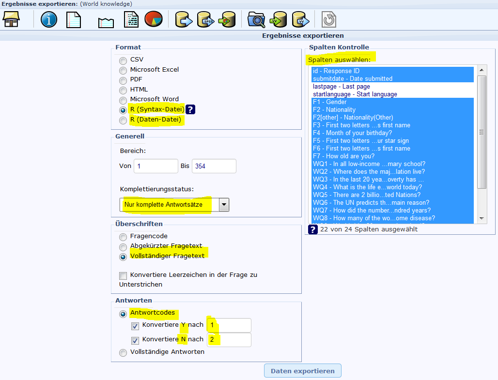
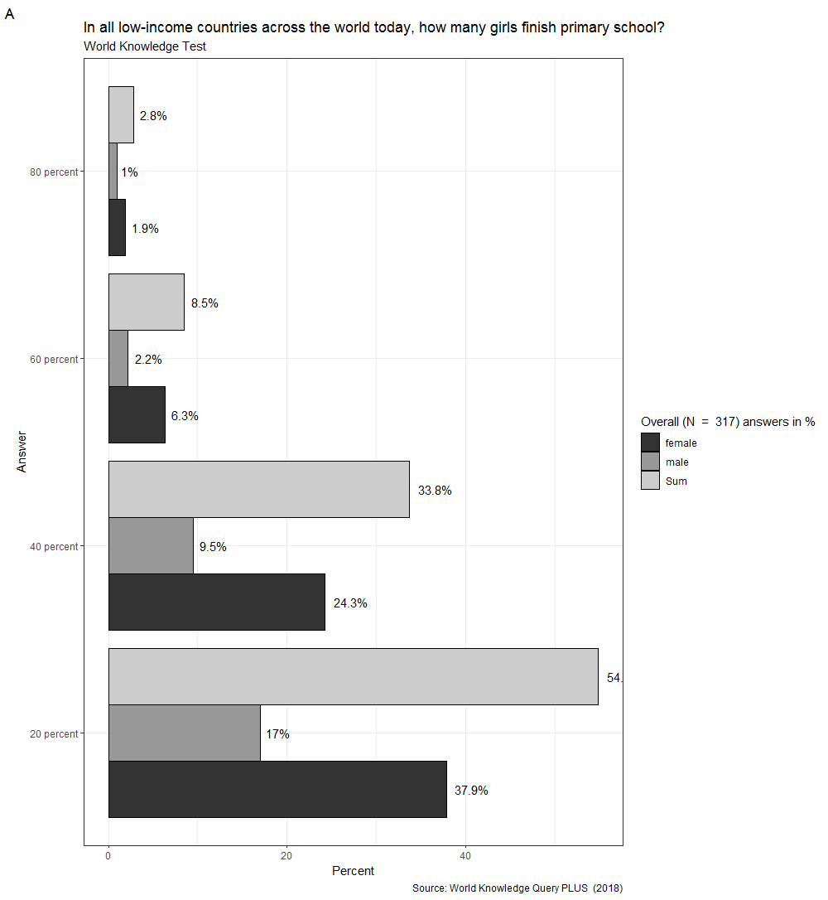

# Datenauswertung Lime Survey


Im nachfolgenden Beispiel werden die Daten des World-Knowledge-Test ausgewertet. Bei diesem Test handelt es sich um eine einfache Umfrage, welche mit dem Online-Survey-Tool *LimeSurvey* erstellt wurde. Die Befragung richtete sich an ca. 300 StudentInnen der Universität Salzburg. Die Daten sollen im Folgenden zur Auswertung einfacher deskriptiver Statistiken mit R verwendet werden.

<center>

{ width=70% }

</center>

LimeSurvey bietet die Möglichkeit, Umfragedaten in verschiedensten Formaten zu exportieren. Wie in obiger Dartellung ersichtlich, bietet sich unter anderem der Export einer R-Daten als auch R-Syntax Datei. Nach Durchführung des Exorts stehen zwei Dateien zur Verfügung:

<center>

{ width=70% }

</center>

Nachfolgend ein Auszug aus der R-Syntaxdatei:


```r
data <- read.csv("survey_791736_R_data_file.csv", 
                 quote            = "'\"", 
                 na.strings       = c("", "\"\""), 
                 stringsAsFactors = FALSE)

# LimeSurvey Field type: F
  data[, 1] <- as.numeric(data[, 1])
  attributes(data)$variable.labels[1] <- "id"
  names(data)[1] <- "id"
# LimeSurvey Field type: DATETIME23.2
  data[, 2] <- as.character(data[, 2])
  attributes(data)$variable.labels[2] <- "submitdate"
  names(data)[2] <- "submitdate"
# LimeSurvey Field type: F
  data[, 3] <- as.numeric(data[, 3])
  attributes(data)$variable.labels[3] <- "Gender"
  data[, 3] <- factor(data[, 3], levels=c(1,2),labels=c("weiblich", "männlich"))
  names(data)[3] <- "F1"
# LimeSurvey Field type: A
  ...
```

Nach dem Laden der Datendatei (*survey_791736_R_data_file.csv*) werden Formatierungen der Datentypen und Vergabe von Variablennamen durchgeführt. Da Variablennamen von LimeSurvey vergeben werden, ist es in den meisten Fällen sinnvoll, diese manuell zu ändern. Auch eine genaue Kontrolle (und gegebenenfalls Korrektur) bei den Datentypen ist angebracht.

Üblicherweise ändert sich eine Umfrage nach Freischaltung bezüglich ihrer Datenstruktur nicht mehr, daher ist dieser Aufwand auch nur einmalig durchzuführen. *WICHTIG*: bei allen folgenden Exports aus Limesurvey ist dann nur mehr die Datendatei zu exportieren - die Syntaxdatei braucht dann nicht mehr exportiert werden[^15]!

[^15]: es sei denn, die Struktur der Umfrage ändert sich wider erwarten!

## Datenvorverarbeitung {-}

Lade und überarbeite die Syntaxdatei (*survey_791736_R_syntax_file.R*). Beachte dabei folgende Punkte:

* Sonderzeichen werden oft nicht korrekt übernommen - verwende die RStudio-Funktion Search and Replace um alle falsch übertragenen Sonderzeichen zu korrigieren.
* Ändere die Variablennamen auf *sinnvolle* Namen (vgl. Attribute)
* Überprüfe die Datentypen sämtlicher Variablen. Ändere den Datentyp der Variablen falls notwendig.

Nach erfolgter Überarbeitung kann das Skript in eine Funktion umgewandelt werden. Der Name der Funktion sollte dabei *LS_Import.R* lauten und als einziges Argument sollte die Variable *F2L* (für File t(w)o Load) angegeben werden. 

*Hinweis:* die Funktion *read.csv()* muss entsprechend angepasst werden!


```r
LS_Import <- function(F2L) {
  data <- read.csv(F2L,
                   quote            = "'\"",
                   na.strings       = c("", "\"\""),
                   stringsAsFactors = FALSE)
  
  # LimeSurvey Field type: F
  data[, 1] <- as.numeric(data[, 1])
  attributes(data)$variable.labels[1] <- "id"
  names(data)[1] <- "id"
  # LimeSurvey Field type: DATETIME23.2
  ...
```

Des Weiteren sollte am Ende der Funktion als Rückgabewert der Datenframe (data) angegeben werden (siehe nachfolgenden Codteil am Ende der *LS_Import.R* Funktion):


```r
  ...
  names(data)[22] <- "WQ12"
  
  return(data)
}
```

### Aufgabe 1 {-}

Erstelle nun ein neues Skript (Name: *09_RLimeSurvey.R*), in welchen du zuerst den Standard-Header kopierst (siehe nachfolgenden Code) und welches danach die Daten über die soeben erstellte Funktion lädt! Prüfe mit einer geeigneten Funktion die Struktur des geladenen Dataframes.


```r
#---- 09_RLS_Init
  rm(list = ls())
  if (!require("pacman")) install.packages("pacman")
  pacman::p_load(here)
```

Durch diese Funktion können die Daten fortlaufend auf dem aktuellen Stand gehalten werden. Der einzige Nachteil besteht noch darin, dass man manuell die Daten aus LimeSurvey exportieren muss. Dass kann allerdings automatisiert werden. Dazu braucht man nur den Zugang zur SQL-Datenbank von Limesurvey und die entsprechenden Pakete in R laden. Aus Datenschutzgründen ist es im Rahmen dieser LV nicht möglich, den Zugang zur LS-Datenbank freizuschalten, daher werden wir diese Möglichkeit nicht weiter besprechen. Es sei jedoch an dieser Stelle darauf hingewiesen, dass man mit einem entsprechenden Zugang zu den Daten auch die Möglichkeit hat, Skripte und Funktionen in R in die Aufgabenplanung eines Windows/Linux-Systems einzubauen (sogenannte chron-jobs) und damit ein vollständig automatisches Auswertesystem zu erstellen.

## Deskriptive Statistik {-}

Bei den nachfolgenden Aufgaben erzeugen wir deskriptive Statistiken in Form von Tabellen und einer Graphik.

### Aufgabe 2 {-}

Im Folgendem wollen wir und mit der einfachen Auswertung der vorliegenden Daten beschäftigen. Die ersten Schritte einer Datenauswertung beginnen i.A. mit einer deskriptiven Statistik. Aufgrund der vorwiegend nominalen Daten des Fragebogens eignen sich am besten Häufigkeitstabellen. Erstelle daher folgende Tabellen (verwende dazu die Funktion *table()*):

1. Anzahl der Männer und Frauen die an der Umfrage teilgenommen haben.
2. Anzahl der Personen je Nation.
3. Anzahl der Personen nur jener Nationen, die an der Umfrage teilgenommen haben[^16].
4. Anzahl der Personen nur jener Nationen, die an der Umfrage teilgenommen haben, getrennt nach Geschlecht.
5. Gleich wie Aufgabe 4, nur mit zusätzlicher Angabe der Randsummen!
6. Gleich wie Aufgabe 5, nur die auf 2 Stellen gerundeten Angaben in Prozent[^17].

[^16]: *Hinweis:* verwende die Funktion *droplevels()*
[^17]: *Hinweis:* runden mit der Funktion *round()*, Prozente mit der Funktion *prop.table()*

### Aufgabe 3 {-}

Ein zur deskriptiven Analyse hilfreiches Paket ist *doBy*. Wir wollen die darin enthaltene Funktion *summaryBy()* verwenden, um folgende Aufgabenstellungen zu lösen:

1. Berechne das Durchschnittsalter getrennt nach Geschlecht.
2. Berechne den Mittelwert, die Standardabweichung, die Varianz, das Minimum und das Maximum der Variablen Alter getrennt nach Geschlecht.
3. Berechne das Durchschnittsalter getrennt nach Geschlecht und Nationalität.
4. Berechne den Mittelwert, die Standardabweichung, die Varianz, das Minimum und das Maximum der Variablen Alter getrennt nach Geschlecht und Nationalität.

Das Paket doBy bietet darüber hinaus eine Vielzahl von Funktionen, die vor allem für das Arbeiten mit gruppierten Daten sehr hilfreich sein können. Hingewiesen sei noch auf die Möglichkeit der Berechnung von Kontrasten im Rahmen einer *least square mean* (ANOVA) Analyse. Es würde den Rahmen dieser LV sprengen, alle verfügbaren Funktionen zu besprechen und zu verwenden. Weitere Details zu diesem Paket sind der [Dokumentation](https://cran.r-project.org/web/packages/doBy/doBy.pdf){target="_blank"} zu entnehmen.

### Aufgabe 4 {-}

Neben den Tabellen spielen Graphiken eine wesentliche Rolle in der deskriptiven Statistik. In dieser Aufgabe wollen wir mit dem Paket *ggplot2* ein Balkendiagramm erstellen, welche für die erste Frage des Tests die prozentuellen Anteile pro Antwortkategorie getrennt nach Geschlecht darstellt. Darüber hinaus sollte in dieser Graphik auch jeweils ein Balken pro Antwortkategorie für den prozentuellen Anteil unabhängig vom Geschlecht angezeigt werden. Folgende Graphik stellt das gewünschte Ergebnis dar:

<center>

{ width=40% }

</center>

Um die Aufgabe auf das eigentliche Ziel (eine Graphik zu erstellen) zu beschränken, kannst du den folgenden Code in dein R-Skript kopieren (diskutiere das Ergebnis dieses Codefragmentes)[^18]:


[^18]: die Definition von *LegTit* und *WQ_Label* wird in einer Folgeaufgabe noch zur weiteren Gestaltung der Graphik verwendet.


```r
  library(ggplot2)
  
  LegTit          <- paste0('Overall (N  =  ', dim(DF)[1], ') answers in %')  
  ColInd          <- which(colnames(DF) %in% c("WQ1"))
  WQ_Label        <- attributes(DF)$variable.labels[ColInd]

  CT              <- round(100*addmargins(prop.table(table(DF[,ColInd], DF$Gender)), 
                                          margin  =  2), 2)
  DF_CT           <- as.data.frame(CT)
  colnames(DF_CT) <- c("Answer", "Gender", "Percent")
```

Ergänze nun den Code mit der entsprechenden Funktion zur Erstellung dieser Graphik und ergänze/ändere den Graphen nach folgenden Vorgaben:

1. Drehe die Koordinaten 90 Grad (verwende die Funktion *coord_flip()*).
2. Die x-Achsenbeschriftung sollte *Answer* sein (verwende die Funktion *xlab()*).
3. Die Beschriftung der Legende sollte dem bereits definierten Text der Variablen *LegTit* entsprechen (verwende die Funktion *guides(fill = guide_legend(title = ???))*).
4. Verwende die Funktion *labs()*, um Titel (= *WQ_Label*), Subtitel (= *"World Knowledge Test"*), Caption (= *"Source: World Knowledge Query PLUS  (2018)"*, tag (= *"A"*) anzuzeigen.
5. Ändere das Farbschema des Graphen auf Grauschattierungen (verwende die Funktion *scale_fill_grey()*).
6. Zeige über den Balken die jeweilig erreichten Prozentwerte an (verwende die Funktion *geom_text(aes(label = paste0(round(???, 1), "%")), position = position_dodge(width=0.9), hjust = -0.25)*).
7. Ändere den Hintergrund der Graphik auf Transparent (verwende die Funktion *theme_bw()*).

Der fertige Graph sollte folgendermaßen aussehen:

<center>

{ width=60% }

</center>

## Lösungen {-}

### Lösung Aufgabe 1 {-}


```r
  source("LS_Import.R")
  F2L <- "Data/survey_791736_R_data_file.csv"
  DF  <- LS_Import(F2L = F2L)
  str(DF)
```

### Lösung Aufgabe 2 {-}


```r
  table(DF$Gender) # A2-1
  table(DF$Nationality) # A2-2
  table(droplevels(DF$Nationality))  # A2-3
  table(DF$Gender, droplevels(DF$Nationality)) # A2-4
  addmargins(table(DF$Gender, droplevels(DF$Nationality))) # A2-5
  addmargins(round(prop.table(table(DF$Gender, droplevels(DF$Nationality)))*100,2)) # A2-6
```

### Lösung Aufgabe 3 {-}


```r
  library(doBy)
  summaryBy(formula = Age ~ Gender, 
            data    = DF) # A3-1
  summaryBy(formula = Age ~ Gender, 
            data    = DF, 
            FUN     = c(mean, sd, var, min, max)) # A3-2
  summaryBy(formula = Age ~ Gender + Nationality, 
            data    = DF) # A3-3
  summaryBy(formula = Age ~ Gender + Nationality, 
            data    = DF, 
            FUN     = c(mean, sd, var)) # A3-4
```

### Lösung Aufgabe 4 {-}


```r
  library(ggplot2)
  
  LegTit          <- paste0('Overall (N  =  ', dim(DF)[1], ') answers in %')  
  ColInd          <- which(colnames(DF) %in% c("WQ1"))
  WQ_Label        <- attributes(DF)$variable.labels[ColInd]

  CT              <- round(100*addmargins(prop.table(table(DF[,ColInd], DF$Gender)), margin  =  2), 2)
  DF_CT           <- as.data.frame(CT)
  colnames(DF_CT) <- c("Answer", "Gender", "Percent")
  
  ggplot(DF_CT, aes(x  =  Answer, y  =  Percent, fill  =  Gender)) +
        geom_bar(position = position_dodge(), stat = "identity",
                 colour = "black", # Use black outlines,
                 size = .3) +
    coord_flip() +
    xlab("Answer") +
    guides(fill = guide_legend(title = LegTit)) +
    labs(title    = WQ_Label,
         subtitle = "World Knowledge Test",
         caption  = "Source: World Knowledge Query PLUS  (2018)",
         tag      = "A") +
    scale_fill_grey() +
    geom_text(aes(label = paste0(round(Percent, 1), "%")), 
              position  = position_dodge(width=0.9),
              hjust     = -0.25) +
    theme_bw()
```
