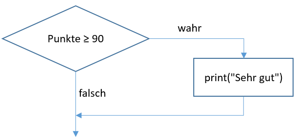
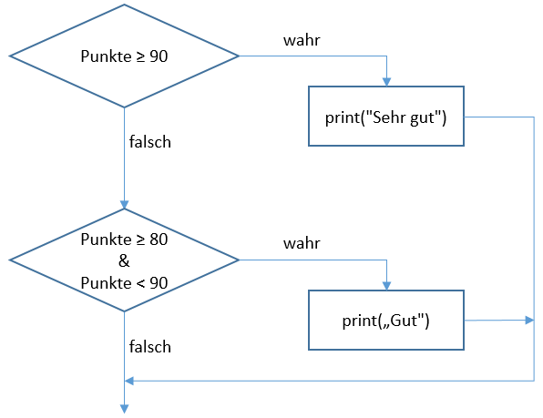
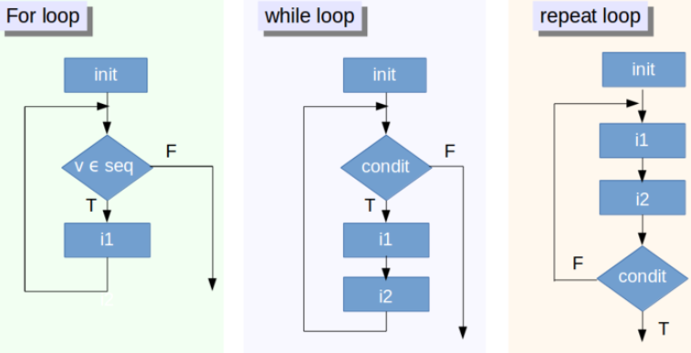
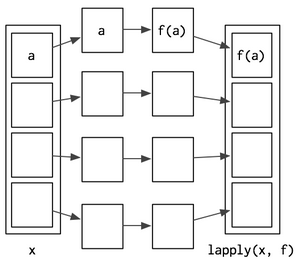

# Bedingungen und Schleifen

## Bedingte Ausführung {-}


Normalerweise wird ein R-Code Zeile für Zeile, von oben nach unten, ausgeführt. Manchmal möchte man aber eine Zeile - oder einen ganzen Block von Zeilen - nur unter einer bestimmten Bedingung durchführen. Dazu bietet sich in R die If-Anweisung an. 

### Einfache If-Bedingung {-}

Folgende Abbildung zeigt die Programmlogik für eine einfache If-Bedingung:

<center>

{ width=50% }

</center>

Mit folgendem Code kann diese einfache Entscheidung umgesetzt werden:


```r
  punkte <- 90
  if (punkte >= 90) {
    print("Sehr gut")
    }
```

### Else-If-Bedingung {-}

Trifft eine Bedinung nicht zu, kann mit Hilfe der Else-If-Bedingung eine weitere Bedingung überprüft werden:

<center>

{ width=50% }

</center>

Folgender Code zeigt die Syntax, mit der eine derartige Überprüfung in R umgesetzt werden kann:


```r
  punkte <- 85
  if (punkte >= 90) {
    print("Sehr gut")
    } else if (punkte >= 80 & punkte < 90) {
    print("Gut");    
    } else {
      print("Nicht genügend");    
  }
```

*Bemerkung:* bei genauer Betrachtung des Codes kann man feststellen, dass neben der *if ()* und der *else if ()* auch eine generelle *else ()* Anweisung am Ende der Entscheidungslogik verwendet werden kann (aber nicht unbedingt muss). Diese Logik lässt sich nun für weitere Abfragen erweitern.

### Aufgabe 1 {-}

Erweitere den Code, sodass für eine beliebige Eingabe von *Punkte* zwischen 0 und 100 folgende Ausgabe erzeugt wird:

* $>= 90 \rightarrow$ Sehr gut
* $>= 80 \& < 90 \rightarrow$ Gut
* $>= 70 \& < 80 \rightarrow$ Befriedigend
* $>= 60 \& < 70 \rightarrow$ Genügend
* $< 60 \rightarrow$ Nicht genügend

[Hier findest du die Lösung zur Aufgabe](#aufgabe-1-lsg).

### Die ifelse Bedingung {-}

Eine weitere Möglichkeit bietet noch die folgende *ifelse(test_expression, x, y)* Funktion. Betrachte folgendes Beispiel:


```r
  punkte <- sample(1:100, 10)
  ifelse(punkte < 60, "Nicht genügend", "Bestanden")
```

## Iterationen in R {-}

Sinn und Zweck von Iterationen (*Schleifen*, *Loops*) ist es, einen Code $n$-mal auszuführen. Die Variable $n$ ist hierbei eine ganze Zahl (integer) und in der Regel beim Start der Schleife mit einem festen Wert definiert. In R stehen folgende Loop-Strukturen zur Verfügung:

<center>

{ width=70% }

</center>

Diese Schleifen unterscheiden sich dahingehend:

* *For-Loop*: führt eine Instruktion ($i1$, $i2$, etc.) so oft durch, bis das Ende einer vordefinierten Sequenz (z.B. 1:100) erreicht ist.
* *While-Loop*: so lange eine Bedingung zutrifft (wahr ist), werden die Instruktionen $i1$, $i2$, etc. ausgeführt. Der while-loop wird dann beendet, wenn die Bedingung von *wahr* auf *falsch* wechselt.
* *Repeat-Loop*: ähnlich dem while, nur dass die Instruktion $i1$ und $i2$ zumindest einmal ausgführt werden und zwar unabhängig davon, was die Bedingung am Ende der Schleife ergibt.

### Die for-Schleife {-}

Die Syntax einer *for*-Schleife ist relativ simple:


```r
  n <- 5
  for(i in 0:n) {
    print(i);
  }
```

Manchmal kann es erforderlich sein, eine bestimmte Iteration zu unterbrechen und zum nächsten Durchlauf weiterzugehen. Dies kann man mit dem *next*-Befehl erreichen, wie folgender Code zeigt:


```r
  m <- 20
  for (k in 1:m){
    if (!k %% 2)
      next
    print(k)
  }  
```

Eine einfache Anwendung einer for-Schleife wird im nachfolgenden Code demonstriert. Um eine For-Schleife vorzeitig zu beenden - wenn z.B. ein besonderes Ereignis während der Abarbeitung des Codes eintritt -  kann man mit der Funktion *break* den sofortigen Ausstieg aus der Schleife erzwingen. Ein derartiger frühzeitiger Ausstieg aus einer Schleife ist im nachfolgenden Code zum Zweck der Veranschaulichung eingebaut (macht inhaltlich aber bei diesem Beispiel nicht wirklich viel Sinn). Kopier den Code in dein Skript, führe ihn aus und diskutiere die Eigenschaften und das Ergebnis.


```r
  # Create a vector filled with random normal values
  u1 <- rnorm(30)
  print("This loop calculates the square of the first 10 elements of vector u1")
  
  # Initialize `usq`
  usq <- 0
  
  for(i in 1:10) {
    # i-th element of `u1` squared into `i`-th position of `usq`
    usq[i] <- u1[i]*u1[i]
    print(usq[i])
  }
  
  print(i)  
```

For-Schleifen kommen vor allem bei Berechnungen in Matrizen auch in verschachtelter Form vor. Betrachte das folgende Beispiel und diskutiere die Eigenschaften dieser Schleife(n):


```r
  # Insert your own integer here
  my_int <- 20
  nr     <- as.integer(my_int)
  # Create a n x n matrix with zeroes
  mymat <- matrix(0, nr, nr)
  # For each row and for each column, assign values based on position
  # These values are the product of two indexes
  for(i in 1:dim(mymat)[1]) {
    for(j in 1:dim(mymat)[2]) {
      mymat[i,j] = i*j
    }
    # Just for the sake of demonstrating the break function:
    # Exit the loop when number of rows = 5
    if (i == 5) break
  }
  # Show the first 10x10 chunk or the first `nr` x `nr` chunk
  if (nr > 10) {
    mymat[1:10, 1:10]
  } else mymat[1:nr, 1:nr]
```

For-Schleifen sind wahrscheinlich die am häufigst verwendete Form von Schleifen. Ist jedoch die Anzahl der Durchläufe einer/mehrerer Codezeilen jedoch nicht vorher bestimmbar, sondern abhängig davon, ob eine bestimmte Bedingung erfüllt ist, muss man die while (oder repeat) Schleife verwenden.

### Bemerkung zu For-Loops {-}

For-Loops haben bestimmte Nachteile, weswegen sie auch nach Möglichkeit vermieden werden sollten. Das heißt nicht, dass man for-loops prinzipiell nicht verwenden sollte, aber man sollte sich überlegen, ob for-loops nicht anders gelöst werden könnten. Die Nachteile sind:

1. for-loops sind langsam.
2. es ist manchmal schwer nachvollziehbar, was genau gemacht wird - speziell bei verschachtelten Loops.
3. Fehlersuche ist in loops (manchmal) mühsam.
4. Kontrolle der Funktionalität liegt beim Entwickler - Alternativen zu for-loops sind hingegen gestestet und reduzieren daher die Fehlerwahrscheinlichkeit enorm.

For-loops könnten oft durch bestehende Funktionen - die sogenannten *funtionals* - vermieden werden. Im folgenden wollen wir uns kurz mit der Familie der apply() Funktionen beschäftigen.

### *apply()* {-}

Die *apply()*-Funktionen arbeiten im Wesentlichen mit for-loops, sind jedoch i.A. weit effizienter und vor allem bereits auf ihre Funktionalität geprüft. In der *apply()*-Familie finden sich folgende Funktionen:

* *apply()* und *tapply()*: für Matrizen und Arrays, das *tapply()* entspricht einer Verallgemeinerung von *apply()* und kann auf Arrays ungleicher Größe angewendet werden (also wenn jede Zeile eine andere Anzahl Spalten hat).
* *lapply()*: Anwendung auf Listen mit einem Output als Liste.
* *sapply()* und *vapply()*: Anwendung auf Listen mit einem Output als einfachen Vektor. 
* *mapply()*: für multiple Listen, der Output ist wieder eine Liste.
* *tapply()*: für Arrays, deren Elemente unterschiedliche Größe aufweisen.

Die Wirkungsweise der apply() Funktion kann dem nachfolgenden Code entnommen werden:


```r
  # apply()
  a <- matrix(1:20, nrow = 5)
  apply(a, 1, mean)
  # tapply()
  pulse <- round(rnorm(22, 70, 10 / 3)) + rep(c(0, 5), c(10, 12))
  group <- rep(c("A", "B"), c(10, 12))
  tapply(X = pulse, INDEX = group, FUN = length)  
```

### *lapply()* {-}

Ein einfaches *functional* der *apply()*-Familie ist die *lapply()*-Funktion. Mit dieser Funktion wird eine bestimmte Funktion (z.B. der Mittelwert) auf jedes Element einer Liste angewendet. Nachfolgende Abbildung zeigt die Wirkungsweise von *lapply()*.

<center>

{ width=30% }

</center>

Aus Gründen der Verarbeitungsgeschwindigkeit ist diese Funktion in C geschrieben, aber im Wesentlichen entspricht sie folgenden R-Code:


```r
lapply2 <- function(x, f, ...) {
  out <- vector("list", length(x))
  for (i in seq_along(x)) {
    out[[i]] <- f(x[[i]], ...)
  }
  out
}
```

Diese Funktion verwendet im Kern einen for-loop. Da innerhalb der Funktion (*lapply2()*) eine weitere Funktion (*f(x)*) angewendet wird, nennt man das Ganze auch *functional*.

Folgender Code veranschaulicht die Funktionsweise von *lapply*:


```r
# Create some random data
  l <- replicate(20, runif(sample(1:10, 1)), simplify = FALSE)
# With a for loop
  out <- vector("list", length(l))
  for (i in seq_along(l)) {
    out[[i]] <- length(l[[i]])
  }
  unlist(out)
#-------------------------
# With lapply
  unlist(lapply(l, length))
#-------------------------  
```

### *sapply()* und *vapply()* {-}

Die beiden funcitonals *sapply()* und *vapply()* funktionieren im Prinzip gleich wie *lapply()*, mit dem Unterschied, dass der Output nicht als Liste, sondern als Vektoren zurückgegeben wird. Betrachte folgenden Anwendung der beiden Funktionen:


```r
sapply(mtcars, is.numeric)
sapply(mtcars, mean)
vapply(mtcars, is.numeric, logical(1))
```

Beide Funktionen erzielen genau dasselbe Resultat. Die Unterschiede sind:

* *sapply()* eignet sich besser für interaktives arbeiten, da weniger einzugeben ist.
* *vapply()* eignet sich  besser bei der Anwendung innerhalb von Funktionen, da diese Funktion im Fall von Fehlern während der Ausführung weit bessere Rückmeldung an den Programmierer liefert als sapply!

### *Map()* {-}

Für multiple Inputs eignet sich die *Map()*[^19]  Funkion. Betrachte nachfolgendes Beispiel:

[^19]: *mapply(..., simpligy = FALSE)* ist die genau dieselbe Funktion wie *Map()*.


```r
  # Generate some sample data
  xs <- replicate(5, runif(10), simplify = FALSE)
  ws <- replicate(5, rpois(10, 5) + 1, simplify = FALSE)
  unlist(Map(weighted.mean, xs, ws))
```

## Die while- und repeat Schleife {-}

Ist der Durchlauf von Codezeilen abhängig von einer Bedingung, verwendet man den while-loop. Betrachte einfach den nachfolgenden Code und diskutiere die Eigenschaften der Schleife!


```r
  Corr_Resp <- FALSE
  while (Corr_Resp == FALSE) {
    response <- readline(prompt = "What is the correct answer to life, the universe and everything? Please, enter your ANSWER: ")
    if (response == "42") {
      print("Cool, you obviously read the right books!")
      Corr_Resp <- TRUE
    } else {
      print("Sorry, the answer is incorrect, try again!")
      }
  }
```

Wie sofort klar sein sollte, kann es bei while-loops bezüglich der Abbruchbedingung problematisch werden. Dies gilt auch für den repeat-loop. Betrachte nachfolgendes Beispiel. Vergleiche dieses mit dem while-loop und diskutiere den Unterschied!


```r
  repeat {   
    response <- readline(prompt = "What is the correct answer to life, the universe and everything? Please, enter your ANSWER: ")
    if (response == "42") {
      print("Cool, you obviously read the right books!");
      break
    } else print("Sorry, the answer is incorrect, try again!");
  }
```

### Aufgabe 2 {-}

Im ersten Schritt soll eine $m \times n$ Matrix mit lauter Nullen erstellt werden. Mit einer verschachtelten Schleife soll nun in jede Zelle die sich unterhalb der Diagonale befindet, das Produkt der aktuellen Zeile $\times$ Spalte geschrieben werden. Das Resultat für eine $n = 10 \times m = 10$ sollte also folgendermaßen aussehen:


---- ---- ---- ---- ---- ---- ---- ---- ---- ---
 0    0    0    0    0    0    0    0    0    0 

 2    0    0    0    0    0    0    0    0    0 

 3    6    0    0    0    0    0    0    0    0 

 4    8    12   0    0    0    0    0    0    0 

 5    10   15   20   0    0    0    0    0    0 

 6    12   18   24   30   0    0    0    0    0 

 7    14   21   28   35   42   0    0    0    0 

 8    16   24   32   40   48   56   0    0    0 

 9    18   27   36   45   54   63   72   0    0 

 10   20   30   40   50   60   70   80   90   0 
---- ---- ---- ---- ---- ---- ---- ---- ---- ---

Verwende den nachstehenden Code um die Aufgabe zu lösen. Ersetze dabei die Platzhalter (*XXX*) durch die entsprechenden Indices, Variablen, etc.


```r
  # Make a lower triangular matrix (zeroes in upper right corner)
  m     <- 10 # number of rows in matrix
  n     <- 10 # number of columnes in matrix
  ctr   <- 0  # a counter to count the assignment
  mymat <- matrix(data = 0, nrow = m, ncol = n) # Create a 10 x 10 matrix with zeroes 
  for(i in 1 : XXX) {
    for(j in 1 : XXX) {   
      if(XXX == XXX) { 
        break;
      } else {
        # you assign the values only when i<>j
        mymat[XXX,XXX] <- XXX * XXX
        ctr        <- ctr + 1
      }
    }
    print(XXX * XXX) 
  }
  print(paste('There are', XXX, "cells in the matrix"))  # Print how many matrix cells were assigned
  print(paste('There are', XXX, "cells assigned with values in the matrix"))  # Print how many matrix cells were assigned  
```

[Hier findest du die Lösung zur Aufgabe](#aufgabe-2-lsg).

## Lösungen {-}

### Aufgabe 1 Lsg {-}


```r
  punkte <- 85
  if (punkte >= 90) {
    print("Sehr gut")
  } else if (punkte >= 80 & punkte < 90) {
    print("Gut");    
  } else if (punkte >= 70 & punkte < 90) {
    print("Befriedigend");    
  } else if (punkte >= 60 & punkte < 70) {
    print("genügend");    
  } else {
    print("Nicht genügend");    
  }
```

[zurück zur Aufgabe](#aufgabe-1)

### Aufgabe 2 Lsg {-}


```r
  # Make a lower triangular matrix (zeroes in upper right corner)
  m     <- 10 # number of rows in matrix
  n     <- 10 # number of columnes in matrix
  ctr   <- 0  # a counter to count the assignment
  mymat <- matrix(data = 0, nrow = m, ncol = n) # Create a 10 x 10 matrix with zeroes 
  for(i in 1 : m) {
    for(j in 1 : n) {   
      if(i == j) { 
        break;
      } else {
        # you assign the values only when i<>j
        mymat[i,j] <- i * j
        ctr        <- ctr + 1
      }
    }
    print(i * j) 
  }
  print(paste('There are', length(mymat), "cells in the matrix"))  # Print how many matrix cells were assigned
  print(paste('There are', ctr, "cells assigned with values in the matrix"))  # Print how many matrix cells were assigned
```

[zurück zur Aufgabe](#aufgabe-2)
