# Abschlussarbeit

Die nachfolgenden Beispiele fassen die in dieser LV besprochenen Themenbereiche in Form von Aufgaben zusammen. Diese Aufgaben sind von dir zu bearbeiten und [per Mail](mailto:walter.r.gruber@sbg.ac.at) bis zum 28.02.2018 an mich zu senden. Als Vorlage für diese Übungen steht auf [tuval.at](http://www.tuval.at/){target="_blank"} ein R-Script zur Verfügung. Bitte dieses herunterladen und entsprechend den Anweisungen bearbeiten. Einige Hinweise zur Verwendung der Vorlage:

1. Nach Herunterladen der Vorlage diese unter dem Namen *WS18_R_X.R* speichern, wobei für das *X* dein Familienname einzusetzen ist.
2. Funktionen die in separaten Dateien abgespeichert werden sollten, sind unter folgenden Namen zu speichern und zu senden: *WS18_R_X_Fun_Y.R*, wobei für *X* wiederum dein Familienname einzusetzen ist. Für *Y* bitte den entsprechenden Funktionsnamen laut Anleitung verwenden.

Für die Abgabe der Aufgaben, sowie der Gesamtbeurteilung der LV siehe [Abgabemodus](#abgabemodus-und-beurteilung) am Ende dieses Kapitels.

*Hinweis:* bei jedem erstellten R-Skript sollte der nachfolgende Code am Anfang hineinkopiert werden:


```r
  # Initialisierung
  rm(list = ls())
  if (!require("pacman")) install.packages("pacman")
  pacman::p_load(codebook, doBy, DT, 
                 foreign, ggedit, ggplot2, 
                 ggpubr, Hmisc, jmv, pander, 
                 pastecs, psych, readr, 
                 viridisLite)
```

## Datentypen und Definitionen {-}


Die für folgende Aufgaben verwendeten Daten stammen von der [Weltbank](http://www.worldbank.org/en/programs/icp#5){target="_blank"} und wurden 2011 im Rahmen des International Comparison Program (ICP) erhoben.

> The set of 2011 ICP results contains data for 199 countries that participated in the ICP 2011 from these regions or economic groupings: Africa, Asia and the Pacific, the Caribbean, the Commonwealth of Independent States (CIS), Eurostat-OECD, Latin America, Western Asia, singleton economies, and the Pacific Islands. Also included are estimates for non-benchmark economies. The data covers 26 expenditures categories for goods and services, and several indicators including PPPs, expenditure shares of GDP, total and per capita expenditures in US dollar both in exchange rate terms and PPP terms, and price level indices.

**A1**: Neben dem vollständigen Datensatz steht ein Auszug der Daten (*2011_ICP_Data_Short.csv*) zum Download zur Verfügung. 

* Lade diese Datei und wandle gegebenenfalls die Tabelle in einen *DataFrame* um.
* Überprüfe die Datenstruktur mit einer geeigneten Funktion und gib diese in der Console aus.
      * Falls das Land als Faktor definiert ist, wandle diese Variable in Typ *chr* um.
      * Falls die Variable *Kontinent* nicht als Faktor definiert ist, wandle diese in eine Faktor mit den entsprechenden Stufenbezeichnugen (Afrika, AsiaPacific, etc.) um.
      
Nachfolgende Struktur sollte nach entsprechender Änderung des Datenframes gegeben sein:


```
## 'data.frame':	178 obs. of  6 variables:
##  $ Kontinent        : Factor w/ 7 levels "Afrika","AsiaPacific",..: 1 1 1 1 1 1 1 1 1 1 ...
##  $ Land             : chr  "Algeria" "Angola" "Benin" "Botswana" ...
##  $ GesamtausgabenMrd: num  474.8 143 16.1 27.2 22.8 ...
##  $ PKA_Dollar       : int  13195 7288 1766 13409 1343 712 2757 6126 897 1984 ...
##  $ ExchgRateUS      : num  72.94 93.74 471.87 6.84 471.87 ...
##  $ Population       : int  35980193 19618432 9099922 2030738 16967845 8575172 20030362 500585 4486837 11525496 ...
```

Konrolliere, ob die Datentypen korrekt definiert sind!

## Deskriptive Statistik {-}

**A2**: Erstelle nun eine deskriptive Statistik, welche den folgenden Output (Mittelwert, Standardabweichung, Maximum und Minimum der *GesamtausgabenMrd* getrennt nach Kontinenten) erzeugt:


---------------------------------------------------
   Kontinent     MW GA   SD GA   Max. GA   Min. GA 
--------------- ------- ------- --------- ---------
    Afrika       82.3    168.4    843.8     0.46   

  AsiaPacific    1184    2946     13496     3.704  

  CIS Staaten    478.9   1036     3217      14.88  

 Eurostat-OECD   1036    2385     15534     8.768  

    Karibik      5.206   9.071    38.32     0.081  

 Lateinamerika   308.8   688.7    2816      15.58  

   WestAsien     343.3   398.7    1367      15.98  
---------------------------------------------------

**A3**: Um eine Übersicht über die Bevölkerungsdichten in den verschiedenen Kontinenten zu erhalten, sollte durch Unterteilung der Variablen *Population* einen neue Gruppenvariable *PopulationsGrp* im Datenframe *DF* erstellt werden. Die Einteilung der Gruppen erfolgt dabei über die Quartile der *Population*, wobei:

1. Alle Länder mit einer Population unter dem ersten Quartil (also Population  $< Q_1^{Population}$) sollen der Stufe 1 (= gering) zugeordnet werden.
2. Länder mit einer Population zwischen dem ersten und zweiten Quartil (also Population  $\ge Q_1^{Population}$ und $< Q_2^{Population}$) sollen der Stufe 2 (= mäßig) zugeordnet werden.
3. Länder mit einer Population zwischen dem zweiten und dritten Quartil (also Population  $\ge Q_2^{Population}$ und $< Q_3^{Population}$) sollen der Stufe 3 (= mittel) zugeordnet werden.
1. Alle Länder mit einer Population über dem dritten Quartil (also Population  $> Q_3^{Population}$) sollen der Stufe 
4 (= hoch) zugeordnet werden.

In einer Tabelle sollten anschließend die Häufigkeiten der gering/maessig/mittel/dicht bevölkerten Kontinente ausgegeben werden. Die Tabelle sollte folgendes Ergebnis zeigen: 


-------------------------------------------------------
      &nbsp;         gering   maessig   mittel   dicht 
------------------- -------- --------- -------- -------
    **Afrika**         12        8        19      11   

  **AsiaPacific**      5         4        3       11   

  **CIS Staaten**      0         4        3        2   

 **Eurostat-OECD**     6        16        12      13   

    **Karibik**        20        1        0        0   

 **Lateinamerika**     0         7        5        4   

   **WestAsien**       2         4        2        4   
-------------------------------------------------------

**A4**: Zur Darstellung der durchschnittlichen Gesamtausgaben in den verschiedenen Kontinenten soll ein Balkendiagramm erstellt werden. Das Ergebnis soll inhaltlich der nachfolgenden Graphik entsprechen (Wahl der Farben ist dabei bliebig):


**A5**: Stelle nun die Verteilung der Gesamtausgaben in Mrd. (*GesamtausgabenMrd*) für die beiden Kontinente Lateinamerika und West-Asien als Dichteverteilung dar (sollte wie folgt aussehen):


**A6**: Für die pro Kopf Ausgaben (*PKA_Dollar*) von Afrika und Lateinamerika ist ein  Violine-Plot zu erstellen (siehe nachfolgende Abbildung):


## MehR Aufgaben {-}

Für die folgenden Aufgaben laden wir zunächst einen neuen Datensatz (*EEG_Daten.sav*). Es handelt sich dabei um eine in SPSS gespeicherte Aufzeichnung von EEG-Daten. Worum es bei diesem Experiment genau ging, ist für die Bearbeitung der nachfolgenden Aufgaben unwesentlich. Die Bedeutung der Variablennamen ist folgender Beschreibung zu entnehmen:

* *VPN*: Versuchspersonennummer
* *Bedingung* 
          * Fixed = Präsentation einen Stimuli erfolgte in festen (Fixed) Zeitabständen
          * Varied = Präsentation einen Stimuli erfolgte in variablen (Varied) Zeitabständen
* *Block*: jede Versuchsperon nahm an vier hintereinanderfolgenden Stimulationsserien (Blöcken) teil. Zwischen den Blöcken wurde jeweils eine 5-minüige Pause eingelegt.
* *Korr*: die Antwort auf Stimuli konnte entweder *Korrekt*, oder *Inkorrekt* sein.
* *TrialNr*: innerhalb jeden Blocks wurden $n_B$ Stimulie dargeboten. Die Trialnummer gibt also an, wie viele Stimuli die jeweilige Person im jeweiligen Block präsentiert bekommen hat. Die Anzahl kann variieren, da ungültige Blocks bereits aus den Daten entfernt wurden.
* *P1_Lat_PO7*: beschreibt das zeitliche Auftreten (Latenz) der P1-Komponente[^20] in Millisekunden - gemessen an der EEG-Elektrodenposition PO7[^21].
* *P1_Amp_PO7*: beschreibt die Amplitudenstärke der P1-Komponente[^20] in $\mu V$ - gemessen an der EEG-Elektrodenposition PO7.

[^20]: positiver Amplitudenausschlag (Peak) ca. 100 ms Präsentation des Stimuli.
[^21]: parietal-occipitale Elektrode Nummer 7 (linksseitig).

Die restlichen Variablen unterscheiden sich nur nach der Position der Elektroden (POZ, PO8, ...) am Skalp. Eine detaillierte Beschreibung der Daten inkl. einer deskriptiven Statistik findest du im Kapitel [Codebook EEG-Daten](#codebook-eeg-daten).


```
## re-encoding from UTF-8
```

**A7**: Erstelle eine Tabelle, in welcher die Anzahl der Korrekten und Inkorrekten Antworten je Block dargestellt werden. Dabei sind Zeilen-, Spalten- und Gesamtsumme anzugeben.


-------------------------------------------
   &nbsp;      Inkorrekt   Korrekt    Sum  
------------- ----------- --------- -------
 **Block 1**      722       2385     3107  

 **Block 2**      596       2400     2996  

 **Block 3**      634       2489     3123  

 **Block 4**      676       2461     3137  

   **Sum**       2628       9735     12363 
-------------------------------------------

**A8**: Wähle aus den Daten jene Teilmenge aus, die folgende Bedingung erfüllen (verwende die Funktion *subset()*):

1. VPN = 4
2. Bedingung = Fixed
3. Block = Block 1
4. Korr = Korrekt

Schreibe diese Teilmenge in die Variable *S1_EEG*. Ermittle die Anzahl der Trials in dieser Teilmenge, sowie:

a. Minimum
b. erstes Quartil
c. Median
d. Mittelwert
e. drittes Quartil
f. Maximum


--------------------------------------------------
 Min.   1st Qu.   Median   Mean    3rd Qu.   Max. 
------ --------- -------- ------- --------- ------
 802     838.5     860     857.9     885     899  
--------------------------------------------------

**A9**: Erstelle Liniendiagramm mit eingezeichneten Datenwerte (als Punkte), um den Verlauf der P1-Amplitude der Elektrodenposition PO7 (*P1_Amp_PO7*) über die Trials der eben ausgewählten Daten darzustellen:


**A10**: Erweitere die Graphik dahingehend, dass die *P1_Amp_PO7* getrennt für die Bedingung Fixed und Varied dargestellt werden. Du kannst dies mit zwei Linien oder durch ein Flächendiagramm (geom_area()) darstellen. 

*Beachte*: die Auswahl der Teilmenge muss neu durchgeführt werden, da ja nun nicht nur die Bedingung Fixed, sondern auch Varied dabei sein soll (diese Variable dient dann auch als Gruppentrenner für die Kurven). Am besten du speicherst die neue Auswahl unter dem Variablennamen *S2_EEG*.


## Schleifen und Funktionen {-}

In diesem Abschnitt behandeln wir nochmals die Verwendung von Schleifen und selbst definierten Funktionen. Verwende für die folgenden Aufgaben die bereits in Aufgabe 10 gewählte Teilmenge des Datensets EEG (S2_EEG), also alle Daten der Versuchsperson 4 in den Bedingungen Fixed und Varied des Block 1 mir korrekter Antwort.

**A11**: nach Selektion der entsprechenden Teilmenge sind folgende Aufgaben zu lösen:

1. speichere die Anzahl der in diesem Datensatz (*S2_EEG*) vorhandenen Zeilen in die Variable *AnzZ*.
2. Berechne den Mittelwert der Variablen *P1_Lat_PO7* und speichere das Ergebnis in *MW_P1_Lat_PO7*.
3. Berechne die Standardabweichung der Variablen *P1_Lat_PO7* und speichere das Ergebnis in *SD_P1_Lat_PO7*.
4. Initialisiere eine Variable *z_P1_Lat_PO7* mit der leeren Menge (*NULL*).
5. In einer for-Schleife soll nun für jeden Datensatz die Variable *P1_Lat_PO7* z-transformiert werden. Schreibe das Ergebnis in die Variable *z_P1_Lat_PO7*[^22].

[^22]: die Variable *z_P1_Lat_PO7* ist dann also ein Vektor mit z-transformierten Werten der Variablen Variable *P1_Lat_PO7*, welcher die Länge *AnzZ* haben sollte!


```r
  S2_EEG        <- subset(...)
  AnzZ          <- dim(...)[...]
  MW_P1_Lat_PO7 <- mean(..., ...)
  SD_P1_Lat_PO7 <- sd(..., ...)
  z_P1_Lat_PO7  <- ...
  
  for (...){
    ... <- ...
  }
```

**A12**: Die Berechnung der z-Transformation kann in eine eigene Funktion ausgelagert werden. Kopiere den Code der vorigen Aufgabe und lagere die Berechnung der z-Werte innerhalb der Schleife in eine Funktion mit dem Namen *ZFun* aus. Orientiere dich gegebenenfalls an folgender Vorlage:


```r
  S2_EEG        <- subset(...)
  AnzZ          <- dim(...)[...]
  MW_P1_Lat_PO7 <- mean(..., ...)
  SD_P1_Lat_PO7 <- sd(..., ...)
  z_P1_Lat_PO7  <- ...

  ZFun <- function(...) {
    zWert <- (...) / ...
    return(...)
  }

  for (...){
    ... <- ZFun(...)
  }
```


**A13**: Kopiere zunächst die gesamte Aufgabe 12 ans Ende deines Skripts und führe folgende Änderungen durch:

1. Berechne für die Variable *P1_Lat_PO7* die z-Transformationen und speichere das Ergebnis in der Variablen *z_P1_Lat_PO7*
2. Berechne für die Variable *P1_Amp_PO7* die z-Transformationen und speichere das Ergebnis in der Variablen *z_P1_Amp_PO7*

Es gibt dazu natürlich mehrere Lösungsmöglichkeiten, aber in der vorliegenden Aufgabe sollten verschachtelte Schleifen verwendet werden. Versuch die Aufgabe anhand nachfolgender Vorlage zu lösen:


```r
  S2_EEG        <- subset(...)
  
  AnzZ          <- dim(...)[...]
  
  MW_P1_Lat_PO7 <- mean(...)
  SD_P1_Lat_PO7 <- sd(...)
  z_P1_Lat_PO7  <- ...
  
  MW_P1_Amp_PO7 <- mean(...)
  SD_P1_Amp_PO7 <- sd(...)
  z_P1_Amp_PO7  <- ...
  
  ZFun <- function(..., ..., ...) {
    zWert <- (... - ...) / ...
    return(...)
  }
  
  for (...){
    for (...) {
      if(...){
        z_P1_Lat_PO7[...] <- ZFun(..., ..., ...)
      } else if(...){
        z_P1_Amp_PO7[...] <- ZFun(..., ..., ...)
      } # Ende if
    } # Ende for j
  } # Ende for i
```

## JAMOVI und R {-}

Diese Aufgabe kannst du als Bonusaufgabe betrachten. Um sie zu bearbeiten, musst du zuvor JAMOVI auf deinem Rechner installieren. Details [siehe dieses Link](https://www.jamovi.org/download.html){target="_blank"}.


**A14**: Zur Bearbeitung dieser Aufgabe verwenden wir die Datei *Football.csv*, welche aus dem Repository von [Kaggle](https://www.kaggle.com/karangadiya/fifa19){target="_blank"} heruntergeladen[^23] wurde. Hier eine kurze Beschreibung des Dateiinhaltes:

[^23]: weitere interessante Datenquellen "zum spielen" findest du unter [Ideal student life](https://www.kaggle.com/kerneler/starter-ideal-student-life-survey-f629752e-4){target="_blank"} und [World values](https://www.kaggle.com/fernandol/world-values-survey){target="_blank"}

> *Football.csv* includes lastest edition FIFA 2019 players attributes like Age, Nationality, Overall, Potential, Club, Value, Wage, Preferred Foot, International Reputation, Weak Foot, Skill Moves, Work Rate, Position, Jersey Number, Joined, Loaned From, Contract Valid Until, Height, Weight, LS, ST, RS, LW, LF, CF, RF, RW, LAM, CAM, RAM, LM, LCM, CM, RCM, RM, LWB, LDM, CDM, RDM, RWB, LB, LCB, CB, RCB, RB, Crossing, Finishing, Heading, Accuracy, ShortPassing, Volleys, Dribbling, Curve, FKAccuracy, LongPassing, BallControl, Acceleration, SprintSpeed, Agility, Reactions, Balance, ShotPower, Jumping, Stamina, Strength, LongShots, Aggression, Interceptions, Positioning, Vision, Penalties, Composure, Marking, StandingTackle, SlidingTackle, GKDiving, GKHandling, GKKicking, GKPositioning, GKReflexes, and Release Clause.>

Bearbeite nun folgende Aufgabenstellungen:

1. Lade diese Datei in JAMOVI
2. Erstelle eine deskriptive Statistik (nur den Mittelwert) des Einkommens *WageKEuro* getrennt nach dem bevorzugten "Spielfuß" (*Preferred Foot*).
3. Lass die für diese Statistik im JAMOVI den entsprechenden R-Code anzeigen.
4. Kopiere diesen Code in dein Skript.
5. Lade nun die Datei auch im R (also oberhalb des gerade kopierten Codes) und führe diesen in R durch - vergleiche die Ergebnisse.
6. Zurück im JAMOVI: Im Menü Data kann ein Filter verwendet werden, um Teilmengen der Daten zu selektieren. Setze den Filter auf folgende Einstellung:

<center>

{ width=80% }

</center>

7. Erweitere deine Deskriptive Statistik um einen Boxplot mit Violin und Data (jittered).
8. Kopiere den R-Code in dein Skript und vergleiche die Ergebnbisse. Beachte, dass der Filter in R separat zu setzten ist!


```
## 
##  DESCRIPTIVES
## 
##  Descriptives                            
##  --------------------------------------- 
##            Preferred Foot    WageKEuro   
##  --------------------------------------- 
##    Mean    Left                   3.05   
##            Right                  2.78   
##  ---------------------------------------
```


GRATULATION - du hast es geschafft!

# Abgabemodus und Beurteilung {-}

Wenn du fertig bist und auch keine (bösen) roten Zeilen mehr während der Ausführung deines Skripts erscheinen, dann kannst du wie bereits in der Einleitung des Kapitels [Abschlussarbeit]{#abschlussarbeit} die Abgabe folgendermaßen vorbereiten:

1. Speichere das Skript unter *WS18_R_X.R*, wobei für das X dein Familienname einzusetzen ist.
2. Sende das Skript per Mail (als normaler Anhang, kein ZIP, RAR, TAR o.ä.) an [walter.r.gruber@sbg.ac.at](mailto:walter.r.gruber@sbg.ac.at)
3. Sende das File **vor dem 01.03.2019**

Beurteilt wird nicht der Stil, sondern die Funktionalität der Lösungen! Die Gesamtbeurteilung für diese LV wird  mit den bereits vor Weihnachten bearbeiteten Aufgaben in *DataCamp* ermittelt. Die Gewichtung der Aufgaben wird mit *30% für DataCamp* und *70% für Resuemee* erfolgen.  

Falls es Fragen zu den Aufgaben, Abgabe, Beurteilung, etc. gibt, bitte ich um Kontaktaufnahme per Email. Falls erforderlich, können wir gerne einen Gesprächstermin vereinbaren. Bitte beachten, dass ich erst ab 22.02.2019 wieder an der Uni sein werde.

#  Codebook EEG-Daten {-}

[zurück zur Aufgabe](#mehr-aufgaben)


```
## re-encoding from UTF-8
```


### Metadata

#### Description
__Dataset name__: EEG

The dataset has N=12363 rows and 17 columns.
11487 rows have no missing values on any column.


- __Date published__: 2019-01-31


  * **keywords**: _VPN_, _Bedingung_, _Block_, _Korr_, _TrialNr_, _P1_Lat_PO7_, _P1_Amp_PO7_, _P1_Lat_POz_, _P1_Amp_POz_, _P1_Lat_PO8_, _P1_Amp_PO8_, _P1_Lat_O1_, _P1_Amp_O1_, _P1_Lat_Oz_, _P1_Amp_Oz_, _P1_Lat_O2_ and _P1_Amp_O2_

<!-- end of list -->


## Variables


### VPN {#VPN .tabset}


#### Distribution {#VPN_distribution}

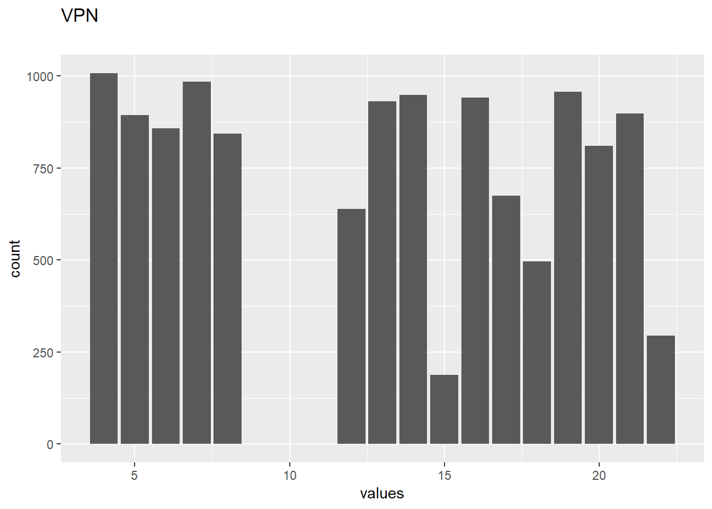

0 missing values.

#### Summary statistics {#VPN_summary}

name   data_type   missing   complete   n       mean    sd     p0   p25   p50   p75   p100   hist     
-----  ----------  --------  ---------  ------  ------  -----  ---  ----  ----  ----  -----  ---------
VPN    numeric     0         12363      12363   12.81   5.87   4    7     14    18    22     ▇▅▁▅▃▅▅▆ 


### Bedingung {#Bedingung .tabset}


#### Distribution {#Bedingung_distribution}

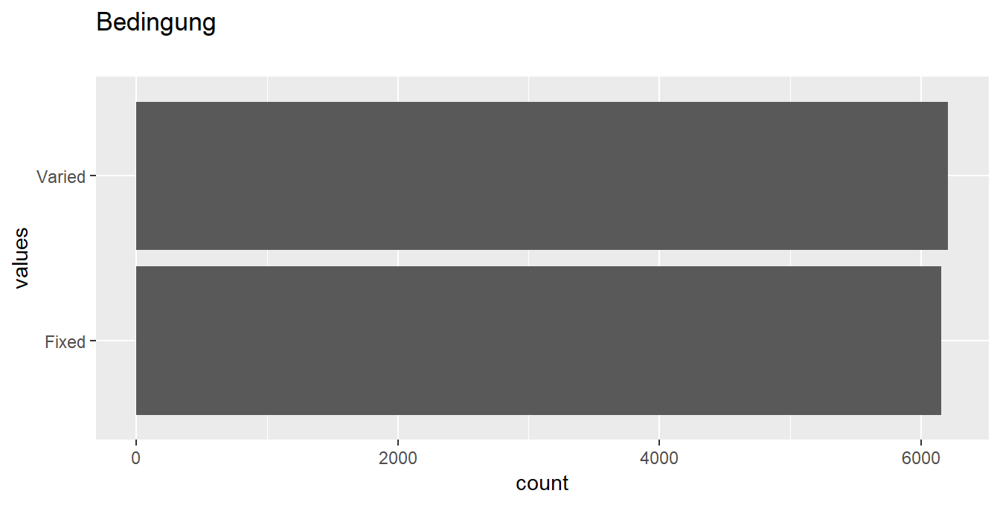

0 missing values.

#### Summary statistics {#Bedingung_summary}

name        data_type   ordered   value_labels             missing   complete   n       n_unique   top_counts                  
----------  ----------  --------  -----------------------  --------  ---------  ------  ---------  ----------------------------
Bedingung   factor      FALSE     1. Fixed,<br>2. Varied   0         12363      12363   2          Var: 6209, Fix: 6154, NA: 0 


### Block {#Block .tabset}


#### Distribution {#Block_distribution}

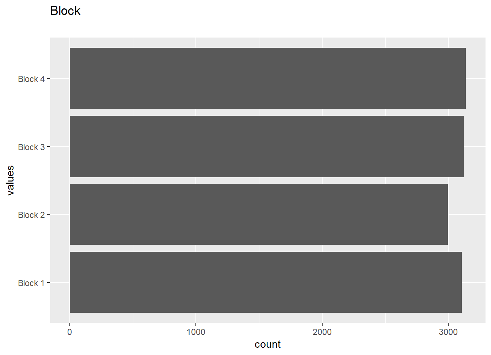

0 missing values.

#### Summary statistics {#Block_summary}

name    data_type   ordered   value_labels                                              missing   complete   n       n_unique   top_counts                                 
------  ----------  --------  --------------------------------------------------------  --------  ---------  ------  ---------  -------------------------------------------
Block   factor      FALSE     1. Block 1,<br>2. Block 2,<br>3. Block 3,<br>4. Block 4   0         12363      12363   4          Blo: 3137, Blo: 3123, Blo: 3107, Blo: 2996 


### Korr {#Korr .tabset}


#### Distribution {#Korr_distribution}

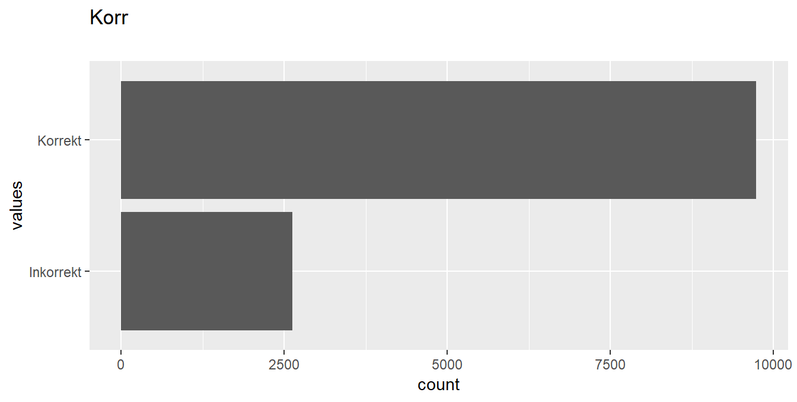

0 missing values.

#### Summary statistics {#Korr_summary}

name   data_type   ordered   value_labels                  missing   complete   n       n_unique   top_counts                  
-----  ----------  --------  ----------------------------  --------  ---------  ------  ---------  ----------------------------
Korr   factor      FALSE     1. Inkorrekt,<br>2. Korrekt   0         12363      12363   2          Kor: 9735, Ink: 2628, NA: 0 


### TrialNr {#TrialNr .tabset}


#### Distribution {#TrialNr_distribution}

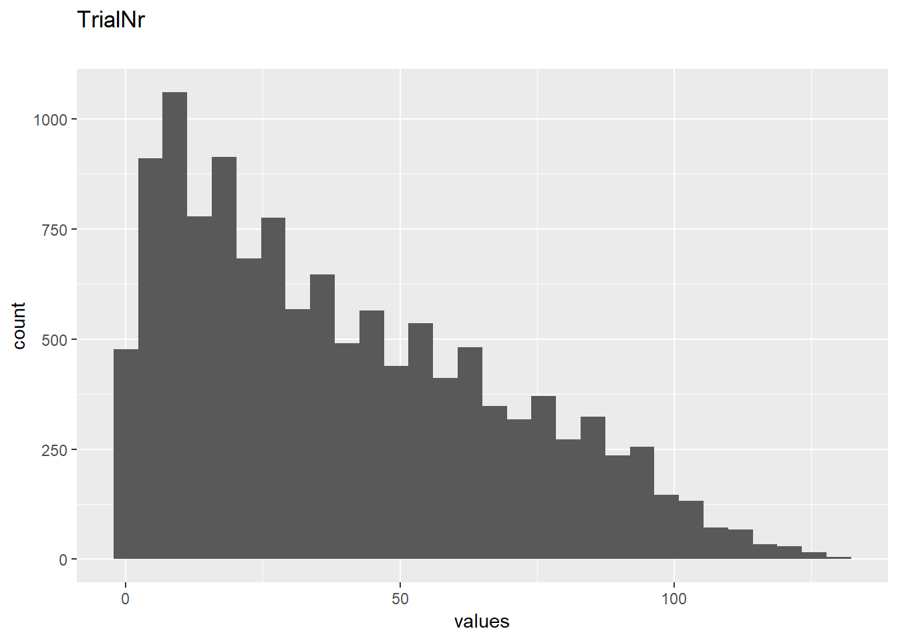

0 missing values.

#### Summary statistics {#TrialNr_summary}

name      data_type   missing   complete   n       mean    sd      p0   p25   p50   p75   p100   hist     
--------  ----------  --------  ---------  ------  ------  ------  ---  ----  ----  ----  -----  ---------
TrialNr   numeric     0         12363      12363   39.74   29.24   1    15    34    61    131    ▇▆▅▃▃▂▁▁ 


### P1_Lat_PO7 {#P1_Lat_PO7 .tabset}


#### Distribution {#P1_Lat_PO7_distribution}

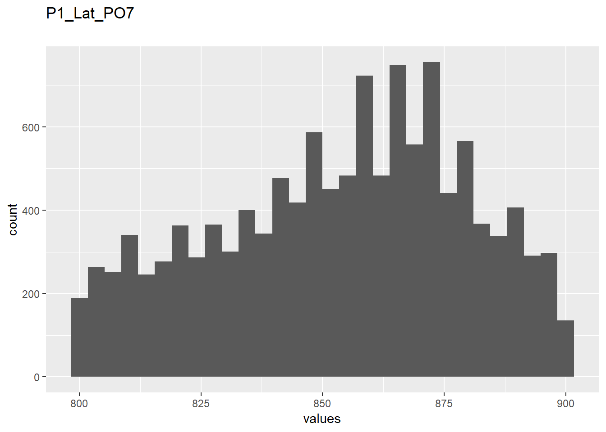

204 missing values.

#### Summary statistics {#P1_Lat_PO7_summary}

name         data_type   missing   complete   n       mean    sd      p0    p25   p50   p75   p100   hist     
-----------  ----------  --------  ---------  ------  ------  ------  ----  ----  ----  ----  -----  ---------
P1_Lat_PO7   numeric     204       12159      12363   853.5   25.95   800   834   857   873   900    ▃▃▃▆▆▇▅▃ 


### P1_Amp_PO7 {#P1_Amp_PO7 .tabset}


#### Distribution {#P1_Amp_PO7_distribution}

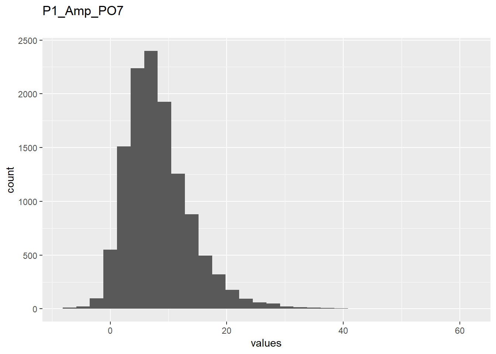

204 missing values.

#### Summary statistics {#P1_Amp_PO7_summary}

name         data_type   missing   complete   n       mean   sd     p0      p25    p50   p75     p100    hist     
-----------  ----------  --------  ---------  ------  -----  -----  ------  -----  ----  ------  ------  ---------
P1_Amp_PO7   numeric     204       12159      12363   8.27   5.67   -7.76   4.43   7.4   11.11   59.84   ▁▇▅▁▁▁▁▁ 


### P1_Lat_POz {#P1_Lat_POz .tabset}


#### Distribution {#P1_Lat_POz_distribution}

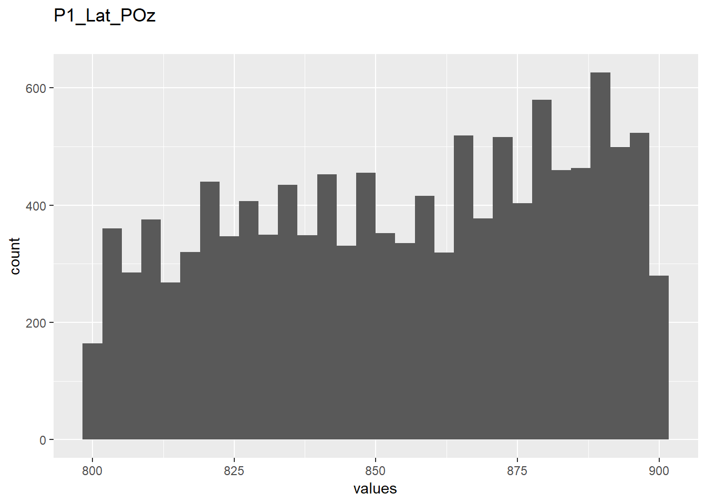

355 missing values.

#### Summary statistics {#P1_Lat_POz_summary}

name         data_type   missing   complete   n       mean     sd      p0    p25   p50   p75   p100   hist     
-----------  ----------  --------  ---------  ------  -------  ------  ----  ----  ----  ----  -----  ---------
P1_Lat_POz   numeric     355       12008      12363   854.43   29.02   800   830   856   880   900    ▅▆▆▆▆▇▇▇ 


### P1_Amp_POz {#P1_Amp_POz .tabset}


#### Distribution {#P1_Amp_POz_distribution}

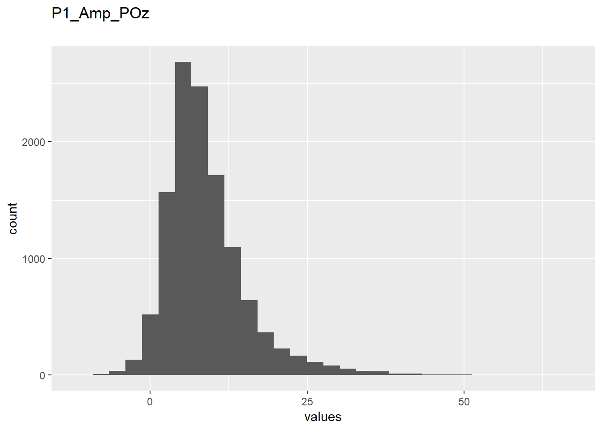

355 missing values.

#### Summary statistics {#P1_Amp_POz_summary}

name         data_type   missing   complete   n       mean   sd     p0       p25    p50    p75     p100    hist     
-----------  ----------  --------  ---------  ------  -----  -----  -------  -----  -----  ------  ------  ---------
P1_Amp_POz   numeric     355       12008      12363   8.88   6.64   -10.66   4.71   7.58   11.52   65.51   ▁▇▅▁▁▁▁▁ 


### P1_Lat_PO8 {#P1_Lat_PO8 .tabset}


#### Distribution {#P1_Lat_PO8_distribution}

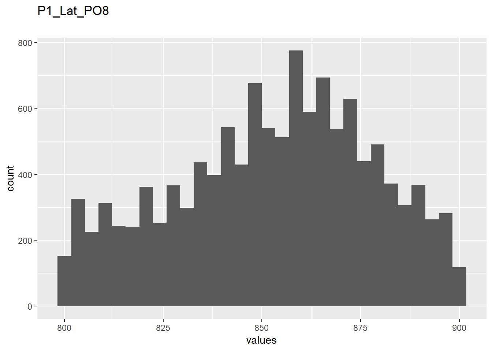

189 missing values.

#### Summary statistics {#P1_Lat_PO8_summary}

name         data_type   missing   complete   n       mean     sd      p0    p25   p50   p75   p100   hist     
-----------  ----------  --------  ---------  ------  -------  ------  ----  ----  ----  ----  -----  ---------
P1_Lat_PO8   numeric     189       12174      12363   852.83   25.27   800   835   855   872   900    ▃▃▅▇▇▇▅▃ 


### P1_Amp_PO8 {#P1_Amp_PO8 .tabset}


#### Distribution {#P1_Amp_PO8_distribution}

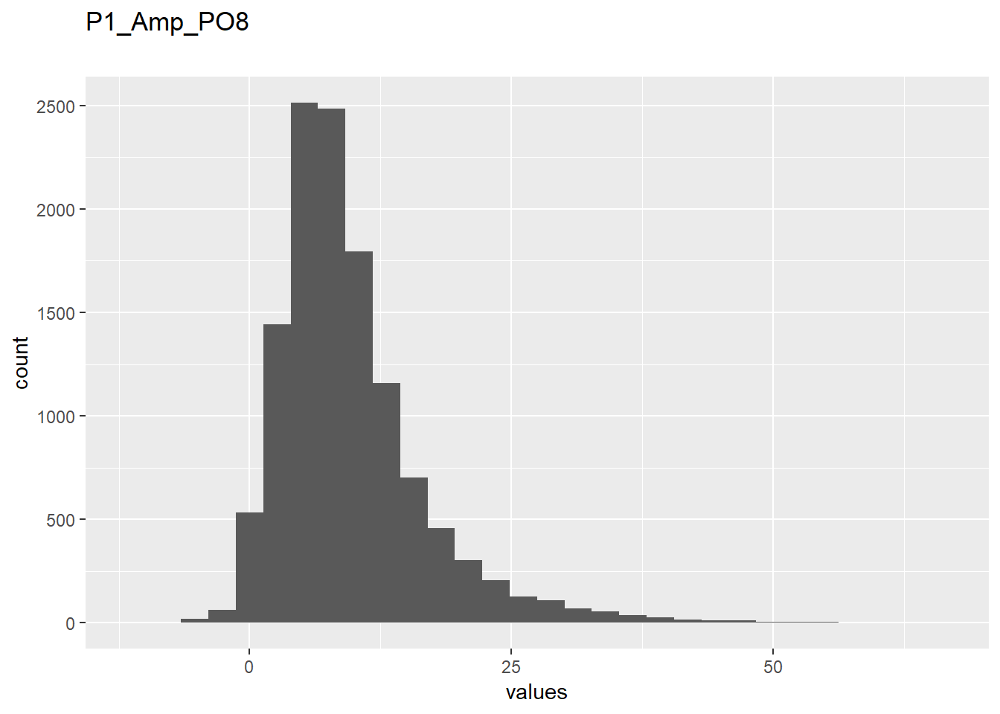

189 missing values.

#### Summary statistics {#P1_Amp_PO8_summary}

name         data_type   missing   complete   n       mean   sd     p0       p25    p50    p75     p100    hist     
-----------  ----------  --------  ---------  ------  -----  -----  -------  -----  -----  ------  ------  ---------
P1_Amp_PO8   numeric     189       12174      12363   9.57   7.18   -11.12   5.02   8.04   12.32   64.74   ▁▇▇▂▁▁▁▁ 


### P1_Lat_O1 {#P1_Lat_O1 .tabset}


#### Distribution {#P1_Lat_O1_distribution}

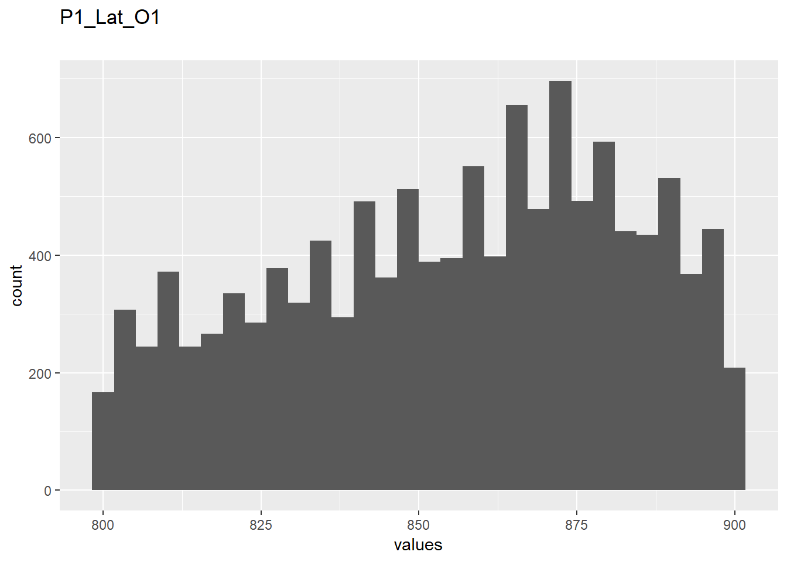

289 missing values.

#### Summary statistics {#P1_Lat_O1_summary}

name        data_type   missing   complete   n       mean     sd      p0    p25   p50   p75      p100   hist     
----------  ----------  --------  ---------  ------  -------  ------  ----  ----  ----  -------  -----  ---------
P1_Lat_O1   numeric     289       12074      12363   855.08   27.38   800   833   858   877.75   900    ▅▅▅▆▆▇▇▆ 


### P1_Amp_O1 {#P1_Amp_O1 .tabset}


#### Distribution {#P1_Amp_O1_distribution}

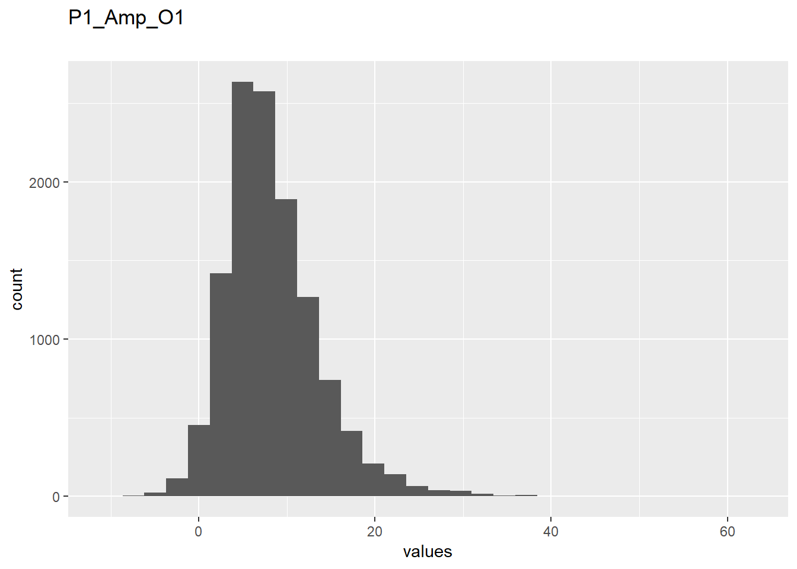

289 missing values.

#### Summary statistics {#P1_Amp_O1_summary}

name        data_type   missing   complete   n       mean   sd     p0       p25    p50    p75     p100   hist     
----------  ----------  --------  ---------  ------  -----  -----  -------  -----  -----  ------  -----  ---------
P1_Amp_O1   numeric     289       12074      12363   8.31   5.38   -11.04   4.74   7.47   11.02   60.8   ▁▇▇▁▁▁▁▁ 


### P1_Lat_Oz {#P1_Lat_Oz .tabset}


#### Distribution {#P1_Lat_Oz_distribution}

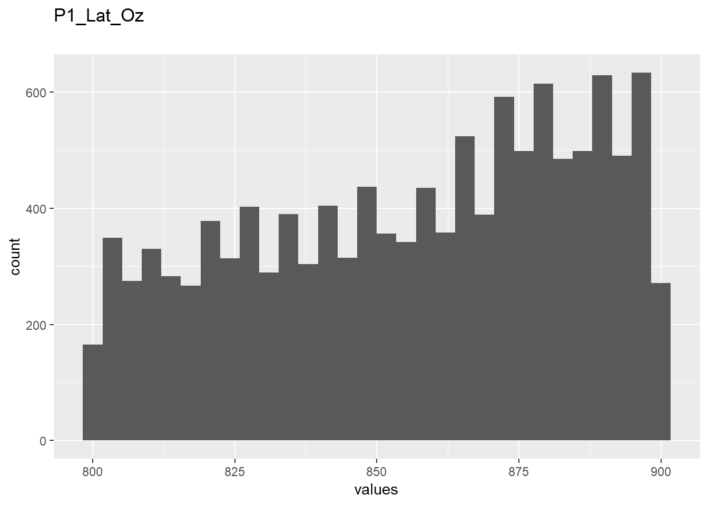

347 missing values.

#### Summary statistics {#P1_Lat_Oz_summary}

name        data_type   missing   complete   n       mean     sd      p0    p25   p50   p75   p100   hist     
----------  ----------  --------  ---------  ------  -------  ------  ----  ----  ----  ----  -----  ---------
P1_Lat_Oz   numeric     347       12016      12363   856.31   28.89   800   832   860   882   900    ▅▅▅▆▆▇▇▇ 


### P1_Amp_Oz {#P1_Amp_Oz .tabset}


#### Distribution {#P1_Amp_Oz_distribution}

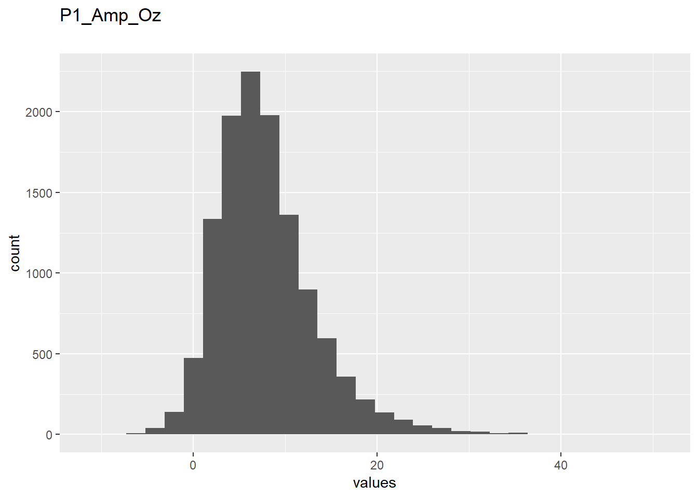

347 missing values.

#### Summary statistics {#P1_Amp_Oz_summary}

name        data_type   missing   complete   n       mean   sd     p0       p25    p50    p75     p100   hist     
----------  ----------  --------  ---------  ------  -----  -----  -------  -----  -----  ------  -----  ---------
P1_Amp_Oz   numeric     347       12016      12363   7.86   5.39   -10.53   4.27   7.08   10.52   49.8   ▁▃▇▂▁▁▁▁ 


### P1_Lat_O2 {#P1_Lat_O2 .tabset}


#### Distribution {#P1_Lat_O2_distribution}

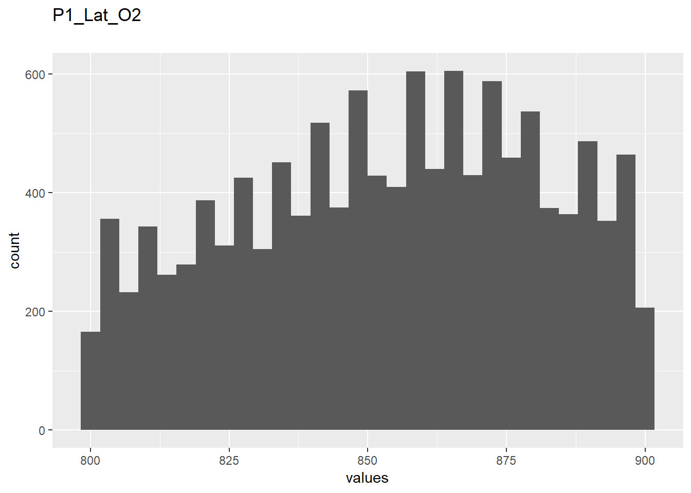

270 missing values.

#### Summary statistics {#P1_Lat_O2_summary}

name        data_type   missing   complete   n       mean     sd     p0    p25   p50   p75   p100   hist     
----------  ----------  --------  ---------  ------  -------  -----  ----  ----  ----  ----  -----  ---------
P1_Lat_O2   numeric     270       12093      12363   853.58   27.3   800   832   855   876   900    ▅▅▆▇▇▇▆▆ 


### P1_Amp_O2 {#P1_Amp_O2 .tabset}


#### Distribution {#P1_Amp_O2_distribution}

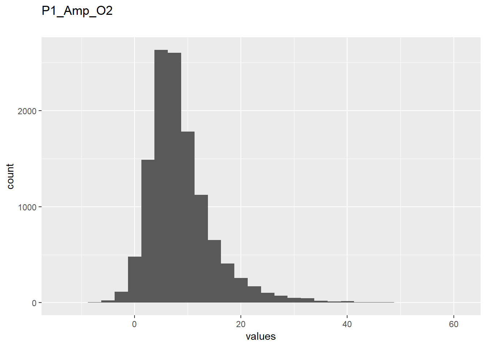

270 missing values.

#### Summary statistics {#P1_Amp_O2_summary}

name        data_type   missing   complete   n       mean   sd     p0       p25    p50    p75     p100    hist     
----------  ----------  --------  ---------  ------  -----  -----  -------  -----  -----  ------  ------  ---------
P1_Amp_O2   numeric     270       12093      12363   8.64   6.24   -13.04   4.67   7.45   11.16   59.52   ▁▃▇▂▁▁▁▁ 


## Missingness report

Among those who finished the survey. Only variables that have missing values are shown.

```
## Warning: Could not figure out who finished the surveys, because the
## variables expired and ended were missing.
```

<div data-pagedtable="false">
  <script data-pagedtable-source type="application/json">
{"columns":[{"label":["description"],"name":[1],"type":["chr"],"align":["left"]},{"label":["P1_Lat_PO8"],"name":[2],"type":["dbl"],"align":["right"]},{"label":["P1_Amp_PO8"],"name":[3],"type":["dbl"],"align":["right"]},{"label":["P1_Lat_PO7"],"name":[4],"type":["dbl"],"align":["right"]},{"label":["P1_Amp_PO7"],"name":[5],"type":["dbl"],"align":["right"]},{"label":["P1_Lat_O2"],"name":[6],"type":["dbl"],"align":["right"]},{"label":["P1_Amp_O2"],"name":[7],"type":["dbl"],"align":["right"]},{"label":["P1_Lat_O1"],"name":[8],"type":["dbl"],"align":["right"]},{"label":["P1_Amp_O1"],"name":[9],"type":["dbl"],"align":["right"]},{"label":["P1_Lat_Oz"],"name":[10],"type":["dbl"],"align":["right"]},{"label":["P1_Amp_Oz"],"name":[11],"type":["dbl"],"align":["right"]},{"label":["P1_Lat_POz"],"name":[12],"type":["dbl"],"align":["right"]},{"label":["P1_Amp_POz"],"name":[13],"type":["dbl"],"align":["right"]},{"label":["var_miss"],"name":[14],"type":["dbl"],"align":["right"]},{"label":["n_miss"],"name":[15],"type":["dbl"],"align":["right"]}],"data":[{"1":"Missing values in 0 variables","2":"1","3":"1","4":"1","5":"1","6":"1","7":"1","8":"1","9":"1","10":"1","11":"1","12":"1","13":"1","14":"0","15":"11487"},{"1":"Missing values per variable","2":"189","3":"189","4":"204","5":"204","6":"270","7":"270","8":"289","9":"289","10":"347","11":"347","12":"355","13":"355","14":"3308","15":"3308"},{"1":"Missing values in 2 variables","2":"1","3":"1","4":"1","5":"1","6":"1","7":"1","8":"1","9":"1","10":"1","11":"1","12":"0","13":"0","14":"2","15":"144"},{"1":"47 other, less frequent patterns","2":"26","3":"26","4":"27","5":"27","6":"24","7":"24","8":"22","9":"22","10":"21","11":"21","12":"28","13":"28","14":"268","15":"732"}],"options":{"columns":{"min":{},"max":[10]},"rows":{"min":[10],"max":[10]},"pages":{}}}
  </script>
</div>


## Codebook table

<!--html_preserve--><div id="htmlwidget-f596f8554b87d16b5831" style="width:100%;height:auto;" class="datatables html-widget"></div>
<script type="application/json" data-for="htmlwidget-f596f8554b87d16b5831">{"x":{"filter":"top","filterHTML":"<tr>\n  <td data-type=\"character\" style=\"vertical-align: top;\">\n    <div class=\"form-group has-feedback\" style=\"margin-bottom: auto;\">\n      <input type=\"search\" placeholder=\"All\" class=\"form-control\" style=\"width: 100%;\"/>\n      <span class=\"glyphicon glyphicon-remove-circle form-control-feedback\"><\/span>\n    <\/div>\n  <\/td>\n  <td data-type=\"character\" style=\"vertical-align: top;\">\n    <div class=\"form-group has-feedback\" style=\"margin-bottom: auto;\">\n      <input type=\"search\" placeholder=\"All\" class=\"form-control\" style=\"width: 100%;\"/>\n      <span class=\"glyphicon glyphicon-remove-circle form-control-feedback\"><\/span>\n    <\/div>\n  <\/td>\n  <td data-type=\"character\" style=\"vertical-align: top;\">\n    <div class=\"form-group has-feedback\" style=\"margin-bottom: auto;\">\n      <input type=\"search\" placeholder=\"All\" class=\"form-control\" style=\"width: 100%;\"/>\n      <span class=\"glyphicon glyphicon-remove-circle form-control-feedback\"><\/span>\n    <\/div>\n  <\/td>\n  <td data-type=\"character\" style=\"vertical-align: top;\">\n    <div class=\"form-group has-feedback\" style=\"margin-bottom: auto;\">\n      <input type=\"search\" placeholder=\"All\" class=\"form-control\" style=\"width: 100%;\"/>\n      <span class=\"glyphicon glyphicon-remove-circle form-control-feedback\"><\/span>\n    <\/div>\n  <\/td>\n  <td data-type=\"character\" style=\"vertical-align: top;\">\n    <div class=\"form-group has-feedback\" style=\"margin-bottom: auto;\">\n      <input type=\"search\" placeholder=\"All\" class=\"form-control\" style=\"width: 100%;\"/>\n      <span class=\"glyphicon glyphicon-remove-circle form-control-feedback\"><\/span>\n    <\/div>\n  <\/td>\n  <td data-type=\"character\" style=\"vertical-align: top;\">\n    <div class=\"form-group has-feedback\" style=\"margin-bottom: auto;\">\n      <input type=\"search\" placeholder=\"All\" class=\"form-control\" style=\"width: 100%;\"/>\n      <span class=\"glyphicon glyphicon-remove-circle form-control-feedback\"><\/span>\n    <\/div>\n  <\/td>\n  <td data-type=\"disabled\" style=\"vertical-align: top;\">\n    <div class=\"form-group has-feedback\" style=\"margin-bottom: auto;\">\n      <input type=\"search\" placeholder=\"All\" class=\"form-control\" style=\"width: 100%;\"/>\n      <span class=\"glyphicon glyphicon-remove-circle form-control-feedback\"><\/span>\n    <\/div>\n  <\/td>\n  <td data-type=\"character\" style=\"vertical-align: top;\">\n    <div class=\"form-group has-feedback\" style=\"margin-bottom: auto;\">\n      <input type=\"search\" placeholder=\"All\" class=\"form-control\" style=\"width: 100%;\"/>\n      <span class=\"glyphicon glyphicon-remove-circle form-control-feedback\"><\/span>\n    <\/div>\n  <\/td>\n  <td data-type=\"character\" style=\"vertical-align: top;\">\n    <div class=\"form-group has-feedback\" style=\"margin-bottom: auto;\">\n      <input type=\"search\" placeholder=\"All\" class=\"form-control\" style=\"width: 100%;\"/>\n      <span class=\"glyphicon glyphicon-remove-circle form-control-feedback\"><\/span>\n    <\/div>\n  <\/td>\n  <td data-type=\"character\" style=\"vertical-align: top;\">\n    <div class=\"form-group has-feedback\" style=\"margin-bottom: auto;\">\n      <input type=\"search\" placeholder=\"All\" class=\"form-control\" style=\"width: 100%;\"/>\n      <span class=\"glyphicon glyphicon-remove-circle form-control-feedback\"><\/span>\n    <\/div>\n  <\/td>\n  <td data-type=\"character\" style=\"vertical-align: top;\">\n    <div class=\"form-group has-feedback\" style=\"margin-bottom: auto;\">\n      <input type=\"search\" placeholder=\"All\" class=\"form-control\" style=\"width: 100%;\"/>\n      <span class=\"glyphicon glyphicon-remove-circle form-control-feedback\"><\/span>\n    <\/div>\n  <\/td>\n  <td data-type=\"character\" style=\"vertical-align: top;\">\n    <div class=\"form-group has-feedback\" style=\"margin-bottom: auto;\">\n      <input type=\"search\" placeholder=\"All\" class=\"form-control\" style=\"width: 100%;\"/>\n      <span class=\"glyphicon glyphicon-remove-circle form-control-feedback\"><\/span>\n    <\/div>\n  <\/td>\n  <td data-type=\"character\" style=\"vertical-align: top;\">\n    <div class=\"form-group has-feedback\" style=\"margin-bottom: auto;\">\n      <input type=\"search\" placeholder=\"All\" class=\"form-control\" style=\"width: 100%;\"/>\n      <span class=\"glyphicon glyphicon-remove-circle form-control-feedback\"><\/span>\n    <\/div>\n  <\/td>\n  <td data-type=\"character\" style=\"vertical-align: top;\">\n    <div class=\"form-group has-feedback\" style=\"margin-bottom: auto;\">\n      <input type=\"search\" placeholder=\"All\" class=\"form-control\" style=\"width: 100%;\"/>\n      <span class=\"glyphicon glyphicon-remove-circle form-control-feedback\"><\/span>\n    <\/div>\n  <\/td>\n  <td data-type=\"character\" style=\"vertical-align: top;\">\n    <div class=\"form-group has-feedback\" style=\"margin-bottom: auto;\">\n      <input type=\"search\" placeholder=\"All\" class=\"form-control\" style=\"width: 100%;\"/>\n      <span class=\"glyphicon glyphicon-remove-circle form-control-feedback\"><\/span>\n    <\/div>\n  <\/td>\n  <td data-type=\"character\" style=\"vertical-align: top;\">\n    <div class=\"form-group has-feedback\" style=\"margin-bottom: auto;\">\n      <input type=\"search\" placeholder=\"All\" class=\"form-control\" style=\"width: 100%;\"/>\n      <span class=\"glyphicon glyphicon-remove-circle form-control-feedback\"><\/span>\n    <\/div>\n  <\/td>\n  <td data-type=\"character\" style=\"vertical-align: top;\">\n    <div class=\"form-group has-feedback\" style=\"margin-bottom: auto;\">\n      <input type=\"search\" placeholder=\"All\" class=\"form-control\" style=\"width: 100%;\"/>\n      <span class=\"glyphicon glyphicon-remove-circle form-control-feedback\"><\/span>\n    <\/div>\n  <\/td>\n<\/tr>","extensions":["Buttons"],"data":[["<a href=\"#VPN\">VPN<\/a>","<a href=\"#Bedingung\">Bedingung<\/a>","<a href=\"#Block\">Block<\/a>","<a href=\"#Korr\">Korr<\/a>","<a href=\"#TrialNr\">TrialNr<\/a>","<a href=\"#P1_Lat_PO7\">P1_Lat_PO7<\/a>","<a href=\"#P1_Amp_PO7\">P1_Amp_PO7<\/a>","<a href=\"#P1_Lat_POz\">P1_Lat_POz<\/a>","<a href=\"#P1_Amp_POz\">P1_Amp_POz<\/a>","<a href=\"#P1_Lat_PO8\">P1_Lat_PO8<\/a>","<a href=\"#P1_Amp_PO8\">P1_Amp_PO8<\/a>","<a href=\"#P1_Lat_O1\">P1_Lat_O1<\/a>","<a href=\"#P1_Amp_O1\">P1_Amp_O1<\/a>","<a href=\"#P1_Lat_Oz\">P1_Lat_Oz<\/a>","<a href=\"#P1_Amp_Oz\">P1_Amp_Oz<\/a>","<a href=\"#P1_Lat_O2\">P1_Lat_O2<\/a>","<a href=\"#P1_Amp_O2\">P1_Amp_O2<\/a>"],["numeric","factor","factor","factor","numeric","numeric","numeric","numeric","numeric","numeric","numeric","numeric","numeric","numeric","numeric","numeric","numeric"],[null,"FALSE","FALSE","FALSE",null,null,null,null,null,null,null,null,null,null,null,null,null],[null,"1. Fixed,<br>2. Varied","1. Block 1,<br>2. Block 2,<br>3. Block 3,<br>4. Block 4","1. Inkorrekt,<br>2. Korrekt",null,null,null,null,null,null,null,null,null,null,null,null,null],["0","0","0","0","0","204","204","355","355","189","189","289","289","347","347","270","270"],["12363","12363","12363","12363","12363","12159","12159","12008","12008","12174","12174","12074","12074","12016","12016","12093","12093"],["12363","12363","12363","12363","12363","12363","12363","12363","12363","12363","12363","12363","12363","12363","12363","12363","12363"],[null,"2","4","2",null,null,null,null,null,null,null,null,null,null,null,null,null],[null,"Var: 6209, Fix: 6154, NA: 0","Blo: 3137, Blo: 3123, Blo: 3107, Blo: 2996","Kor: 9735, Ink: 2628, NA: 0",null,null,null,null,null,null,null,null,null,null,null,null,null],[" 12.81",null,null,null," 39.74","853.5 ","  8.27","854.43","  8.88","852.83","  9.57","855.08","  8.31","856.31","  7.86","853.58","  8.64"],[" 5.87",null,null,null,"29.24","25.95"," 5.67","29.02"," 6.64","25.27"," 7.18","27.38"," 5.38","28.89"," 5.39","27.3 "," 6.24"],["  4   ",null,null,null,"  1   ","800   "," -7.76","800   ","-10.66","800   ","-11.12","800   ","-11.04","800   ","-10.53","800   ","-13.04"],["  7   ",null,null,null," 15   ","834   ","  4.43","830   ","  4.71","835   ","  5.02","833   ","  4.74","832   ","  4.27","832   ","  4.67"],[" 14   ",null,null,null," 34   ","857   ","  7.4 ","856   ","  7.58","855   ","  8.04","858   ","  7.47","860   ","  7.08","855   ","  7.45"],[" 18   ",null,null,null," 61   ","873   "," 11.11","880   "," 11.52","872   "," 12.32","877.75"," 11.02","882   "," 10.52","876   "," 11.16"],[" 22   ",null,null,null,"131   ","900   "," 59.84","900   "," 65.51","900   "," 64.74","900   "," 60.8 ","900   "," 49.8 ","900   "," 59.52"],["▇▅▁▅▃▅▅▆",null,null,null,"▇▆▅▃▃▂▁▁","▃▃▃▆▆▇▅▃","▁▇▅▁▁▁▁▁","▅▆▆▆▆▇▇▇","▁▇▅▁▁▁▁▁","▃▃▅▇▇▇▅▃","▁▇▇▂▁▁▁▁","▅▅▅▆▆▇▇▆","▁▇▇▁▁▁▁▁","▅▅▅▆▆▇▇▇","▁▃▇▂▁▁▁▁","▅▅▆▇▇▇▆▆","▁▃▇▂▁▁▁▁"]],"container":"<table class=\"display\">\n  <thead>\n    <tr>\n      <th>name<\/th>\n      <th>data_type<\/th>\n      <th>ordered<\/th>\n      <th>value_labels<\/th>\n      <th>missing<\/th>\n      <th>complete<\/th>\n      <th>n<\/th>\n      <th>n_unique<\/th>\n      <th>top_counts<\/th>\n      <th>mean<\/th>\n      <th>sd<\/th>\n      <th>p0<\/th>\n      <th>p25<\/th>\n      <th>p50<\/th>\n      <th>p75<\/th>\n      <th>p100<\/th>\n      <th>hist<\/th>\n    <\/tr>\n  <\/thead>\n<\/table>","options":{"dom":"Bfrtip","buttons":["copy","csv","excel","pdf","print"],"pageLength":200,"order":[],"autoWidth":false,"orderClasses":false,"orderCellsTop":true,"lengthMenu":[10,25,50,100,200]}},"evals":[],"jsHooks":[]}</script><!--/html_preserve-->
